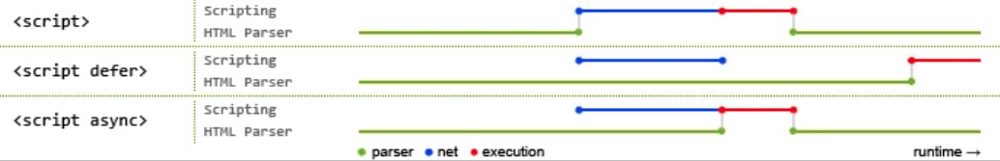

## doctype 的作用是什么？

Doctype 是  html5 标准网页声明，且必须声明在HTML文档第一行。来告知浏览器的解析器用什么文档标准解析这个文档，不同的渲染模式会影响到浏览器对于css代码甚至Javascript 脚本的解析

文档解析类型有：
- BackCompat: 怪异模式，浏览器使用自己的怪异模式解析渲染页面，（如果没有声明DOCTYPE，默认就是这个模式）
- CSS1Compat: 标准模式，浏览器使用W3C的标准解析渲染页面

> IE8还有一种介乎于上述两者之间的近乎标准的模式，但是基本被淘汰了

## 这三种模式的区别是什么？

- 标准模式（standards mode）: 页面按照HTML 与 CSS 的定义渲染
- 怪异模式（quirks mode）: 会模拟更旧的浏览器的行为
- 近乎标准（almost standards）模式: 会实施了一种表单元格尺寸的怪异行为（与IE7之前的单元格布局方式一致），除此之外符合标准定义

## HTML、XHTML、XML 有什么区别
- HTML(超文本标记语言)：在html4.0之前HTML先有实现再有标准，导致HTML非常混乱和松散
- XML(可扩展标记语言)：主要用于存储数据和结构，可扩展，大家熟悉的JSON也是相似的左右，但是更加轻量高效，所以 XML 现在市场越来越小了
- XHTML (可扩展超文本标记语言)：基于上面两者而来，W3C 为了解决HTML混乱问题而生，并基于此诞生了HTML5，开头加入`<!DOCTYPE html>`的做法因此而来，如果不加就是兼容混乱的HTML，加了就是标准模式

> XHTML中的DTD是类似于<!DOCTYPE html PUBLIC "-//W3C//DTD XHTML 1.0 Strict//EN" "http://www.w3.org/TR/xhtml1/DTD/xhtml1-strict.dtd">的形式,有严格版、过渡版、框架版等几个版本.

## 什么是 data-属性？
HTML 的数据属性，用于将数据存储与标准的HTML 元素中作为额外信息，我们可以通过js 访问并操作它，来达到操作数据的目的,也可以通过css 属性选择器来获使用，也可用 css attr来读取 它。

```html
<article id="articelId"  data-user="user1" data-birth-of-date> 
  1231312311
</article>

<style>
  [data-user]{
      color:red
  }
  [data-user*=user1]{
      font-size:28px;
  }
  #articelId:after{
    content:attr(data-user-name);
    display:block;
    width:100px;
    height:100px;
    zoom:1;
  }
</style>

<script type="text/javascript">
  var articledom = document.getElementById('articleId')

  articledom.dataset.birthOfDate = '2000-12-01'

  console.log(articledom.dataset)    // DOMStringMap {birthOfDate:'2000-12-01',user:"user1"}

  console.log(articledom.dataset.birthOfDate)  // 2000-12-01

  articledom.dataset.userName="zhangsan"

  console.log(articledom.dataset)  // DOMStringMap {birthOfDate:'2000-12-01',user:"user1"，userName:"zhangsan"}
</script>

```

> 前端框架出现之后，这种方法已经不流行了

## HTML 语义化的理解

语义化是指使用恰当语义的 html 标签，让页面具有良好的结构与含义，比如`<p>`标签就代表段落,`<acticle>`代表正文内容等等。

语义化的好处主要有两点:
- 开发者友好：使用语义类标签增强了可读性，开发者也能够清晰的看出网页的结构，也更为便于团队的开发和维护
- 机器友好： 带有语义的文字表现力丰富，更适合搜索引擎的爬虫爬取有效信息，语义类还可以支持读屏软件，根据文字可以自动生成目录

这对于简书、知乎这种富文本类的应用很重要，语义化对于其网站的内容传播有很大的帮助，但是对于功能性的web软件重要性大打折扣，比如一个按钮、Skeleton这种组件根本没有对应得语义，，也不需要什么SEO。

## HTML5 与 HTML4 得不同

- 文件类型声明(<!DOCTYPE>)仅有一型： `<!DOCTYPE HTML>`
- 新的解析顺序：不再基于SGML
- 新的元素： section,video,progress,nav,meter,time,aside,canvas,command,datalist,embed,figcaption,figure,footer,header,hgroup,keygen,mark,output,rp,rt,ruby,source,summary,wbr
- input元素得新类型： date,emial,url 等等
- 新的属性：ping (用于a与 area),charset(用于meta),async(用于script)
- 全域属性： id, tabindex, repeat
- 新的全域属性：contenteditable,contentmenu,draggable,dropzone,hidden,spellcheck
- 移除元素： acronym,applet,basrfont,big,center,dir,font,frame,frameset,isindex,noframes,strike,tt

## 有哪些常用的meta标签

meta 标签由 name 和 content 两个属性来定义，来描述一个HTML网页文档得`元信息`,例如作者、日期和时间、网页描述、关键词、页面刷新等

MDN 上 描述得name 属性得可能有：
- application-name : 定义正在运行在网页上得网络应用名称
- author ： 就是这个文档得作者名称，可以用自由得格式去定义
- description ： 其中包含页面内容得简短和精确得描述
- generator: 包含生成页面得软件得标识符
- keywords: 包含与逗号分割得页面内容相关得关键词
- referrer: 控制所有从该文档发出得HTTP请求中HTTP `Referer`首部得内容:

<meta name="referrer"> content 属性可取得值：

| no-referrer                | 不要发送 HTTP `Referer`首部                                  |
| -------------------------- | ------------------------------------------------------------ |
| origin                     | 发送当前文档得 origin                                        |
| no-referrer-when-downgrade | 当目的地是先验安全的(https->https)则发送 [origin](https://developer.mozilla.org/en-US/docs/Glossary/Origin) 作为 referrer ，但是当目的地是较不安全的 (https->http)时则不发送 referrer 。这个是默认的行为。 |
| origin-when-crossorigin    | 在同源请求下，发送完整的URL (不含查询参数) ，其他情况下则仅发送当前文档的 [origin](https://developer.mozilla.org/en-US/docs/Glossary/Origin)。 |
| unsafe-URL                 | 在同源请求下，发送完整的URL (不含查询参数)。                 |

除了一些http标准规定了一些name 作为大家使用得共识，开发者也可以自定义name

- charset 用于描述HTML 文档得编码形式
```html
<meta charset="utf-8">
```

- http-equiv 顾名思义，相当于http得文件头作用，比如下面得代码可以设置http得缓存过期日期
```html
<meta http-equiv="expirs" content="Wed,20 Jun 2019 22:33:00 GMT">
```

- viewport 移动前端最熟悉不过，Web开发人员可以控制视口的大小和比例
```html
<meta name="viewport" content="width=device-width, initial-scale=1, maximum-scale=1">
```

- apple-mobile-web-app-status-bar-style,开发过PWA应用的开发者应该很熟悉，为了自定义苹果工具栏的颜色。
```html
<meta name="apple-mobile-web-app-status-bar-style" content="black-translucent">
```

## src 和 href 得区别？

- src是指向外部资源的位置，指向的内容会嵌入到文档中当前标签所在的位置，在请求src资源时会将其指向的资源下载并应用到文档内，如js脚本，img图片和frame等元素。当浏览器解析到该元素时，会暂停其他资源的下载和处理，知道将该资源加载、编译、执行完毕，所以一般js脚本会放在底部而不是头部。

- href是指向网络资源所在位置（的超链接），用来建立和当前元素或文档之间的连接，当浏览器识别到它他指向的文件时，就会并行下载资源，不会停止对当前文档的处理。

## 知道img的srcset的作用是什么？

可以设计响应式图片，我们可以使用两个新的属性srcset 和 sizes来提供更多额外的资源图像和提示，帮助浏览器选择正确的一个资源。

srcset 定义了我们允许浏览器选择的图像集，以及每个图像的大小。

sizes 定义了一组媒体条件（例如屏幕宽度）并且指明当某些媒体条件为真时，什么样的图片尺寸是最佳选择。

所以，有了这些属性，浏览器会：

- 查看设备宽度
- 检查 sizes 列表中哪个媒体条件是第一个为真
- 查看给予该媒体查询的槽大小
- 加载 srcset 列表中引用的最接近所选的槽大小的图像

> srcset提供了根据屏幕条件选取图片的能力

```html

<!-- img 的 srcset 属性用于浏览器根据宽、高和像素密度来加载相应的图片资源 -->
<!-- 属性格式： 图片地址 宽度描述w 像素密度描述x，多个资源之间用逗号分隔 -->
<!-- 上面得例子表示 浏览器宽度达到 800px 则加载 middle.jpg;达到1400px 则加载 big.jpg；注意：像素密度描述只对固定宽度图片有效 -->


<!-- img 元素的size 属性给浏览器提供一个预估的图片显示宽度 -->
<!-- 属性格式：媒体查询 宽度描述（支持px）,多条规则用逗号分隔 -->
<!-- 上面的例子表示浏览器窗口为 320px时图片宽度为 300px,其他情况为 1200px -->
```

## 还有哪一个标签能起到跟srcset相似作用？

`<picture>`元素通过包含零或多个 `<source>` 元素和一个 ``元素来为不同的显示/设备场景提供图像版本。浏览器会选择最匹配的子` <source> `元素，如果没有匹配的，就选择 `` 元素的 src 属性中的URL。然后，所选图像呈现在``元素占据的空间中

> picture同样可以通过不同设备来匹配不同的图像资源

```html

<picture>
    <source srcset="/media/examples/surfer-240-200.jpg"
            media="(min-width: 800px)">
    
</picture>

```

## script标签中defer和async的区别

- defer: 浏览器指示脚本在文档被解析后执行，script被异步加载后并不会立刻执行，而是等待文档被解析完毕后执行

- async： 同样是异步加载脚本，区别时脚本加载完毕后立即执行，这导致 async 属性下的脚本是 乱序的，对于 script 有先后依赖关系的情况，并不适用

  

>  蓝色线代表网络读取，红色线代表执行时间，这俩都是针对脚本的；绿色线代表 HTML 解析 

## 有几种前端存储的方式？这些方式的区别是什么？

- cookies: 在HTML5标准前本地存储的主要方式，优点是兼容性好，请求头自带cookie 方便，缺点是大小只有4k，自动请求头加入cookie 浪费流量，每个domain限制 20个 cookie，使用起来麻烦需要自行封装

- localStorage: HTML5加入的以键值对（key-value）为标准的方式，优点是操作方便，永久性存储（除非手动删除）,大小为5M,兼容IE8+

- sessionStorage: 与 localStorage 基本类似，区别是sessionStorage 当页面关闭后会被清理，而且与 cookie,localStorage
不同，它不能再所有同源窗口中共享，是会话级别的存储方式

- Web SQL: 2010 年被W3C废弃的本地数据库数据存储方案，但是主流浏览器（火狐除外）都已经有了相关的实现，web sql 类似于SQLite，是真正意义上的关系型数据库，用sql 进行操作，当我们用 Javascript 时，要进行转换，较为繁琐

- IndexdDB: 是被正式纳入HTML5标准的数据库存储方案，它是 NoSql 数据库，用键值对进行存储，可以进行快速读取操作，非常适合web场景，同时 用 Javascript 进行操作会非常方便

