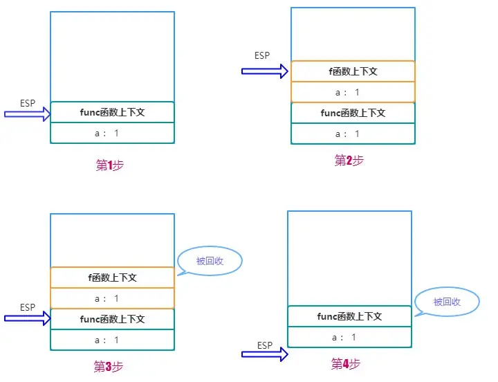
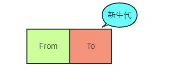
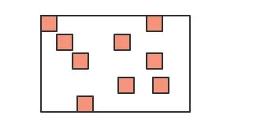
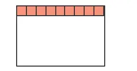
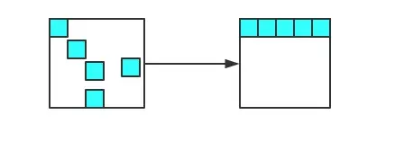
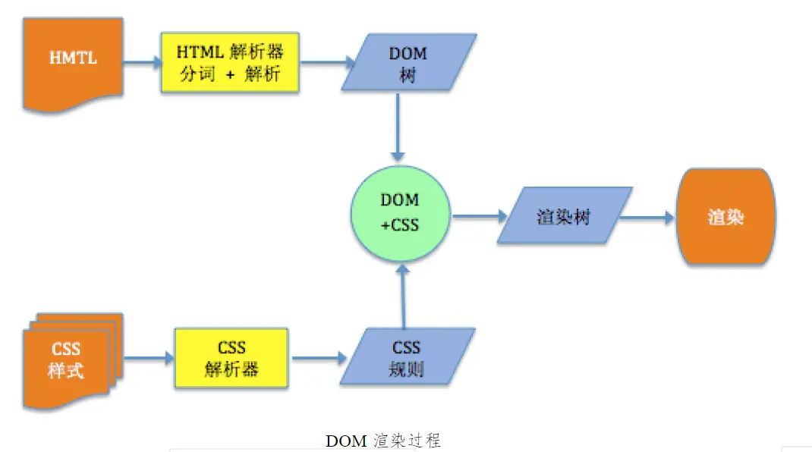

# 每日一道面试题

## 第一题：写 React / Vue 项目时为什么要在列表组件中写 key，其作用是什么

vue 和 react 都是采用 diff 算法来对比新旧虚拟节点，从而更新节点。在 vue 的 diff 函数中（建议先了解一下 diff 算法过程）。
在交叉对比中，当新节点跟旧节点`头尾交叉对比`没有结果时，会根据新节点的 key 去对比旧节点数组中的 key，从而找到相应旧节点（这里对应的是一个 key => index 的 map 映射）。如果没找到就认为是一个新增节点。而如果没有 key，那么就会采用遍历查找的方式去找到对应的旧节点。一种一个 map 映射，另一种是遍历查找。相比而言。map 映射的速度更快。

vue 部分源码如下：

```js
// vue项目  src/core/vdom/patch.js  -488行
// 以下是为了阅读性进行格式化后的代码

// oldCh 是一个旧虚拟节点数组
if (isUndef(oldKeyToIdx)) {
  oldKeyToIdx = createKeyToOldIdx(oldCh, oldStartIdx, oldEndIdx);
}
if (isDef(newStartVnode.key)) {
  // map 方式获取
  idxInOld = oldKeyToIdx[newStartVnode.key];
} else {
  // 遍历方式获取
  idxInOld = findIdxInOld(newStartVnode, oldCh, oldStartIdx, oldEndIdx);
}
```

创建 map 函数

```js
function createKeyToOldIdx(children, beginIdx, endIdx) {
  let i, key;
  const map = {};
  for (i = beginIdx; i <= endIdx; ++i) {
    key = children[i].key;
    if (isDef(key)) map[key] = i;
  }
  return map;
}
```

遍历寻找

```js
// sameVnode 是对比新旧节点是否相同的函数
function findIdxInOld(node, oldCh, start, end) {
  for (let i = start; i < end; i++) {
    const c = oldCh[i];

    if (isDef(c) && sameVnode(node, c)) return i;
  }
}
```

## 第二题：['1', '2', '3'].map(parseInt) what & why ?

第一眼看到这个题目的时候，脑海跳出的答案是 [1, 2, 3]，但是**真正的答案是[1, NaN, NaN]**。

- 首先让我们回顾一下，map 函数的第一个参数 callback：

```js
var new_array = arr.map(function callback(currentValue[, index[, array]]) {
// Return  element for new_array
}[, thisArg])这个callback一共可以接收三个参数，其中第一个参数代表当前被处理的元素，而第二个参数代表该元素的索引。
```

- 而 parseInt 则是用来解析字符串的，使字符串成为指定基数的整数。
  `parseInt(string, radix)`
  接收两个参数，第一个表示被处理的值（字符串），第二个表示为解析时的基数。
- 了解这两个函数后，我们可以模拟一下运行情况

1. parseInt('1', 0) //radix 为 0 时，且 string 参数不以“0x”和“0”开头时，按照 10 为基数处理。这个时候返回 1
2. parseInt('2', 1) //基数为 1（1 进制）表示的数中，最大值小于 2，所以无法解析，返回 NaN
3. parseInt('3', 2) //基数为 2（2 进制）表示的数中，最大值小于 3，所以无法解析，返回 NaN

- map 函数返回的是一个数组，所以最后结果为[1, NaN, NaN]
- 最后附上 MDN 上对于这两个函数的链接，具体参数大家可以到里面看

1. [parseInt](https://developer.mozilla.org/zh-CN/docs/Web/JavaScript/Reference/Global_Objects/parseInt)
2. [map](https://developer.mozilla.org/zh-CN/docs/Web/JavaScript/Reference/Global_Objects/Array/map)

## 第三题：什么是防抖和节流？有什么区别？如何实现？

函数防抖（debounce）：当持续触发事件时，一定时间段内没有再触发事件，事件处理函数才会执行一次，如果设定的时间到来之前，又一次触发了事件，就重新开始延时。如下图，持续触发scroll事件时，并不执行handle函数，当1000毫秒内没有触发scroll事件时，才会延时触发scroll事件。

 函数节流（throttle）：当持续触发事件时，保证一定时间段内只调用一次事件处理函数。节流通俗解释就比如我们水龙头放水，阀门一打开，水哗哗的往下流，秉着勤俭节约的优良传统美德，我们要把水龙头关小点，最好是如我们心意按照一定规律在某个时间间隔内一滴一滴的往下滴。

区别：在于执行的频率不同，一个是 持续触发事件时，只执行最后一次，限定执行次数；一个是持续触发事件时，每隔一定的时间执行一次， 限定执行频率

```js
/**
 * 触发高频事件后n秒内函数只会执行一次，如果n秒内高频事件再次被触发，则重新计算时间
 * 函数防抖 (只执行最后一次点击) 
 * 每次触发事件时都取消之前的延时调用
 * @param fn
 * @param delay
 * @returns {Function}
 * @constructor
 */
 const Debounce = (fn, t) => {
  let delay = t || 500;
  let timer;
  return function () {
      let args = arguments;
      if(timer){
          clearTimeout(timer);
      }
      timer = setTimeout(() => {
          timer = null;
          fn.apply(this, args);
      }, delay);
  }
}


/**
 * 高频事件触发，但在n秒内只会执行一次，所以节流会稀释函数的执行频率
 * 函数节流
 * 每次触发事件时都判断当前是否有等待执行的延时函数
 * @param fn
 * @param interval
 * @returns {Function}
 * @constructor
 */
 const Throttle = (fn, t) => {
    let last;
    let timer;
    let interval = t || 500;
    return function () {
        let args = arguments;
        let now = +new Date();
        if (last && now - last < interval) {
            clearTimeout(timer);
            timer = setTimeout(() => {
                last = now;
                fn.apply(this, args);
            }, interval);
        } else {
            last = now;
            fn.apply(this, args);
        }
    }
}

```

## 第四题、JavaScript内存机制之问——数据是如何存储的？

>  基本数据类型用`<font color="">栈</font>`存储，引用数据类型用`堆`存储。  闭包变量是存在堆内存中的。 
>
>  栈：先进后出，

具体的说，以下数据类型存储在栈中：

- boolean
- null
- undefined
- number
- string
- symbol
- bigint

而所有的对象数据类型（引用数据类型）存放在 堆中。

需注意的是：在进行 ** <font color=red>赋值</font> **操作时，原始类型的数据直接完整地复制变量值，对象数据类型的数据则是复制引用地址。

因此会有下面的情况:

```js
let obj = {a:1}
let newObj = obj
newObj.a = 2

console.log(obj.a)		// 变成了 2
```

之所以会这样，是因为 obj 和 newObj 是同一份堆空间的引用地址，改变 newObj,就等于改变了引用地址所指向的对空间内存，这时候通过 obj 来获取这块内存的 值当然会改变。

> **为什么不全部用栈来保存呢？**

- 首先 对于系统栈 来说，它的功能除了保存变量之外，还有创建并切换函数执行上下文的功能，举个例子：

```js
function f(a){
	console.log(a)
}

function func(a){
	f(a)
}

func(1)
```

假设用 ESP 指针（ 堆栈指针 ） 来保存当前的执行状态，在系统栈中会产生如下的过程：

1、调用 func,将 func 函数的上下文压栈，ESP指向栈顶

2、执行 func ，又调用 f 函数，将 f 函数的上下文压栈，ESP 指针上移

3、执行完 f 函数，将ESP 下移，f 函数对应的栈顶空间被回收

4、执行完 func,ESP 下移，func对应的空间被回收

图示如下：

   

因此你也看到了，如果采用栈来存储相对基本类型更加复杂的对象数据，那么切换上下文的开销将变得巨大！

不过堆内存虽然空间大，能存放大量的数据，但与此同时垃圾内存的回收会带来更大的开销。

## 第五题、V8 引擎如何进行垃圾内存的回收

JS 语言不像 C/C++, 让程序员自己去开辟或者释放内存，而是类似Java，采用自己的一套垃圾回收算法进行自动的内存管理。作为一名资深的前端工程师，对于JS内存回收的机制是需要非常清楚, 以便于在极端的环境下能够分析出系统性能的瓶颈，另一方面，学习这其中的机制，也对我们深入理解JS的闭包特性、以及对内存的高效使用，都有很大的帮助。

### V8 内存限制

 在其他的后端语言中，如Java/Go, 对于内存的使用没有什么限制，但是JS不一样，V8只能使用系统的一部分内存，具体来说

- 64位系统下，V8最多只能分配1.4G
- 32位系统下，V8最多分配0.7G.

 在前端这样的大内存需求其实并不大，但对于后端而言，nodejs如果遇到一个2G多的文件，那么将无法全部将其读入内存进行各种操作了。 

 我们知道对于栈内存而言，当ESP指针下移，也就是上下文切换之后，栈顶的空间会自动被回收。但对于堆内存而言就比较复杂了，我们下面着重分析堆内存的垃圾回收。 

 在v8里面，所有的Js对象都是直接通过堆来进行分配的。 node也提供了直接的查看方式 

```js
process.memoryUsage()
```

```shell
> process.memoryUsage()
{ rss: 23052288,
  heapTotal: 10731520,
  heapUsed: 6319392,
  external: 8719 }
>
```


所有的对象类型的数据在JS中都是通过堆进行空间分配的。当我们构造一个对象进行赋值操作的时候，其实相应的内存已经分配到了堆上。你可以不断的这样创建对象，让 V8 为它分配空间，直到堆的大小达到上限。 

> V8 为什么要设置内存上限

究其根本 是由两个因素所共同决定的:

- 一个是JS单线程的执行机制，
- 另一个是JS垃圾回收机制的限制。 

 首先JS是单线程运行的，这意味着一旦进入到垃圾回收，那么其它的各种运行逻辑都要暂停; 另一方面垃圾回收其实是非常耗时间的操作，V8 官方是这样形容的: 

>  以 1.5GB 的垃圾回收堆内存为例，V8 做一次小的垃圾回收需要50ms 以上，做一次非增量式(ps:后面会解释)的垃圾回收甚至要 1s 以上。 

 可见其耗时之久，而且在这么长的时间内，我们的JS代码执行会一直没有响应，造成应用卡顿，导致应用性能和响应能力直线下降。因此，V8 做了一个简单粗暴的选择，那就是限制堆内存，也算是一种权衡的手段，因为大部分情况是不会遇到操作几个G内存这样的场景的。 

 不过，如果你想调整这个内存的限制也不是不行。配置命令如下: 

```shell
// 这是调整老生代这部分的内存，单位是MB。后面会详细介绍新生代和老生代内存
node --max-old-space-size=2048 xxx.js 
```

 或者 

```shell
// 这是调整新生代这部分的内存，单位是 KB。
node --max-new-space-size=2048 xxx.js
```

### 新生代内存的回收

 V8 把堆内存分成了两部分进行处理——新生代内存和老生代内存。顾名思义，新生代就是临时分配的内存，存活时间短， 老生代是常驻内存，存活的时间长。V8 的堆内存，也就是两个内存之和。 

  

根据这两种不同种类的堆内存，V8 采用了不同的回收策略，来根据不同的场景做针对性的优化。

首先是新生代的内存，刚刚已经介绍了调整新生代内存的方法，那它的内存默认限制是多少？在 64 位和 32 位系统下分别为 32MB 和 16MB。够小吧，不过也很好理解，新生代中的变量存活时间短，来了马上就走，不容易产生太大的内存负担，因此可以将它设的足够小。

那好了，新生代的垃圾回收是怎么做的呢？

首先将新生代内存空间一分为二:

  

其中From部分表示正在使用的内存，To 是目前闲置的内存。

当进行垃圾回收时，V8 将From部分的对象检查一遍，如果是存活对象那么复制到To内存中(在To内存中按照顺序从头放置的)，如果是非存活对象直接回收即可。

当所有的From中的存活对象按照顺序进入到To内存之后，From 和 To 两者的角色`对调`，From现在被闲置，To为正在使用，如此循环。

那你很可能会问了，直接将非存活对象回收了不就万事大吉了嘛，为什么还要后面的一系列操作？

注意，我刚刚特别说明了，在To内存中按照顺序从头放置的，这是为了应对这样的场景:

  

深色的小方块代表存活对象，白色部分表示待分配的内存，由于堆内存是连续分配的，这样零零散散的空间可能会导致稍微大一点的对象没有办法进行空间分配，这种零散的空间也叫做**内存碎片**。刚刚介绍的新生代垃圾回收算法也叫**Scavenge算法**。

Scavenge 算法主要就是解决内存碎片的问题，在进行一顿复制之后，To空间变成了这个样子:

    

是不是整齐了许多？这样就大大方便了后续连续空间的分配。

不过Scavenge 算法的劣势也非常明显，就是内存只能使用新生代内存的一半，但是它只存放生命周期短的对象，这种对象`一般很少`，因此`时间`性能非常优秀。

### 老生代内存堆的回收

刚刚介绍了新生代的回收方式，那么新生代中的变量如果经过多次回收后依然存在，那么就会被放入到`老生代内存`中，这种现象就叫`晋升`。

发生晋升其实不只是这一种原因，我们来梳理一下会有那些情况触发晋升:

- 已经经历过一次 Scavenge 回收。
- To（闲置）空间的内存占用超过25%。

现在进入到老生代的垃圾回收机制当中，老生代中累积的变量空间一般都是很大的，当然不能用`Scavenge`算法啦，浪费一半空间不说，对庞大的内存空间进行复制岂不是劳民伤财？

那么对于老生代而言，究竟是采取怎样的策略进行垃圾回收的呢？

第一步，进行标记-清除。这个过程在《JavaScript高级程序设计(第三版)》中有过详细的介绍，主要分成两个阶段，即标记阶段和清除阶段。首先会遍历堆中的所有对象，对它们做上标记，然后对于代码环境中`使用的变量`以及被`强引用`的变量取消标记，剩下的就是要删除的变量了，在随后的`清除阶段`对其进行空间的回收。

当然这又会引发内存碎片的问题，存活对象的空间不连续对后续的空间分配造成障碍。老生代又是如何处理这个问题的呢？

第二步，整理内存碎片。V8 的解决方式非常简单粗暴，在清除阶段结束后，把存活的对象全部往一端靠拢。

   

由于是移动对象，它的执行速度不可能很快，事实上也是整个过程中最耗时间的部分。 

### 增量标记

由于JS的单线程机制，V8 在进行垃圾回收的时候，不可避免地会阻塞业务逻辑的执行，倘若老生代的垃圾回收任务很重，那么耗时会非常可怕，严重影响应用的性能。那这个时候为了避免这样问题，V8 采取了增量标记的方案，即将一口气完成的标记任务分为很多小的部分完成，每做完一个小的部分就"歇"一下，就js应用逻辑执行一会儿，然后再执行下面的部分，如果循环，直到标记阶段完成才进入内存碎片的整理上面来。其实这个过程跟React Fiber的思路有点像，这里就不展开了。

经过增量标记之后，垃圾回收过程对JS应用的阻塞时间减少到原来了1 / 6, 可以看到，这是一个非常成功的改进。

## 第六题 虚拟DOM的优劣如何

### 何为虚拟Dom

>  解释1：用js模拟一颗DOM树，放在浏览器的内存中，当需要变更时，虚拟DOM进行diff算法进行新旧虚拟DOM的对比，将变更放入到队列中。反应到实际的DOM上，减少DOM的操作。 

>  解释2：虚拟DOM将DOM转换为一颗js树。diff算法逐级的进行比较、删除、新增操作。但是如果存在多个相同的元素可能比浪费性能，所以React和Vue引用key值进行区分。 

文档对象模型或 DOM 定义了一个接口，该接口允许 JavaScript 之类的语言访问和操作 HTML 文档。元素由树中的节点表示，并且接口允许我们操纵它们。但是此接口需要付出代价，大量非常频繁的 DOM 操作会使页面速度变慢。

Vue 通过在内存中实现文档结构的虚拟表示来解决此问题，其中虚拟节点（VNode）表示 DOM 树中的节点。当需要操纵时，可以在虚拟 DOM的 内存中执行计算和操作，而不是在真实 DOM 上进行操纵。这自然会更快，并且允许虚拟 DOM 算法计算出最优化的方式来更新实际 DOM 结构。

一旦计算出，就将其应用于实际的 DOM 树，这就提高了性能，这就是为什么基于虚拟 DOM 的框架（例如 Vue 和 React）如此突出的原因。

### 为什么DOM 渲染慢？

  

所谓DOM渲染，即浏览器将HTML字符串转换成网页视图并渲染视图的过程。

1. 首先，浏览器的HTML解析器，会对HTML字符串进行解析，并将它转换成DOM树，同时，CSS解析器也会解析HTML使用到的CSS样式，生成一系列CSS规则。
2. 然后浏览器的渲染引擎将DOM树和CSS规则进行整合，并生成一个可用于视图渲染的DOM渲染树。
3. 接着确定DOM布局，即每一个节点在浏览器中的确切位置。
4. 最后一步是进行绘制，将每一个节点的每一个像素都绘制在屏幕上。

> 为了理解这一过程的复杂性，我们可以对HTML解析器的处理做一个特写：在HTML解析器中，有两个程序交替执行：分词程序和解析程序；分词程序负责将HTML字符串划分成合法的DOM标签字符串，然后将它们交给用于处理的解析器，解析器将它们添加到正在构建的DOM树中；当分词器解析所有字符串时，将构建DOM树。

您可以理解为什么DOM呈现如此缓慢：这个过程真的太复杂了,DOM对象本身也是一个js对象，所以严格来说，并不是操作这个对象慢，而是说操作了这个对象后，会触发一些浏览器行为，比如布局（layout）和绘制（paint）。 在web页面交互中添加和删除DOM将大大降低视图呈现和交互的效率。

### 为什么我们要使用虚拟DOM

- 保证性能下限
- 不需要手动优化的情况下，我依然可以给你提供过得去的性能
- 跨平台

#### 保证性能下限

框架的虚拟 DOM 需要适配任何上层 API 可能产生的操作，它的一些 DOM 操作的实现必须是普适的，所以它的性能并不是最优的；但是比起粗暴的 DOM 操作性能要好很多，因此框架的虚拟 DOM 至少可以保证在你不需要手动优化的情况下，依然可以提供还不错的性能，即保证性能的下限；

例如比较 innerHTML vs. Virtual DOM 的重绘性能消耗： 

- innerHTML:  render html string O(template size) + 重新创建所有 DOM 元素 O(DOM size)

- Virtual DOM: render Virtual DOM + diff O(template size) + 必要的 DOM 更新 O(DOM change)

Virtual DOM render + diff 显然比渲染 html 字符串要慢，但是！它依然是纯 js 层面的计算，比起后面的 DOM 操作来说，依然便宜了太多。

可以看到，innerHTML 的总计算量不管是 js 计算还是 DOM 操作都是和整个界面的大小相关，但 Virtual DOM 的计算量里面，只有 js 计算和界面大小相关，DOM 操作是和数据的变动量相关的。

前面说了，和 DOM 操作比起来，js 计算是极其便宜的。这才是为什么要有 Virtual DOM：它保证了不管你的数据变化多少，每次重绘的性能都可以接受。保证了性能的下线。

#### 不需要手动优化的情况下，我依然可以给你提供过得去的性能

这是一个性能 vs. 可维护性的取舍。框架的意义在于为你掩盖底层的 DOM 操作，让你用更声明式的方式来描述你的目的，从而让你的代码更容易维护。没有任何框架可以比纯手动的优化 DOM 操作更快，因为框架的 DOM 操作层需要应对任何上层 API 可能产生的操作，它的实现必须是普适的。针对任何一个 benchmark，我都可以写出比任何框架更快的手动优化，但是那有什么意义呢？在构建一个实际应用的时候，你难道为每一个地方都去做手动优化吗？出于可维护性的考虑，这显然不可能。框架给你的保证是，你在不需要手动优化的情况下，我依然可以给你提供过得去的性能。

#### 跨平台

 虚拟 DOM 本质上是 JavaScript 对象,而 DOM 与平台强相关，相比之下虚拟 DOM 可以进行更方便地跨平台操作，例如服务器渲染、weex 开发等等。 

## 第七题、什么是渲染函数？举个例子

ue 允许我们以多种方式构建模板，其中最常见的方式是只把 HTML 与特殊指令和 mustache 标签一起用于响应功能。但是你也可以通过 JavaScript 使用特殊的函数类（称为渲染函数）来构建模板。这些函数与编译器非常接近，这意味着它们比其他模板类型更高效、快捷。由于你使用 JavaScript 编写渲染函数，因此可以在需要的地方自由使用该语言直接添加自定义函数。

对于标准 HTML 模板的高级方案非常有用。

 **这里是用 HTML 作为模板的 Vue 程序** 

```javascript
new Vue({
  el: '#app',
  data: {
    fruits: ['Apples', 'Oranges', 'Kiwi']
  },
  template:
      `<div>
         <h1>Fruit Basket</h1>
         <ol>
           <li v-for="fruit in fruits">{{ fruit }}</li>
         </ol>
      </div>`
});

```

 **这里是用渲染函数开发的同一个程序：** 

```javascript
new Vue({
  el: '#app',
  data: {
    fruits: ['Apples', 'Oranges', 'Kiwi']
  },
  render: function(createElement) {
    return createElement('div', [
      createElement('h1', 'Fruit Basket'),
      createElement('ol', this.fruits.map(function(fruit) { 
        return createElement('li', fruit); 
      }))
    ]);
  }
});

```

 **输出：** 

Fruit Basket

1. Apples
2. Oranges
3. Kiwi

在上面的例子中，我们用了一个函数，它返回一系列 `createElement()` 调用，每个调用负责生成一个元素。尽管 v-for 指令在基于 HTML 的模板中起作用，但是当使用渲染函数时，可以简单地用标准 `.map()` 函数遍历 fruits 数据数组。

## 第八题、在大型 Vue 程序中管理状态的推荐方法是什么？为什么？

当程序在功能和代码方面不断增长时，状态管理会变得困难，并且使用无穷无尽的下游网络 prop 和上游事件当然不是明智的决定。在这种情况下，有必要将状态管理转移到中央管理系统。 Vue 生态系统中提供了 Vuex，它是官方的状态管理库，也是推荐用于集中存储状态的模式。

Vuex 允许维护中央状态。组件将 Vuex 用作响应性数据存储，并在状态更新时进行更新。多个或者不相关的组件可以依赖于相同的中央存储。

在这种情况下，Vue 充当纯 View 层。要修改状态，视图层（例如按钮或交互式组件）需要发出 Vuex `Action`，然后执行所需的任务。为了更新或修改状态，Vuex 提供了 `Mutations`。

这个工作流程的目的是留下可用的操作痕迹。


## 第九题、vue路由传参的三种基本方式

 现有如下场景，点击父组件的li元素跳转到子组件中，并携带参数，便于子组件获取数据。 


父组件中

```vue
<li	v-for="article in articles" @click="getDescribe(article.id)">...</li>
```

- 方案一

```vue
getDescribe(id){
	this.$router.push({
		path:`/describe/${id}`
	})
}
```

不过需要 对应路由配置如下

```javascript
{
    path:'/describe/:id',
    name:'Describe',
    component:Describe
}
```


 很显然，需要在path中添加/:id来对应 $router.push 中path携带的参数。在子组件中可以使用如下方式来获取传递的参数值。 

子组件获取参数

```javascript
$route.params.id
```

- 方案二

 父组件中：通过路由属性中的name来确定匹配的路由，通过params来传递参数 

```javascript
this.$router.push({
    name: 'Describe',
    params: {
        id: id
    }
})
```

 对应路由配置: 注意这里不能使用:/id来传递参数了，因为父组件中，已经使用params来携带参数了。 

```javascript
{
     path: '/describe',
     name: 'Describe',
     component: Describe
   }
```

 子组件中: 这样来获取参数 

```javascript
$route.params.id
```

- 方案三

 父组件：使用path来匹配路由，然后通过query来传递参数，这种情况下 query传递的参数会显示在url后面?id=？ 

```javascript
this.$router.push({
    path: '/describe',
    query: {
        id: id
    }
})
```

 对应路由配置： 

```javascript
{
     path: '/describe',
     name: 'Describe',
     component: Describe
 }
```

 对应子组件: 这样来获取参数 

```javascript
$route.query.id
```

第十题、简单介绍下webpack的工作原理

webpack 的运行流程是一个串行的过程，从启动到结束会依次执行一下流程

- 初始化参数：从配置文件和shell 语句中读取与合并参数，得出最终的参数
- 开始编译：用上一步得到的参数初始化 Compiler 对象，加载所有配置的插件，执行 Compiler 对象的 run 方法开始执行编译
- 确定入口：根据配置中的 entry 找出所有的入口文件
- 编译模块：从入口文件开始，调用所有配置的loader 对模块进行 解析编译，再找出该模块依赖的模块，再递归本步骤直到所有入口依赖的文件都经过了本步骤的处理
- 完成模块编译：在经过上述 步骤使用 loader 解析完所有模块之后，得到了每个模块被解析后的最终内容以及它们之间的依赖关系，
- 输出资源：根据入口和模块之间的依赖关系，开始打包组装成一个个包含多个模块的chunk,再把每个chunk转换成一个单独的文件加入到输出列表，这不是可以修改输出内容的最后机会
- 输出完成：在确定好输出内容后，根据配置确定输出的路径和文件名，把文件内容写入到文件系统

## 第十题、Vue 中的 computed 和 watch 的区别在哪里 

- computed：计算属性

计算属性是由data中的已知值，得到的一个新值。
这个新值只会根据已知值的变化而变化，其他不相关的数据的变化不会影响该新值。
计算属性不在data中，计算属性新值的相关已知值在data中。
别人变化影响我自己。

- watch：监听数据的变化

监听data中数据的变化
监听的数据就是data中的已知值
我的变化影响别人

1.watch擅长处理的场景：一个数据影响多个数据

2.computed擅长处理的场景：一个数据受多个数据影响

## 第十一题、script标签中defer和async的区别是什么？

默认情况下，脚本的下载和执行将会按照文档的先后顺序同步进行。当脚本下载和执行的时候，文档解析就会被阻塞，在脚本下载和执行完成之后文档才能往下继续进行解析。

下面是async和defer两者区别：

- 当script中有defer属性时，脚本的加载过程和文档加载是异步发生的，等到文档解析完(DOMContentLoaded事件发生)脚本才开始执行。
- 当script有async属性时，脚本的加载过程和文档加载也是异步发生的。但脚本下载完成后会停止HTML解析，执行脚本，脚本解析完继续HTML解析。
- 当script同时有async和defer属性时，执行效果和async一致。


## 第十二题、JS数据类型之问-概念篇

### 1、JS原始数据类型有哪些？引用数据类型有哪些？

在 JS 中，存在着 7中原始值，分别是：

-  boolean
- null
- undefined
- number
- string
- symbol
- bigint

引用数据类型：对象<font color=red>`Object`</font>(包含 普通对象-Object，数组对象-Array，正则对象-RegExp，日期对象-Date，数学函数-Math，函数对象-Function)


### 2、说出下面运行的结果，解释原因

```javascript
function test(person) {
  person.age = 26
  person = {
    name: 'hzj',
    age: 18
  }
  return person
}
const p1 = {
  name: 'fyq',
  age: 19
}
const p2 = test(p1)
console.log(p1) // -> ?
console.log(p2) // -> ?

```

结果是：

```javascript
p1:{name: "fyq", age: 26}
p2:{name: "hzj", age: 18}
```

> 原因: 在函数传参的时候传递的是对象在堆中的内存地址值，test函数中的实参person是p1对象的内存地址，通过调用person.age = 26确实改变了p1的值，但随后person变成了另一块内存空间的地址，并且在最后将这另外一份内存空间的地址返回，赋给了p2。

### 3、null 是对象吗？为什么？

结论：null  不是 对象

解释：虽然 typeof null 会输出 object，但是这只是 JS 存在的一个悠久 Bug。在 JS 的最初版本中使用的是 32 位系统，为了性能考虑使用低位存储变量的类型信息，000 开头代表是对象然而 null 表示为全零，所以将它错误的判断为 object 。

>  在ECMA6中, 曾经有提案为历史平凡, 将type null的值纠正为null, 但最后提案被拒了. 理由是历史遗留代码太多, 不想得罪人, 不如继续将错就错当和事老  , 参考 [harmony:typeof_null [ES Wiki\]](https://link.zhihu.com/?target=http%3A//wiki.ecmascript.org/doku.php%3Fid%3Dharmony%3atypeof_null) 

### 4、'1'.toString() 为什么可以调用

其实在这个语句运行的过程中做了这样几件事

```javascript
var s = new Object("1")
s.toString();
s = null;
```

第一步: 创建Object类实例。注意为什么不是String ？ 由于Symbol和BigInt的出现，对它们调用new都会报错，目前ES6规范也不建议用new来创建基本类型的包装类。

第二步: 调用实例方法。

第三步: 执行完方法立即销毁这个实例。

 整个过程体现了`基本包装类型`的性质，而基本包装类型恰恰属于基本数据类型，包括Boolean, Number和String。 

> 参考:《JavaScript高级程序设计(第三版)》P118 

### 5、0.1+0.2 为什么不等于0.3？

0.1 和 0.2 在转换成 2进制后会无限循环，由于标准位数的限制后面多余的位数会被截掉，此时就已经出现了精度的丢失，相加后因浮点数小数位的限制而截断的二进制数字在转换为十进制就会变成  0.30000000000000004 。

### 6、如何理解 BigInt ?

#### 什么是 BigInt ?

> BigInt 是一种新的数据类型，用于当整数值大于Number 数据类型支持的范围时，这种数据类型允许我们安全的对<font color=red>大整数</font>执行算术操作，表示高分辨率的时间戳，使用大整数id,等等，而不需要使用库。

#### 为什么需要 BigInt ?

在 JS 中，所有的数字都已双精度64位 浮点格式表示，那这会带来什么问题呢？

这导致JS中的Number无法精确表示非常大的整数，它会将非常大的整数四舍五入，确切地说，JS中的Number类型只能安全地表示-9007199254740991(-(2^53-1))和 9007199254740991（(2^53-1)），任何超出此范围的整数值都可能失去精度。

```javas
console.log(999999999999999999)  // -> 1000000000000000000
```

 同时也会有一定的安全性问题: 

```javascript
9007199254740992 === 9007199254740993	// -> true 
```

#### 如何创建并使用BigInt？

 要创建BigInt，只需要在数字末尾追加n即可。 

```javascript
console.log( 9007199254740995n );    // → 9007199254740995n
console.log( 9007199254740995 );     // → 9007199254740996
```

 另一种创建BigInt的方法是用BigInt()构造函数、 

```javascript
BigInt("9007199254740995");    // → 9007199254740995n
```

 简单使用如下: 

```javascript
10n + 20n;    // → 30n	
10n - 20n;    // → -10n	
+10n;         // → TypeError: Cannot convert a BigInt value to a number	
-10n;         // → -10n	
10n * 20n;    // → 200n	
20n / 10n;    // → 2n	
23n % 10n;    // → 3n	
10n ** 3n;    // → 1000n	

const x = 10n;	
++x;          // → 11n	
--x;          // → 9n
console.log(typeof x);   //"bigint"

```

#### 值得警惕的点

1. BigInt 不支持一元加号运算符，这可能时某些程序可能依赖于 + 始终生成 Number 的不变量，或者抛出异常。另外，更改 + 的行为也会破坏 asm.js 代码。

2. 因为隐式类型转换可能丢失信息，所以不允许在bigint 和 Number 之间进行混合操作。当混合使用大整数和浮点数时，结果值可能无法有 BigInt 或 Number 精确表示。

   ```javascript
   10 + 10n		// -> TypeError
   ```

3. 不能将 BigInt 传递给Web api 和 内置的 JS 函数，这些函数需要一个 Number类型的数字，尝试这样做会报 TypeError 错误。

   ```javascript
   Math.max(2n,4n,6n)		// -> TypeError
   ```

4. 当 Boolean 类型与 BigInt 类型相遇时，BigInt 的处理方式与 Number 类似，换句话说，只要不是 0n,BigInt 就被视为 truthy 的值

   ```javascript
   if(0n){	// 条件判断位 false
       
   }
   
   if(3n){	// 条件位 true
       
   }
   
   ```

5. 元素都为 BigInt 的数组可以 进行 sort

6. BigInt 可以正常的进行位运算，如 |、&、<<、和 ^

## 第十三题、能不能说一说浏览器缓存

缓存是性能优化中非常重要的一环，浏览器的缓存机制对开发也是非常重要的知识点。接下来以三个部分来把浏览器的缓存机制说清楚： 

- 强缓存
- 协商缓存
- 缓存位置

### 强缓存

浏览器中的缓存作用分为两种情况，一种是需要发送`HTTP`请求，一种是不需要发送。

首先是检查强缓存，这个阶段`不需要`发送HTTP请求。

如何来检查呢？通过相应的字段来进行，但是说起这个字段就有点门道了。

在`HTTP/1.0`和`HTTP/1.1`当中，这个字段是不一样的。在早期，也就是`HTTP/1.0`时期，使用的是**Expires**，而`HTTP/1.1`使用的是**Cache-Control**。让我们首先来看看Expires。

#### Expires

`Expires`即过期时间，存在于服务端返回的响应头中，告诉浏览器在这个过期时间之前可以直接从缓存里面获取数据，无需再次请求。比如下面这样:

```
Expires: Wed, 22 Nov 2019 08:41:00 GMT
复制代码
```

表示资源在`2019年11月22号8点41分`过期，过期了就得向服务端发请求。

这个方式看上去没什么问题，合情合理，但其实潜藏了一个坑，那就是**服务器的时间和浏览器的时间可能并不一致**，那服务器返回的这个过期时间可能就是不准确的。因此这种方式很快在后来的HTTP1.1版本中被抛弃了。

#### Cache-Control

在HTTP1.1中，采用了一个非常关键的字段：`Cache-Control`。这个字段也是存在于

它和`Expires`本质的不同在于它并没有采用`具体的过期时间点`这个方式，而是采用过期时长来控制缓存，对应的字段是**max-age**。比如这个例子:

```
Cache-Control:max-age=3600
复制代码
```

代表这个响应返回后在 3600 秒，也就是一个小时之内可以直接使用缓存。

如果你觉得它只有`max-age`一个属性的话，那就大错特错了。

它其实可以组合非常多的指令，完成更多场景的缓存判断, 将一些关键的属性列举如下: **public**: 客户端和代理服务器都可以缓存。因为一个请求可能要经过不同的`代理服务器`最后才到达目标服务器，那么结果就是不仅仅浏览器可以缓存数据，中间的任何代理节点都可以进行缓存。

**private**： 这种情况就是只有浏览器能缓存了，中间的代理服务器不能缓存。

**no-cache**: 跳过当前的强缓存，发送HTTP请求，即直接进入`协商缓存阶段`。

**no-store**：非常粗暴，不进行任何形式的缓存。

**s-maxage**：这和`max-age`长得比较像，但是区别在于s-maxage是针对代理服务器的缓存时间。

值得注意的是，当**Expires**和**Cache-Control**同时存在的时候，**Cache-Control**会优先考虑。

当然，还存在一种情况，当资源缓存时间超时了，也就是`强缓存`失效了，接下来怎么办？没错，这样就进入到第二级屏障——**协商缓存**了。

### 协商缓存

强缓存失效之后，浏览器在请求头中携带相应的`缓存tag`来向服务器发请求，由服务器根据这个tag，来决定是否使用缓存，这就是**协商缓存**。

具体来说，这样的缓存tag分为两种: **Last-Modified** 和 **ETag**。这两者各有优劣，并不存在谁对谁有`绝对的优势`，跟上面强缓存的两个 tag 不一样。

#### Last-Modified

即最后修改时间。在浏览器第一次给服务器发送请求后，服务器会在响应头中加上这个字段。

浏览器接收到后，如果再次请求，会在请求头中携带`If-Modified-Since`字段，这个字段的值也就是服务器传来的最后修改时间。

服务器拿到请求头中的`If-Modified-Since`的字段后，其实会和这个服务器中`该资源的最后修改时间`对比:

- 如果请求头中的这个值小于最后修改时间，说明是时候更新了。返回新的资源，跟常规的HTTP请求响应的流程一样。
- 否则返回304，告诉浏览器直接用缓存。

#### ETag

`ETag` 是服务器根据当前文件的内容，给文件生成的唯一标识，只要里面的内容有改动，这个值就会变。服务器通过`响应头`把这个值给浏览器。

浏览器接收到`ETag`的值，会在下次请求时，将这个值作为**If-None-Match**这个字段的内容，并放到请求头中，然后发给服务器。

服务器接收到**If-None-Match**后，会跟服务器上该资源的**ETag**进行比对:

- 如果两者不一样，说明要更新了。返回新的资源，跟常规的HTTP请求响应的流程一样。
- 否则返回304，告诉浏览器直接用缓存。

#### 两者对比

1. 在`精准度`上，`ETag`优于`Last-Modified`。优于 ETag 是按照内容给资源上标识，因此能准确感知资源的变化。而 Last-Modified 就不一样了，它在一些特殊的情况并不能准确感知资源变化，主要有两种情况:

- 编辑了资源文件，但是文件内容并没有更改，这样也会造成缓存失效。
- Last-Modified 能够感知的单位时间是秒，如果文件在 1 秒内改变了多次，那么这时候的 Last-Modified 并没有体现出修改了。

1. 在性能上，`Last-Modified`优于`ETag`，也很简单理解，`Last-Modified`仅仅只是记录一个时间点，而 `Etag`需要根据文件的具体内容生成哈希值。

另外，如果两种方式都支持的话，服务器会优先考虑`ETag`。

### 缓存位置

前面我们已经提到，当`强缓存`命中或者协商缓存中服务器返回304的时候，我们直接从缓存中获取资源。那这些资源究竟缓存在什么位置呢？

浏览器中的缓存位置一共有四种，按优先级从高到低排列分别是：

- Service Worker
- Memory Cache
- Disk Cache
- Push Cache

### Service Worker

Service Worker 借鉴了 Web Worker的 思路，即让 JS 运行在主线程之外，由于它脱离了浏览器的窗体，因此无法直接访问`DOM`。虽然如此，但它仍然能帮助我们完成很多有用的功能，比如`离线缓存`、`消息推送`和`网络代理`等功能。其中的`离线缓存`就是 **Service Worker Cache**。

Service Worker 同时也是 PWA 的重要实现机制，关于它的细节和特性，我们将会在后面的 PWA 的分享中详细介绍。

### Memory Cache 和 Disk Cache

**Memory Cache**指的是内存缓存，从效率上讲它是最快的。但是从存活时间来讲又是最短的，当渲染进程结束后，内存缓存也就不存在了。

**Disk Cache**就是存储在磁盘中的缓存，从存取效率上讲是比内存缓存慢的，但是他的优势在于存储容量和存储时长。稍微有些计算机基础的应该很好理解，就不展开了。

好，现在问题来了，既然两者各有优劣，那浏览器如何决定将资源放进内存还是硬盘呢？主要策略如下：

- 比较大的JS、CSS文件会直接被丢进磁盘，反之丢进内存
- 内存使用率比较高的时候，文件优先进入磁盘

### Push Cache

即推送缓存，这是浏览器缓存的最后一道防线。它是 `HTTP/2` 中的内容，虽然现在应用的并不广泛，但随着 HTTP/2 的推广，它的应用越来越广泛。关于 Push Cache，有非常多的内容可以挖掘，不过这已经不是本文的重点，大家可以参考这篇[扩展文章](https://jakearchibald.com/2017/h2-push-tougher-than-i-thought/)。

### 总结

对浏览器的缓存机制来做个简要的总结:

首先通过 `Cache-Control` 验证强缓存是否可用

- 如果强缓存可用，直接使用

- 否则进入协商缓存，即发送 HTTP 请求，服务器通过请求头中的

  ```
  Last-Modified
  ```

  或者

  ```
  ETag
  ```

  字段检查资源是否更新 

  - 若资源更新，返回资源和200状态码
  - 否则，返回304，告诉浏览器直接从缓存获取资源

