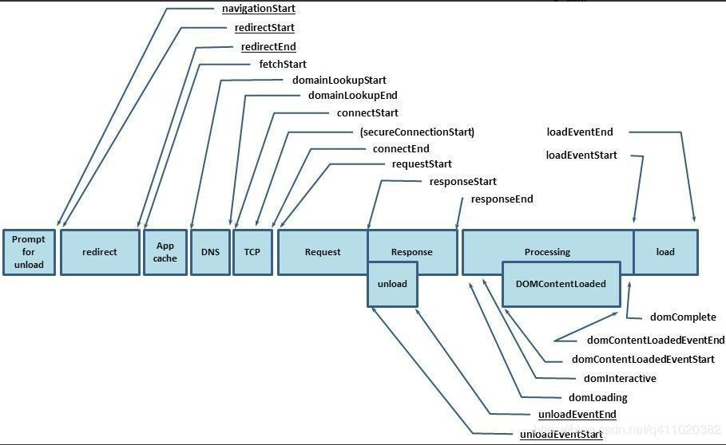
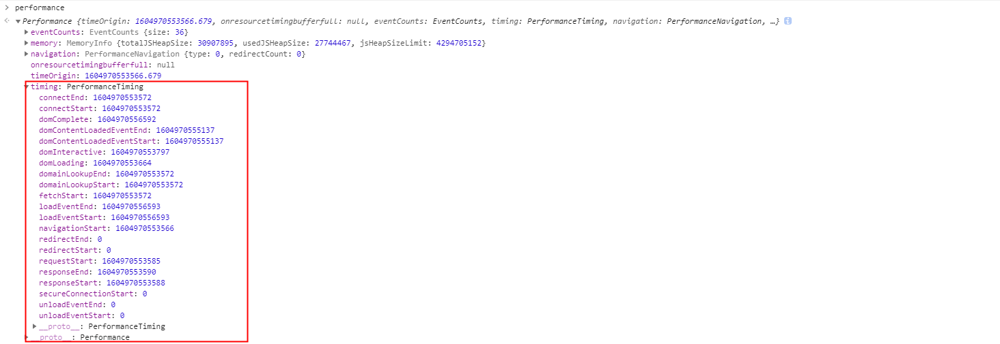
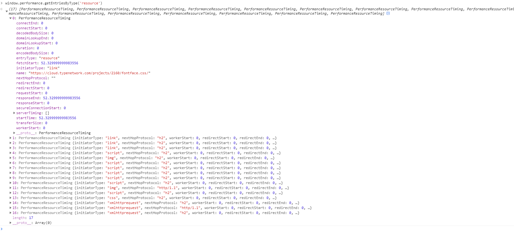

## 前端监控简介

Web承载的业务越来越复杂，用户对于Web的体验要求也越来越高，Web性能的优劣对业务收益也有着非常直接的影响。

前端的开发环境比较复杂，页面在不同浏览器、微信等APP都可能展现不同，用户的网络网速、手机性能等，也会影响页面访问速度。在移动端可能更为明显，移动端用户对页面响应延迟、页面无法使用的容忍度更低。

通常前端建立搭建监控体系，主要是为了监控页面的性能和错误，达到预警和追踪定位问题。因此监控又分为性能监控和错误监控

## 性能监控


性能监控一般利用`window.performance`来进行数据采集。

> Performance 接口可以获取到当前页面中与性能相关的信息。它是 High Resolution Time API 的一部分，同时也融合了 Performance Timeline API、Navigation Timing API、 User Timing API 和 Resource Timing API

这个API的属性 `timing` ，包含了页面加载各个阶段的其实及结束时间


 



```javascript

  timing: {

    // 同一个浏览器上一个页面卸载（unload）结束时的时间戳，如果没有上一个页面，这个值和fetchSatrt的 相同
    navigationStart: 1543806782096,

    // 上一个页面 unload 事件抛出时的 时间戳，如果没有上一个页面，这个值会返回 0
    unloadEventStart: 1543806782523,

    // 和 unloadEventEnd 相对应，unload 事件处理完成时的 时间戳，如果没有上一个页面，这个值会返回0
    unloadEventEnd: 1543806782523,

    // 第一个 http 重定向开始时的时间戳，如果没有重定向，或者重定向中的一个不同源，这个值会返回0
    redirectStart: 0,

    // 最后一个 http 重定向完成时（也就是所时http响应的最后一个比特字节被收到的时间）的时间戳
    // 如果没有重定向，或者重定向中的一个不同源，这个值会返回0
    redirectEnd: 0,

    // 浏览器准备好使用 http请求来获取（fetch）文档的时间戳，这个时间点会在检查任何应用缓存之前
    fetchStart: 1543806782096,

    // DNS 域名查询开始的unxi 时间戳
    // 如果使用了持续连接（persistent connection） ，或者这个信息储存到了缓存或者本地资源上，这个值将和 fetchStart 一样
    domainLookupStart: 1543806782096,

    // DNS 域名查询完成的时间
    // 如果使用了本地缓存（即无DNS查询）或持久连接，则与 fetchStart 值箱灯
    domainLookupEnd: 1543806782096,

    // Http (TCP) 域名查询结束的时间戳
    // 如果使用了持续连接（persistent connection） 或者这个信息储存到缓存或本地子元素行，这个值将和fetchStart 一致
    connectStart: 1543806782099,

    // HTTP（TCP） 返回浏览器与服务器之间的连接建立时的时间戳。
    // 如果建立的是持久连接，则返回值等同于fetchStart属性的值。连接建立指的是所有握手和认证过程全部结束。
    connectEnd: 1543806782227,

    // HTTPS 返回浏览器与服务器开始安全链接的握手时的时间戳。如果当前网页不要求安全连接，则返回0。
    secureConnectionStart: 1543806782162,

    // 返回浏览器向服务器发出HTTP请求时（或开始读取本地缓存时）的时间戳。
    requestStart: 1543806782241,

    // 返回浏览器从服务器收到（或从本地缓存读取）第一个字节时的时间戳。
          //如果传输层在开始请求之后失败并且连接被重开，该属性将会被数制成新的请求的相对应的发起时间。
    responseStart: 1543806782516,

    // 返回浏览器从服务器收到（或从本地缓存读取，或从本地资源读取）最后一个字节时
          //（如果在此之前HTTP连接已经关闭，则返回关闭时）的时间戳。
    responseEnd: 1543806782537,

    // 当前网页DOM结构开始解析时（即Document.readyState属性变为“loading”、相应的 readystatechange事件触发时）的时间戳。
    domLoading: 1543806782573,

    // 当前网页DOM结构结束解析、开始加载内嵌资源时（即Document.readyState属性变为“interactive”、相应的readystatechange事件触发时）的时间戳。
    domInteractive: 1543806783203,

    // 当解析器发送DOMContentLoaded 事件，即所有需要被执行的脚本已经被解析时的时间戳。
    domContentLoadedEventStart: 1543806783203,

    // 当所有需要立即执行的脚本已经被执行（不论执行顺序）时的时间戳。
    domContentLoadedEventEnd: 1543806783216,

    // 当前文档解析完成，即Document.readyState 变为 'complete'且相对应的readystatechange 被触发时的时间戳
    domComplete: 1543806783796,

    // load事件被发送时的时间戳。如果这个事件还未被发送，它的值将会是0。
    loadEventStart: 1543806783796,

    // 当load事件结束，即加载事件完成时的时间戳。如果这个事件还未被发送，或者尚未完成，它的值将会是0.
    loadEventEnd: 1543806783802
  }

```
通过以上数据，我们可以得到几个有用的时间

### 页面性能相关的几个时间

+ 页面重定向耗时

``` javascript
// 重定向耗时
redirect: performance.timing.redirectEnd - performance.timing.redirectStart

```

+ DOM 渲染耗时

``` javascript
// DOM 渲染耗时
dom: performance.timing.domComplete - performance.timing.domLoading,

```

+ 页面加载耗时

``` javascript
// 页面加载耗时
load: performance.timing.loadEventEnd - performance.timing.navigationStart,

```

+ 页面卸载耗时

``` javascript
// 页面卸载耗时
unload: performance.timing.unloadEventEnd - performance.timing.unloadEventStart,

```

+ 请求耗时

``` javascript
// 页面卸载耗时
request: performance.timing.responseEnd - performance.timing.requestStart,

```

+ 获取性能信息时当前时间

``` javascript
// 获取性能信息时当前时间
time: new Date().getTime(),

```

+ 还有一个比较重要的时间就是**白屏时间**，它指从输入网址，到页面开始显示内容的时间

将以下脚本放在`</head>` 前面就能获取白屏时间

```html
<script>
  whiteScreen = new Date() - performance.timing.navigationStart
</script>
```

**通过以上这几个时间，就可以得知页面首屏加载性能如何了**

 另外，通过 `window.performance.getEntriesByType('resource')` 这个方法，我们还可以获取相关资源（js、css、img...）的加载时间，它会返回页面当前所加载的所有资源。



 它一般包括以下几个类型

- script
- link
- img
- css
- fetch
- other
- xmlhttprequest

我们只需要哟个到以下几个信息

```javascript
// 资源的名称
name: item.name

// 资源加载耗时
duration: item.duration.toFixed(2)

// 资源大小
size: item.transferSize,


// 资源所用协议
protocol: item.nextHopProtocol,


```

### 采集这些性能数据的方法

> 获取性能信息

```javascript

const getPerformance = () => {
  if(!window.performance) return
  const {timing} = window.performance
  const performanceTiming = {
    // 重定向耗时
    redirect: timing.redirectEnd - timing.redirectStart,

    // 白屏时间
    whiteScreen: whiteScreen,

    // dom渲染耗时
    dom: timing.domComplete - timing.navigationStart,

    // 页面加载耗时
    load: timing.loadEventEnd - timing.navigationStart,

    // 页面卸载耗时
    unload: timing.unloadEventEnd - timing.unloadEventStart,

    // 请求耗时
    request: timing.responseEnd - timing.requestStart,

    // 获取性能信息时当前时间
    time: new Date().getTime(),

  }

  return performanceTiming

}

```

### 获取资源信息

```javascript

// 获取资源信息
const getResources = () => {
    if (!window.performance) return
    const data = window.performance.getEntriesByType('resource')
    const resource = {
        xmlhttprequest: [],
        css: [],
        other: [],
        script: [],
        img: [],
        link: [],
        fetch: [],
        // 获取资源信息时当前时间
        time: new Date().getTime(),
    }

    data.forEach(item => {
        const arry = resource[item.initiatorType]
        arry && arry.push({
            // 资源的名称
            name: item.name,
            // 资源加载耗时
            duration: item.duration.toFixed(2),
            // 资源大小
            size: item.transferSize,
            // 资源所用协议
            protocol: item.nextHopProtocol,
        })
    })

    return resource
}

```

## 错误监控

前端能捕获到错误有三种

1. 资源加载错误，通过 `addEventListener('error',callback,true)`在捕获阶段捕捉资源加载失败错误
2. js执行错误，通过 `window.onerror`捕捉js错误
3. promise 错误，通过 `addEventListener('unhandledrejection',callback)`捕捉 promise 错误，但是没有发生错误的行数，列数等信息，只能手动抛出相关错误信息


我们可以建一个错误数组变量`errors`在错误发生时，将错误的相关信息添加到数组，然后在某个阶段统一上报，具体如何操作请看代码

```javascript

// 捕获资源加载失败错误  js css img ...
addEventListener('error',e=>{
  const { target } = e
  if(target != window){
    monitor.errors.push({
      type: target.localName,
      url: target.src || target.href,
      msg: (target.src || target.href) + ' is load error',
      // 错误发生时间
      time: new Date().getTime()
    })
  }
},true)


// 监听 js 错误
window.onerror = function(msg,url,row,col,error){
  monitor.errors.push({
    type:'javascript',
    row,
    col,
    msg: error && error.stack ? error.stack : msg,
    url,
    // 错误发生的时间
    time: new Date().getTime()
  })
}


// 监听 promise 错误 缺点时获取不到行数数据
addEventListener('unhandledrejection',e=>{
  minitor.errors.push({
    type:'promise',
    msg:(e.reason && e.reason.msg) || e.reason || '',
    // 错误发生时间
    time: new Date().getTime()
  })
})
```

## 数据上报

性能数据可以在页面加载完成之后上报，尽量不要对页面性能产生影响

```javascript
window.onload = () =>{
  // 在浏览器空闲时间获取性能及资源信息
  if(widnow.requestIdleCallback){
    window.requestIdleCallback(()=>{
      monitor.performance = getPerformance()
      monitor.resources = getResources()
    })
  }else{
    setTimeout(() => {
            monitor.performance = getPerformance()
            monitor.resources = getResources()
        }, 0)
  }
}

```

当然，你也可以设一个定时器，循环上报。不过每次上报最好做一下去重再上报，避免同样的数据重复上报

## 错误数据上报
错误上报可以在用一个 `errors`数组收集所有的错误，再在某一阶段统一上报（延时上报）。其实，也可以改成在错误发生时上报（即时上报）。这样可以避免在收集完错误延时上报还没触发，用户却已经关掉网页导致数据丢失的问题。

```javascript

// 监听 js 错误
window.onerror = function(msg, url, row, col, error) {
    const data = {
        type: 'javascript',
        row: row,
        col: col,
        msg: error && error.stack? error.stack : msg,
        url: url,
        // 错误发生的时间
        time: new Date().getTime(),
    }

    // 即时上报
    axios.post({ url: 'xxx', data, })
}

```

## SPA

`window.performance`API是有缺点的，在SPA 切换路由时，`window.performance.timing`的数据不会更新。所以我们需要另想办法来统计切换路由到加载完成的时间，以Vue为例，一个可行的办法就是切换路由时，在路由的全局前置首位`beforeEach`里获取开始时间，在组件的`mounted`钩子里执行`vm.$nextTick`函数来获取组件的渲染完毕时间。

```javascript

router.beforeEach((to, from, next) => {
	store.commit('setPageLoadedStartTime', new Date())
})

```

```javascript

mounted() {
	this.$nextTick(() => {
		this.$store.commit('setPageLoadedTime', new Date() - this.$store.state.pageLoadedStartTime)
	})
}

```

## 用户信息收集

除了性能监控和错误监控，前端监控还可以用于用户信息收集

### navigator
使用`widnow.navigator`可以收集到用户的设备信息，操作系统，浏览器信息...

`navigator` API 中包含哪些可以搜集的用户信息

```javascript

navigator: {
    // 浏览器是否联网 true-联网 false-未联网
    online: true,

    // 用户信息
    userAgent: "Mozilla/5.0 (Windows NT 10.0; Win64; x64) AppleWebKit/537.36 (KHTML, like Gecko) Chrome/86.0.4240.183 Safari/537.36"
}

```

### UV(Unique visitor)

是指通过互联网访问，浏览这个网页的自然人。访问网站的一台电脑客户端为一个访客。00：00 ~ 24：00 内相同的客户端只被计算一次。一天内同个访客多次访问仅计算一个 `UV`。在用户访问网站时，可以生成一个随机字符串+时间日期，保存在本地。在网页发生请求时（如果超过当天24小时，则重新生成），把这些参数传到后端，后端利用这些信息生成`UV`统计报告。


### PV(Page View)

即页面浏览量或点击量，用户每一次对网站中的每个网页访问均被记录一个`PV`。用户对同一页面的多次访问，访问量累计，用以衡量网站用户访问的网页数量。

### 页面停累时间

**传统网站**用户在进入A页面时，通过后台请求把用户进入页面的时间捎上。过了10分钟，用户进入B页面，这时后台可以通过接口捎带的参数可以判断用户在A页面停留了10分钟。**SPA**可以利用`router`来获取用户停留时间，拿Vue距离，通过` router.beforeEach`、 `destroy`这两个钩子函数来获取用户停留该路由组件的时间。

### 浏览深度

通过`document.documentElement.scrollTop`属性以及屏幕高度，可以判断用户是否浏览完网站内容

### 页面跳转来源

通过`document.referer`属性，可以知道用户是从哪个网站跳转而来


