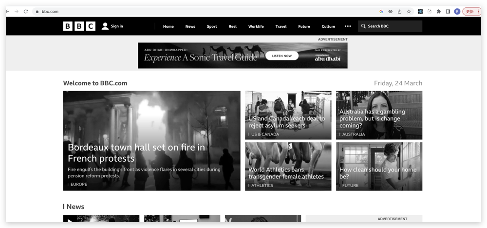

## 1、filter 滤镜

> 灰阶滤镜

```css
html {
  filter: grayscale(1);
}
```



> 阴间滤镜

```css
html {
  filter: grayscale(1);
}
```


## 2、 css 阴影效果

<html lang="en">
<head>
  <meta charset="UTF-8">
  <meta http-equiv="X-UA-Compatible" content="IE=edge">
  <meta name="viewport" content="width=device-width, initial-scale=1.0">
</head>
<style>
  .flex-wrap{width:100%;display:flex;justify-content:space-between;}
  .flex-item2{flex:2;}
  .flex-item{flex:1;}
  .box-shadow{
    box-shadow:0 0 10px red;
  }
  .box-shadow::before{
    box-shadow:0 0 10px red;
  }
  .filter{
    filter:drop-shadow(0 0 10px red)
  }
  .pop-box{
    position:relative;
    font-size:2em;
    line-height:100px;
    padding-left:20px;
    border-radius:5px;
    color:#fff;
    background:skyblue;
  }
  .pop-box::before{
    position:absolute;
    width:0px;
    height:0px;
    border-width:15px;
    border-style:solid;
    border-color:transparent skyblue transparent transparent;
    content:'';
    top:50%;
    left:-15px;
    transform:translate(-50%,-50%);
  }
</style>
<body>
  <div class="flex-wrap">
    <div class="flex-item2">
      <div style="height:50px;"> 给 img标签 添加 box-shadow: 0 0 10px #000;效果如下 </div>
      
    </div>
     <div class="flex-item">
      <div style="height:50px;"> 给 pop-box 添加 box-shadow: 0 0 10px #000;效果如下 </div>
      <div class="pop-box">pop-box</div>
     </div>
  </div>
</body>
</html>

想在图形周边加上一层阴影，这时候不能使用 `box-shadow`,因为 `box-shadow` 是针对盒模型的，而不是针对图像元素

```css
.box-shadow {
  box-shadow: 0 0 10px red;
}
```

<html lang="en">
<head>
  <meta charset="UTF-8">
  <meta http-equiv="X-UA-Compatible" content="IE=edge">
  <meta name="viewport" content="width=device-width, initial-scale=1.0">
</head>
<body>
  <div class="flex-wrap">
    <div class="flex-item2">
      <div style="height:50px;"> 给 img标签 添加 box-shadow: 0 0 10px #000;效果如下 </div>
      
    </div>
     <div class="flex-item">
      <div style="height:50px;"> 给 pop-box 添加 box-shadow: 0 0 10px #000;效果如下 </div>
      <div class="pop-box box-shadow">pop-box</div>
     </div>
  </div>
</body>
</html>

这时候应该使用 filter:drop-shadow(0 0 10px #fff);

```css
.filter {
  filter: drop-shadow(0 0 10px red);
}
```

<html lang="en">
<head>
  <meta charset="UTF-8">
  <meta http-equiv="X-UA-Compatible" content="IE=edge">
  <meta name="viewport" content="width=device-width, initial-scale=1.0">
</head>
<body>
  <div class="flex-wrap">
    <div class="flex-item2">
      <div style="height:50px;"> 给 img标签 添加 box-shadow: 0 0 10px #000;效果如下 </div>
      
    </div>
     <div class="flex-item">
      <div style="height:50px;"> 给 pop-box 添加 box-shadow: 0 0 10px #000;效果如下 </div>
      <div class="pop-box filter">pop-box</div>
     </div>
  </div>
</body>
</html>

## 3、调整文字方向

`writing-mode` 调整文字方向，默认 `horizaontal-tb`横向从左往右书写;设置为 `vertical-rl`即可设置竖向从右往左书写

```css
.poem {
  writing-mode: vertical-rl;
}

.author .year {
  text-orientation: upright;
  text-combine-upright: all;
}
```

<html lang="en">
<head>
  <meta charset="UTF-8">
  <meta http-equiv="X-UA-Compatible" content="IE=edge">
  <meta name="viewport" content="width=device-width, initial-scale=1.0">
</head>
<style>
  .poem{
    color:#333;font-size:1.4em;writing-mode:vertical-rl;
      width:100%;
      overflow:auto;
      line-height:1;
    }
  .author{
    color:#aaa;
    font-size:0.8em;
    text-align:end;
  }
  .author .year{
  text-orientation:upright;
  text-combine-upright:all
}
</style>
<body>
 <div class="poem">
 <h1>寻李白</h1>
 <div class="author">
  <span>余光中</span>
  <span class="year">1928</span>
  <span>~</span>
  <span class="year">2017</span>
 </div>
 <p>——痛饮狂歌空度日 飞扬跋扈为谁雄</p>
<p>那一双傲慢的靴子至今还落在</p>
<p>高力士羞愤的手里，人却不见了</p>
<p>把满地的难民和伤兵</p>
<p>把胡马和羌笛交践的节奏</p>
<p>留给杜二去细细的苦吟</p>
<p>自从那年贺知章眼花了</p>
<p>认你做谪仙，便更加佯狂</p>
<p>用一只中了魔咒的小酒壶</p>
<p>把自己藏起来，连太太也寻不到你</p>
<p>怨长安城小而壶中天长</p>
<p>在所有的诗里你都预言</p>
<p>会突然水遁，或许就在明天</p>
<p>只扁舟破浪，乱发当风</p>
<p>树敌如林，世人皆欲杀</p>
<p>肝硬化怎杀得死你？</p>
<p>酒入豪肠，七分酿成了月光</p>
<p>余下的三分啸成剑气</p>
<p>绣口一吐就半个盛唐</p>
<p>从开元到天宝，从洛阳到咸阳</p>
<p>冠盖满途车骑的嚣闹</p>
<p>不及千年后你的一首</p>
<p>水晶绝句轻叩我额头</p>
<p>当地一弹挑起的回音</p>
<p>一贬世上已经够落魄</p>
<p>再放夜郎母乃太难堪</p>
<p>至今成谜是你的籍贯</p>
<p>陇西或山东，青莲乡或碎叶城</p>
<p>不如归去归哪个故乡？</p>
<p>凡你醉处，你说过，皆非他乡</p>
<p>失踪，是天才唯一的下场</p>
<p>身后事，究竟你遁向何处？</p>
<p>猿啼不住，杜二也苦劝你不住</p>
<p>一回头囚窗下竟已白头</p>
<p>七仙，五友，都救不了你了</p>
<p>匡山给雾锁了，无路可入</p>
<p>仍炉火示纯青，就半粒丹砂</p>
<p>怎追蹑葛洪袖里的流霞？</p>
<p>樽中月影，或许那才是你故乡</p>
<p>常得你一生痴痴地仰望？</p>
<p>而无论出门向西哭，向东哭</p>
<p>长安却早已陷落</p>
<p>二十四万里的归程</p>
<p>也不必惊动大鹏了，也无须招鹤</p>
<p>只消把酒杯向半空一扔</p>
<p>便旋成一只霍霍的飞碟</p>
<p>诡绿的闪光愈转愈快</p>
<p>接你回传说里去</p>
 </div>
</body>
</html>

## 4、单行文本溢出 和 多行文本溢出

- 单行文本溢出

```css
/* 单行文本溢出省略号 */
.oneE {
  width: 300px;
  height: 30px;
  line-height: 30px;
  white-space: nowrap;
  overflow: hidden;
  text-overflow: ellipsis;
}
```

<style>
  .oneE{
    width:300px;
    height:30px;
    line-height:30px;
    white-space:nowrap;
    overflow:hidden;
      text-overflow: ellipsis;
  }
</style>
<div class="oneE">这是一段十个字的文本这是一段十个字的文本这是一段十个字的文本</div>


- 多行文本溢出

```css
 .webkit-box{
    width:300px;
    height:150px;
    line-height:30px;
    overflow:hidden;
    display: -webkit-box;
    -webkit-line-clamp:5; /* 限定行数，超出多少行 为 溢出 */
    -webkit-box-orient:vertical;
  }
```
<style>
  .webkit-box{
    width:300px;
    height:150px;
    line-height:30px;
    overflow:hidden;
    display: -webkit-box;
    -webkit-line-clamp:5; /* 限定行数，超出多少行 为 溢出 */
    -webkit-box-orient:vertical;
  }
</style>
<div class="webkit-box">这是一段十个字的文本这是一段十个字的文本这是一段十个字的文本这是一段十个字的文本这是一段十个字的文本这是一段十个字的文本
这是一段十个字的文本这是一段十个字的文本这是一段十个字的文本这是一段十个字的文本这是一段十个字的文本这是一段十个字的文本这是一段十个字的文本这是一段十个字的文本这是一段十个字的文本这是一段十个字的文本这是一段十个字的文本这是一段十个字的文本这是一段十个字的文本这是一段十个字的文本这是一段十个字的文本这是一段十个字的文本这是一段十个字的文本这是一段十个字的文本这是一段十个字的文本这是一段十个字的文本这是一段十个字的文本</div>


<Vssue title="Vssue Demo" />
