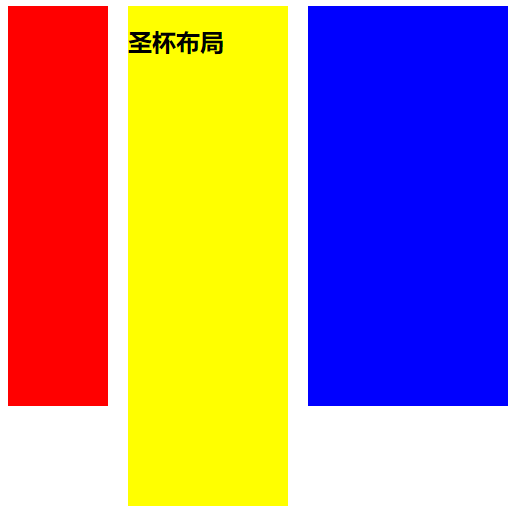
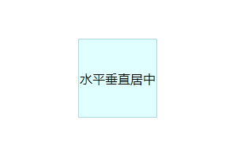

## 绘制三角形

原理：利用border 属性加 transparent(透明) 来完成的

html:

```html
<div class="box1"></div>
```

### 等腰三角形

```css
.box1{
    border-width:100px;
    border-color:skyblue red green yellow
    width:0px;
    height:0px;
    border-style:solid;
  }
```


```css
.box1{
    border-width:100px;
    border-color:skyblue red green yellow
    width:0px;
    height:0px;
    border-style:double;
  }
```


```css
.box1{
    border-width:100px;
    border-color:skyblue red green yellow
    width:0px;
    height:0px;
    border-style:dotted;
  }
```


```css
.box1{
    border-width:100px;
    border-color:skyblue red green yellow
    width:0px;
    height:0px;
    border-style:groove;
  }
```


### 等边

```css
.box1{
    border-width:100px 80px;
    border-color:skyblue transparent transparent transparent;
    width:0px;
    height:0px;
    border-style:groove;
  }
```


##  布局

### 单列布局

>  特征: 定宽，水平居中

- 一种是 header、content、footer 宽度都相同，其一般不会占满浏览器的最大宽度，但会随着浏览器窗口缩小宽度会自适应
- 一种是 header、footer 宽度为浏览器宽度，但是content 版心  以及 header 和 footer里的内容不会沾满全屏

第一种：

html:

```html
<div class="layout">
    <div class="header"></div>
    <div class="content"></div>
    <div class="footer"></div>
</div>
```

css

```css
.layout{
    max-width:960px;
    margin: 0 auto;
}
```

第二种：

html

```html
<div id="header">
  <div class="layout">头部</div>
</div>
<div id="content" class="layout">内容</div>
<div id="footer">
  <div class="layout">尾部</div>
</div>
```

css

```css
.layout{
    max-width:960px;
    margin:0 auto;
}
```

### 两列布局

> 特征： 左右两列，一列固定，一列自适应


html:

```html
<div class="wrap" style="height:100px;">
	<div class=left>left</div>
    <div class="right">right</div>
</div>
```

方案一：浮动

css

```css
    .left{
        width:100px;
        float: left;
        height: 100%;
        background-color: teal;
    }
    .right{
        width:auto;
        margin-left:100px;
        height: 100%;
        background-color: tomato;
    }
```


方案二： flex

css

```css
.wrap{
    display:flex;
}
.left{
    flex: 0 0 100px;
    background-color: teal;
}
.right{
    flex: auto;
    background-color: tomato;
}
```

方案三：position

css

```css
.wrap{
    position:relative;
}
.left{
    position:absolute;
    width:100px;
    height:100%;
    background-color: teal;
}
.right{
    margin-left:100px;
    height:100%;
    background-color: tomato;
}
```

方案四：grid 布局

```css
.wrap{
    display:grid;
    grid-template-columns:100px auto;	// 定义每一列的宽度
    grid-template-rows:100%;		// 定义每一行的高度
}
```

### 三列布局

> 特征：中间列自适应宽度，旁边两侧固定宽度


html:

```html
<div class="wrap">
    <div class="left">left</div>
    <div class="middle">middle</div>
    <div class="right">ight</div>
</div>
```


方案一：position + margin

```css
   .wrap {
        width: 500px;
        height: 100px;
        position: relative;
        text-align: center;
    }

    .left {
        background-color: teal;
        position: absolute;
        width: 100px;
        height: 100%;
    }

    .middle {
        background-color: turquoise;
        margin: 0 200px 0 100px;
        height: 100%;
    }

    .right {
        background-color: yellowgreen;
        position: absolute;
        width: 200px;
        top: 0px;
        right: 0px;
        height: 100%;
    }
```

方案二： 浮动原理

```css
     .wrap {
        width: 500px;
        height: 100px;
        text-align: center;
    }

    .left {
        background-color: teal;
        float:left;
        width:100px;
        height:100%;
    }

    .middle {
        background-color: turquoise;
        float: left;
        height:100%;
        width: calc(100% - 300px);
    }

    .right {
        background-color: yellowgreen;
        float:right;
        width:200px;
        height:100%;
    }
```

方案三： flex 布局

```css
.wrap {
        width: 500px;
        height: 100px;
        text-align: center;
    	display:flex;
    }

    .left {
        background-color: teal;
        flex:0 0 100px;
    }

    .middle {
        background-color: turquoise;
        flex:auto;
    }

    .right {
        background-color: yellowgreen;
        flex:0 0 200px;
    }
```

方案四： grid 布局

```css
	.wrap {
        width: 500px;
        height: 100px;
        text-align: center;
    	display:grid;
    	grid-template-columns:100px auto 200px;
    	grid-template-rows:100%
    }


    .left {
        background-color: teal;
 
    }

    .middle {
        background-color: turquoise;

    }

    .right {
        background-color: yellowgreen;
    }

```

### 圣杯布局

> 特征：特殊的三列布局，同样也是两边宽度固定，中间自适应，唯一区别是 dom 结构必须是先写中间列部分，这样实现中间列可以有限加载



html

```html
 <article class="container">
     <div class="center">
         <h2>圣杯布局</h2>
     </div>
     <div class="left"></div>
     <div class="right"></div>
 </article>
```

具体实现：

- 让左右浮动在一行显示，相对定位
- 中间模块宽度为 100%
- 左右模块分别移动到中间模块的前后
- 父容器设置 内间距 padding 将内容区填充挤到中间

```css
 .container {
    padding-left: 120px;
    padding-right: 220px;
    width: 500px;
    box-sizing: border-box;
  }
  .left {
    float: left;
    width: 100px;
    height: 400px;
    background: red;
    margin-left: -100%;
    position: relative;
    left: -120px;
  }
  .center {
    float: left;
    width: 100%;
    height: 500px;
    background: yellow;
  }
  .right {
    float: left;
    width: 200px;
    height: 400px;
    background: blue;
    margin-left: -200px;
    position: relative;
    right: -220px;
  }

```

### 双飞翼布局

> 特征： 也是三列布局，在圣杯布局的基础上进一步优化，解决了圣杯布局错乱的问题，实现了内容与布局的分离，而且任何一列都可以是最高列，不会出问题

  

html

```html
<div class="main">
    <div class="middle">
			<div class="middle-inner">中间</div>
    </div>
    <div class="left">左边</div>
    <div class="right">右边</div>
</div>
```

```css
.main>div { 
    float:left;
    position: relative;
    height: 300px; 
}
.middle { 
    width: 100%;
    background-color: lightgreen 
}
.left { 
   width:200px;
   margin-left:-100%;
   background-color:#b0f9c2 
}
.right { 
   width: 200px;
   margin-left:-200px;
   background-color:pink 
}
.middle-inner{
   margin:0 200px; 
   background-color: burlywood; 
   height:300px;
}


```

## 水平垂直居中

> 让一个盒子 在 父容器中水平垂直居中



公共部分：

```html
<div class="wrap">
    <div class="center">水平处置居中</div>
</div>

<style>
    .wrap{
        width:100vw;
        height:100vh;
        overflow:hidden;
    }
    .center{
        box-sizing:border-box;
        width:100px;
        height:100px;
        line-height:100px;
        text-align:center;
        font-size:16px;
        border:1px solid lightblue;
        background:lightcyan;
    }
</style>
```

方案一：定位

```css
.wrap{
    position:relative;
}

/*定位 + 负外间距*/
.center{
    position:absolue;
    left:50%;
    top:50%;
    margin-left:-50px;
    margin-top:-50px;
}

 .center{
     position: absolute;
     left: 0;
     top: 0;
     right: 0;
     bottom: 0;
     margin: auto;
}

/*定位 + translate*/
.center{
    position:absolue;
    left:50%;
    top:50%;
    transform:translate(-50%,-50%);
}
```

方案二： flex

```css
.wrap{
    display:flex;
    justify-content: center;
    align-items:center;
}
```

方案三：table-cell

```css
.wrap{
    display:table-cell;
    vertical-align:middle;
    text-align:center;
}
.center{
    display:inline-block;
}

.wrap{
    display:table-cell;
    vertical-align:middle;
}
.center{
    margin: auto;
}
```

方案四：grid

```css
.wrap{
    display:grid;
    place-items:center center;
}
```

## 区别链接样式

为了更容易知道链接的目标，有时你想让一些链接看起来和其它的不同。下面的代码在文本链接前添加一个图标，对不同的资源加以区分

```css
a[href^="http://"]{
    padding-right:20px;
    background:url(external.gif) no-repeat center center;
}

/*email*/
a[href^="mailto:"]{
    padding-right:20px;
    background:url(email.png) center center no-repeat;
}

/*pdf*/
a[href$=".pdf"]{
    padding-right:20px;
    background:url(pdf.png) center center no-repeat;
}
```

## 背景渐变动画

```html
<div class="button"></div>

<style>
    .button{
        width:150px;
        height:50px;
        
        background-image:linear-gradient(#5187c4,#1c2f45);
        background-size: auto 200%;
        background-position:0 100%;
        transition:background-position 0.5s;
    }
    .button:hover{
        background-position:0 0;
    }
</style>
```

## 模糊文本

```html
<div class="text">模糊文本模糊文本</div>

<style>
    .text{
        color:transparent;
        text-shadow:0 0 5px rgba(0,0,0,.5)
    }
</style>
```

## 省略号动画

```html
<div class="text">
    省略号动画省略号动画省略号动画省略号动画省略号动画省略号动画省略号动画省略号动画省略号动画省略号动画省略号动画
</div>

<style>
	.text:after {
        overflow: hidden;
        display: inline-block;
        vertical-align: bottom;
        animation: ellipsis 2s infinite;
        content: "\2026"; /* ascii code for the ellipsis character */
    }
    @keyframes ellipsis {
        from {
            width: 2px;
        }
        to {
            width: 15px;
        }
    }
</style>
```

## css 清除浮动

方案一：

```css
.clearfix:after{
    content:"";
    display:block;
    width:0;
    height:0;
    clear:both;
}
```

方案二：

```css
.clearfix:before,.container:after{
    content:"";
    display:table;
}
.clear:after{
	clear:both;
}
.clearfix{
    zoom:1;
}
```

## 跨浏览器的透明度

```css
.transparent{
    filter:alpha(opacity=50);		/* internet explorer */
    -khtml-opacity:0.5;				/* khtml, old safari */
    -moz-opacity:0.5;			  	/* mozilla, netscape */
    opacity:0.5;				    /* fx, safari, opera */
}
```

## 通用媒体查询

```css
/* Smartphones (portrait and landscape) ----------- */
@media only screen 
and (min-device-width : 320px) and (max-device-width : 480px) {
  /* Styles */
}
/* Smartphones (landscape) ----------- */
@media only screen and (min-width : 321px) {
  /* Styles */
}
/* Smartphones (portrait) ----------- */
@media only screen and (max-width : 320px) {
  /* Styles */
}
/* iPads (portrait and landscape) ----------- */
@media only screen and (min-device-width : 768px) and (max-device-width : 1024px) {
  /* Styles */
}
/* iPads (landscape) ----------- */
@media only screen and (min-device-width : 768px) and (max-device-width : 1024px) and (orientation : landscape) {
  /* Styles */
}
/* iPads (portrait) ----------- */
@media only screen and (min-device-width : 768px) and (max-device-width : 1024px) and (orientation : portrait) {
  /* Styles */
}
/* Desktops and laptops ----------- */
@media only screen and (min-width : 1224px) {
  /* Styles */
}
/* Large screens ----------- */
@media only screen and (min-width : 1824px) {
  /* Styles */
}
/* iPhone 4 ----------- */
@media only screen and (-webkit-min-device-pixel-ratio:1.5), only screen and (min-device-pixel-ratio:1.5) {
  /* Styles */
}
```

## 自定义文本选择

```css
::selection { background:#e2eae2;}
::-moz-selection { background: #e2eae2; }
::-webkit-selection { background: #e2eae2; }
```

