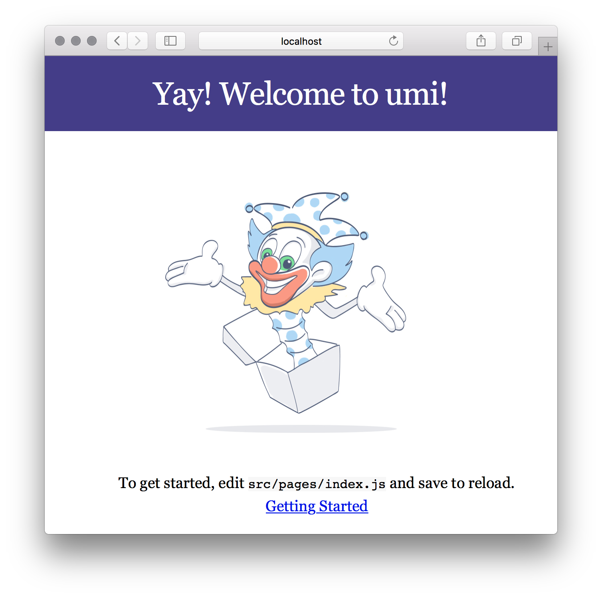

# umi

umi，中文可发音为乌米，是一个可插拔的企业级 react 应用框架。umi 以路由为基础的，支持[类 next.js 的约定式路由](https://umijs.org/zh/guide/router.html)，以及各种进阶的路由功能，并以此进行功能扩展，比如[支持路由级的按需加载](https://umijs.org/zh/plugin/umi-plugin-react.html#dynamicimport)。然后配以完善的[插件体系](https://umijs.org/zh/plugin/)，覆盖从源码到构建产物的每个生命周期，支持各种功能扩展和业务需求，目前内外部加起来已有 50+ 的插件。

umi 是蚂蚁金服的底层前端框架，已直接或间接地服务了 600+ 应用，包括 java、node、H5 无线、离线（Hybrid）应用、纯前端 assets 应用、CMS 应用等。


## 简单使用 

>  环境准备： node 版本必须 8.10 以上

1. 全局安装 umi, 推荐使用 yarn 管理 npm 依赖 

```shell
npm i yarn tyarn -g

yarn global add umi

# or

npm i umi -g

umi -v
```

>  FAQ：如果提示 **umi: command not found**，你需要将 `yarn global bin` 路径配置到环境变量中，方法如下： 

```shell
# mac 系统:
$ sudo vi ~/.bash_profile
# 在 .bash_profile 中添加下面一行：
export PATH="$PATH:`yarn global bin`"

# windows系统:
# 获取 global bin 的路径
$ yarn global bin
C:\Users\Administrator\AppData\Local\Yarn\bin
# 复制上面的 global bin 的路径，添加到系统环境变量 PATH。
```

2. 脚手架

先找个地方建个空目录

```shell
$ mkdir myapp && cd myapp
```

### 通过 `umi g` 创建一些页面，

```bash
$ umi g page index
$ umi g page users
```

> `umi g` 是 `umi generate` 的别名，可用于快速生成 component、page、layout 等，并且可在插件里被扩展，比如 umi-plugin-dva 里扩展了 dva:model，然后就可以通过 `umi g dva:model foo` 快速 dva 的 model。

启动本地服务器

```sh
$ umi dev
```

### 通过脚手架创建项目

```sh
$ mkdir myapp
$ cd myapp
$ yarn create umi
```

>  FAQ：如果提示 **create-umi 命令不存在**，你需要执行 `yarn global bin`，然后把 global bin 的路径添加到环境变量 `PATH` 中。 

选择 app project

```sh
? Select the boilerplate type (Use arrow keys)
  ant-design-pro  - Create project with an layout-only ant-design-pro boilerplate, use together with umi block.
❯ app             - Create project with a simple boilerplate, support typescript.
  block           - Create a umi block.
  library         - Create a library with umi.
  plugin          - Create a umi plugin.
```

 选择是否使用 TypeScript， 

```sh
? Do you want to use typescript? (y/N)
```

 然后，选择你需要的功能，功能介绍详见 [plugin/umi-plugin-react](https://umijs.org/zh/plugin/umi-plugin-react.html)， 

```sh
? What functionality do you want to enable? (Press <space> to select, <a> to toggle all, <i> to invert selection)
❯◯ antd
 ◯ dva
 ◯ code splitting
 ◯ dll
```

 确定后，会根据你的选择自动创建好目录和文件， 

```shell
   create package.json
   create .gitignore
   create .editorconfig
   create .env
   create .eslintrc
   create .prettierignore
   create .prettierrc
   create .umirc.js
   create mock/.gitkeep
   create src/app.js
   create src/assets/yay.jpg
   create src/global.css
   create src/layouts/index.css
   create src/layouts/index.js
   create src/models/.gitkeep
   create src/pages/index.css
   create src/pages/index.js
   create webpack.config.js
✨  File Generate Done
✨  Done in 161.20s.
```

 然后安装依赖， 

```sh
$ yarn
```

最后通过 `yarn start` 启动本地开发，

```bash
$ yarn start
```

如果顺利，在浏览器打开 [http://localhost:8000](http://localhost:8000/) 可看到以下界面，

  