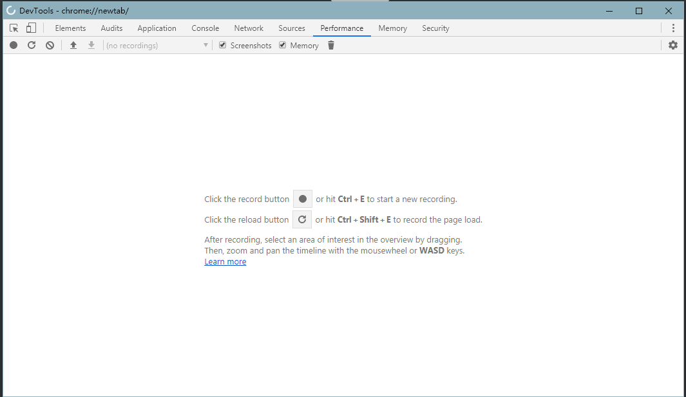
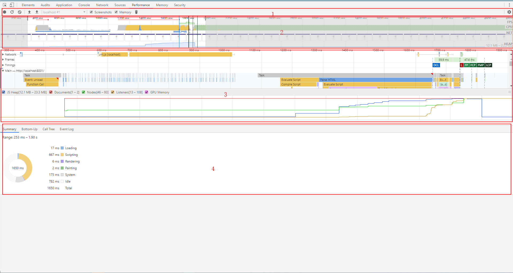
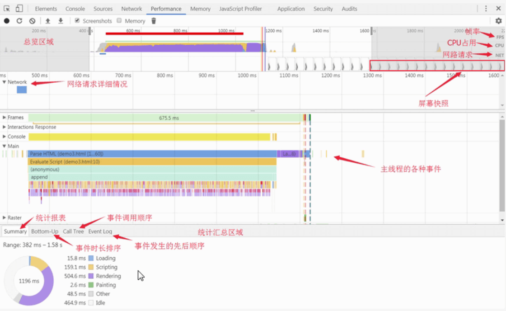

# chorme 开发者工具 performance

 Chrome DevTools的performance面板可以记录和分析页面在运行时的所有活动 ,可以利用它来对页面进行 性能分析

## 简单使用

使用快捷键 ctrl+shift+n 可以快速调出该面板

使用 ctrl + shift+e 可重新载入当前页面进行性能分析

使用 ctrl + e 开始 新的 记录和分析

进行页面性能分析时最好使用浏览器的匿名模式（无痕模式）

## 面板介绍

从上到下分别位4个区域

1. 工具栏，包含录制，刷新页面分析，清除结果等一系列操作
2. overview总览图，高度概括随时间线的变动，包含FPS,CPU,NET
3. 火焰图，从不同的角度分析框选区域。例如：Network,Frames,Interactions,Main等
4. 总结区域，精确到毫秒级的分析，以及按调用层级，事件分类的整理

  

###  Overview 

 Overview  窗口 包含以下三个图标

1. FPS 每秒帧数，绿色竖线越高,FPS越高，FPS图表上的红色块表示长时间帧，很可能会出现卡顿，需要优化的地方
2. CPU CPU资源，此面积图表示消耗 CPU 资源的事件类型
3. NET 每条彩色横杠表示一种资源。横杠越长，检索资源所需的时间越长，每个横杠的浅色部分表示等待时间（从请求资源到第一个子节下载完成的时间）

可以放大显示一部分记录，以便简化分析。使用 Overview 窗格可以放大显示一部分记录。 放大后，火焰图会自动缩放以匹配同一部分

　　选择部分后，可以使用 W、A、S 和 D 键调整您的选择。 W 和 S 分别代表放大和缩小。 A 和 D 分别代表左移和右移

### 火焰图

　在火焰图上看到一到三条垂直的虚线。蓝线代表 DOMContentLoaded 事件。 绿线代表首次绘制的时间。 红线代表 load 事件

　　在火焰图中选择事件时，Details 窗格会显示与事件相关的其他信息

###  总结区域 

蓝色(Loading)：网络通信和HTML解析
黄色(Scripting)：JavaScript执行
紫色(Rendering)：样式计算和布局，即重排
绿色(Painting)：重绘
灰色(other)：其它事件花费的时间
白色(Idle)：空闲时间 

<Vssue title="Vssue Demo" />