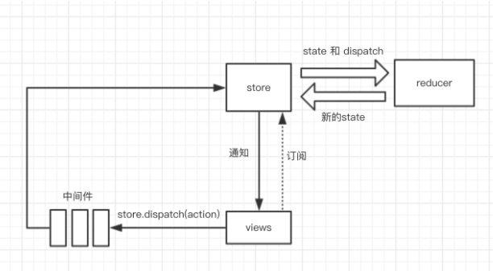
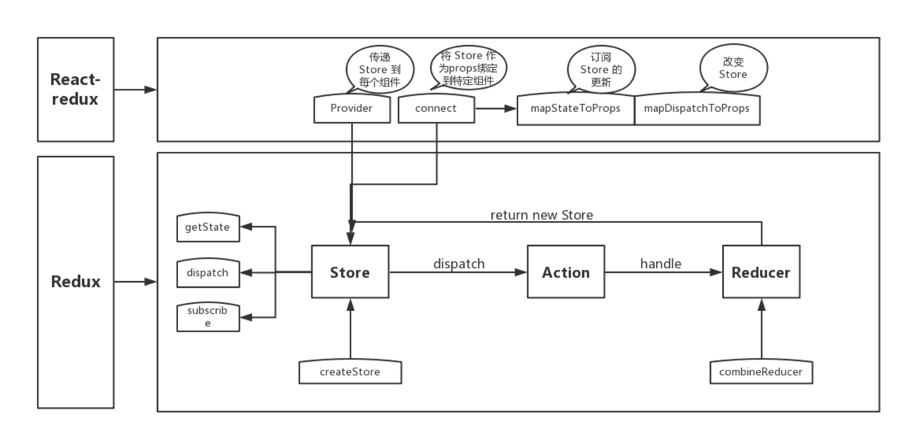

## React 最新的生命周期是怎样的？

React 16 之后有三个生命周期被废弃（但并未被删除）

- componentWillMount
- componentWillReceiveProps
- componentWillUpdate

官方计划在 17 版本 完全删除这三个函数，只保留 UNSAVE_ 前缀的三个函数，目的是为了向下兼容，但是对于开发者而言应该尽量避免使用它们，而是使用新增的生命周期函数替代它们

目前React 16.8 的生命周期分为 三个阶段，分别是挂载阶段、更新阶段、卸载阶段

挂载阶段：

| 生命周期函数                    | 描述或用途                                                   |
| ------------------------------- | ------------------------------------------------------------ |
| constructor                     | 在 React 组件挂载之前，会调用它的构造函数;通常在react中，构造函数仅用于两种场景：1 -  通过 `this.state` 赋值对象来初始化内部 state;  2 - 为事件处理函数绑定实例 |
| static getDerivedStateFromProps | 静态方法，`static getDerivedStateFromProps(nextProps, prevState)` 会在调用 render  方法之前调用，并且在初始挂载及后续更新时都会被调用, 当我们接收到新的属性象去修改 state时，可以使用此方法 |
| render                          | 是class 组件中唯一必须实现的方法，返回需要渲染的东西，不应该包含其它的业务逻辑，可以返回原生的DOM、React组件、Fragment、Portals、字符串和数字、Boolean 和 null 等内容 |
| componentDidMount               | 会在组件挂载后（插入Dom树中）立即调用，如果有依赖于Dom节点的初始化操作应该仿佛在这里。比如对canvas，svg的操作，服务器请求，订阅都可以写在这个里面，但是记得在componentWillUnmount中取消订阅。 |
| UNSAFE_componentWillMount()     | 在挂载之前被调用。它在 `render()` 之前调用，因此在此方法中同步调用 `setState()` 不会触发额外渲染。 |

更新阶段

| static getDerivedStateFromProps  | 此方法在更新个挂载阶段都可能会调用                           |
| -------------------------------- | ------------------------------------------------------------ |
| shouldComponentUpdated           | `shouldComponentUpdate(nextProps, nextState)` 有两个参数nextProps和nextState,表示新的属性和变化之后的state,返回一个布尔值，true表示会触发重新渲染，false表示不会触发重新渲染，默认返回true,我们通常利用此声明周期来优化 React 程序性能 |
| render                           | 更新阶段也会触发此渲染函数                                   |
| getSnapshotBeforeUpdate          | `getSnapshotBeforeUpdate(prevProps, prevState)` 这个方法在 render 之后，componentDidUpdate 之前调用，有两个参数 prevProps和prevState，表示之前的属性和之前的state,这个函数有一个返回值，会作为第三个参数传给componentDidUpdate,如果你不想要返回值，可以返回null,此声明周期必须与 componentDidUpdate 搭配使用 |
| componentDidUpdate               | `componentDidUpdate(prevProps, prevState, snapshot)`该方法在 getSnapshotBeforeUpdate 方法之后被调用，有三个参数prevProps，prevState,snapshot，表示之前的props ，之前的state,和snapshot。 第三个参数是 getSnapshotBeforeUpdate 返回的，如果触发某些回调函数时需要用到Dom 元素的状态，则将对比或计算的过程迁移至 getSnapshotBeforeUpdate ，然后在 componentDidUpdate 中统一触发回调或更新状态 |
| UNSAFE_componentWillUpdate       | 当组件收到新的 props 或 state 时，会在 render 之前调用，使用此方法作为在更新发生之前执行准备更新的机会 |
| UNSAFE_componentWillReceiveProps | 会在已挂载的组件接收新的props 之前被调用。如果你需要更新状态以响应prop更改（如重置它）,你可以比较`this.props`和`nextProps`并在此方法中使用 `this.setState`执行 state转换 |

卸载阶段

| componentWillUnmount | 当我们的组件被卸载或者销毁了就会调用，我们可以在这个函数里去清楚一些定时器，取消网络请求，清理无效的DOM元素等垃圾清理工作 |
| -------------------- | ------------------------------------------------------------ |
|                      |                                                              |

> 一个查看react生命周期的[网站](http://projects.wojtekmaj.pl/react-lifecycle-methods-diagram/)

## React 的请求应该放在哪个生命周期中？

React 的异步请求到底应该放在哪个生命周期里，有人认为在 `componentWillMount` 中可以提前进行异步请求，避免白屏，其实这个观点是由有问题的

由于Javascript 中异步事件的性质，当您启动API调用时，浏览器会在此期间返回执行其他工作。当React渲染一个组件时，它不会等待componentWillMount 它完成任何事情 - React 继续前进并继续 render, 没有办法“暂停”渲染以等待数据到达。

而且在 `componentWillMount` 请求会有一系列潜在的问题，首先，在服务器渲染时，如果在componentWillMount 里获取数据， fetch data 会执行两次，一次在服务端一次在客户端吗，这造成了多余的请求，其次，在React 16 进行 React Fiber 重写后，`componentWillMount` 可能在一次渲染中多次调用

目前官方推荐的异步请求是在 `componentDidMount` 中进行

如果有特殊需求需要提前请求，也可以在特殊情况下在 constructor 中请求

## setState 到底是异步还是同步？

先给出答案：有时表现出异步，有时表现出同步

- `setState` 只在合成事件和钩子函数中是 异步的，在原生事件 和 setTimeout 中都是同步的
- `setState` 的 "异步" 并不是说内部有异步代码实现，其实本身执行的过程和代码都是同步的，只是合成事件和钩子函数的调用顺序在更新之前，导致在合成事件和钩子函数中没法立马拿到更新后的值，形成了所谓的"异步",当然可以通过第二个参数 `setState(partialState,callback)`的 `callback`拿到更新后的结果
- `setState` 的批量更新优化也是建立在"异步"（合成事件，钩子函数）之上的，在原生事件和 setTimeout 中不会批量更新，在"异步"中如果对同一个值进行多次 `setState` , `setState` 的批量更新策略会对其进行覆盖，去最后一次的执行，如果是同事 `setState`多个不同的值，在更新时会对其进行合并批量更新。

## React 组件通信如何实现？

React组件间通信方式

- 父组件向子组件通讯: 父组件可以向子组件 通过 传 props 的方式，向子组件进行通讯
- 子组件向父组件通讯： props + 回调的方式，父组件向子组件传递 props 进行通信，此 props 为作用域为父组件自身的函数，子组件调用该函数，将子组件想要传递的信息，作为参数，传递到父组件的作用域中
- 兄弟组件通讯：找到这两个兄弟组件共同的父节点，结合上面两种方式由父节点转发信息进行通讯
- 跨层级通讯： `context` 设计目的是为了共享哪些对于一个组件树而言时“全局”的数据，例如当前认证的用户、主题或首选语言，对于跨越多层的全局数据通过 `context` 通讯再适合不过
- 发布订阅模式： 发布者发布事件，订阅者监听事件并作出反应，我们可以通过引入 event模块进行通讯
- 全局状态管理工具： 借助Redux 或者 Mobx 等全局状态管理工具进行通信，这种工具会维护一个全局状态中心 Store，并根据不同的事件产生新的状态

 

 ## React如何进行组件/逻辑 复用

抛开已经被官方弃用的Mixin,组件抽象的技术目前有三种比较主流

- 高阶组件
  + 属性代理
  + 反向继承
- 渲染属性
- react-hooks

## mixin,hoc(高阶组件),render Props 、react-hooks 的优劣如何？

mixin 的缺陷：

- 组件与 mixin 之间存在隐式依赖（Mixin 经常依赖组件的特定方法，但在定义组件时并不知道这种依赖关系）
- 多个 Mixin 之间可能产生冲突（比如定义了相同的state）
- Mixin 倾向于增加更多状态，这降低了应用的可预测性,导致复杂度剧增
- 隐式依赖导致依赖关系不透明，维护成本和理解成本迅速攀升
  + 难以快速理解组件行为，需要全盘了解所有依赖 Mixin 的扩展行为，及其之间的相互影响
  + 组件自身的方法和state 字段不敢轻易删改，因为难以确定有没有 Mixin 依赖他
  + Mixin 也难以维护，因为 Mixin 逻辑最后会被合并到一期，很难搞清楚一个 Mixin 的输入输出

Hoc 相比 Mixin 的优势

- HOC 通过外层组件通过 props 影响内层组件的状态，而不是直接改变其 state，不存在从图和互相干扰，这就降低了耦合度
- 不同于 Mixin 的打平 + 合并，HOC 具有天然的层级结构（组件树结构）,这又降低了复杂度

HOC 的缺陷

- 扩展性限制：Hoc 无法从外部访问子组件的state ，因此无法通过 shouldComponentUpdated 过滤掉不必要的更新，React在 支持 ES6 class 之后提供了 React.PureComponent 来解决这个问题
- Ref 传递问题：Ref 被隔断，后来的 React.forwardRef 来解决这个问题
- Wrapper Hell: Hoc 可能出现多层包裹组件的情况，多层抽象同样增加了复杂度和理解成本
- 命名冲突：如果高阶组件多次嵌套，没有使用命名空间的话会产生冲突，然后覆盖老属性
- 不可见性：Hoc 相当于在原有组件外层再包装一个组件，你压根不知道外层的保障是啥，对于你式黑盒

Render Props 的优点

- 上述HOC 的缺点 Render Props 都可以解决

Render Props 的缺陷

- 使用繁琐: Hoc 使用只需要借助装饰器语法通常一行代码就可以进行复用，Render Props 无法左到如此简单
- 嵌套过深： Render Props 虽然拜托了组件多层嵌套的问题，但是转化为了函数回调的嵌套

React Hooks 优点
- 简洁： React Hooks 解决了 Hoc 和 Render Props 的嵌套问题，更加简洁
- 解耦： React Hooks 可以更方便的把UI 和状态分离，做到更彻底的解耦
- 组合： Hooks 中可以引用另外的Hooks 形成新的 Hooks ，组合变化万千
- 函数友好： React Hooks 为函数组件而生，从而解决了类组件的几大问题：
  + this 指向容易错误
  + 分割在不同生命周期中的逻辑使的代码难以理解和维护
  + 代码复用成本高（高阶组件容易使代码量剧增）

React Hooks 的缺陷
- 额外的学习成本（Functional Component 与 Class Component 之间的困惑）
- 写法上有限制（不能出现在条件 和 循环中），并且写法限制增加了重构成本
- 破坏了 PureComponent、React.memo 浅比较的性能优化效果（为了取最新的Props 和 State,每次 render() 都要重新创建事件处理函数）
- 在闭包场景可能会引用到旧的 state、props 值
- 内部实现上不直观（依赖一份可变的全局状态，不再那么'纯'）
- React.memo 并不能完全替代 shouldComponentUpdate (因为拿不到 state change,只针对 props change)

## redux 的工作流程

首先，我们看下几个核心概念：

- Store: 保存数据的地方，你可以把它看成一个容器，整个应用只能有一个Store
- State: Store 对象包含所有数据，如果想得到某个时刻的数据，就要对 Store 生成快照，这一时刻的数据集合，就叫做 State
- Action: State 的变化，会导致 View 的变化。但是，用户接触不到 State,只能接触到View。所以，State 的变化必须使View 导致的。Action 就是 View 发出的通知，表示 State 应该要发生变化了。
- Action Creator: View 要发送多少种消息，就会有多少种Action.如果都手写，会很麻烦，所以我们顶一个一个函数来生成Action,这个函数就叫 Action Creator.
- Reducer: Store 收到 Action 之后，必须给出一个新的State,这样View 才会发生变化。这种 State 的计算过程就叫做 Reducer。 Reducer 是一个函数，它接受 Action 和 当前 State 作为参数，返回一个新的State。
- dispatch: 是 View 发出 Action 的唯一方法

然后我们过下整个工作流程：

1、首先，用户（通过View）发出 Action,发出方式就用到了 dispatch 方法
2、然后，Store 自动调用 Reducer,并且传入两个参数: 当前State 和 收到的Action,Reducer 会返回新的 State
3、State 一旦有变化，Store 就会调用监听函数，来更新View

到这儿为止，一次用户交互流程结束。可以看到，在整个流程中数据都是单向流动的，这种方式保证了流程的清晰。

 

 ## react-redux 是如何工作的？
  - Provider: Provider 的作用是从最外部封装了整个应用，并向connect 模块传递 store
  - connect: 负责链接 React 和 Redux
    + 获取state: connect 通过 context 获取Provider 中的store,通过 store.getState() 获取整个store tree 上所有state
    + 包装原组件： 将state 和 action 通过 props 的方式传入到原组件内部 wrapWithConnect 返回一个 ReactComponent 对象Connect,
      Connect 重新render 外部传入的原组件 WrapperedComponent,并把 connect 中传入的mapStateToProps，mapDispatchToProps 与组件上原有的props合并后，通过属性的方式传给 WrappedComponent
    + 监听 store tree 变化： connect 缓存了 store tree 中state的状态，通过当前 state 状态和变更前state 状态进行比较，从而确定是否调用`this.setState()`方法触发 Connect 及其子组件的重新渲染

     

## redux 中如何进行异步操作

当然我们可以在  `componentDidMount` 中直接进行请求无需借助redux

但在一定规模的项目中，上述方法很难进行异步流的管理，通常情况下我们会借助redux 的异步中间件进行异步处理

redux 异步流中间件其实有很多，但是档下主流的异步中间件只有两种redux-thunk、redux-saga,当然redux-observable 可能也有资格占据一席之地，其余的异步中间件不管是社区活跃度还是npm 下载了都比较差了

