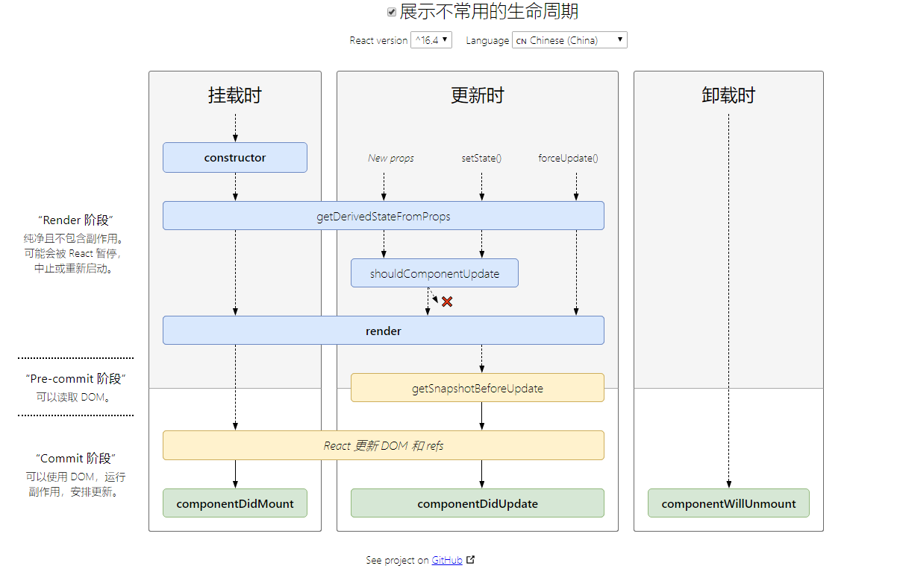
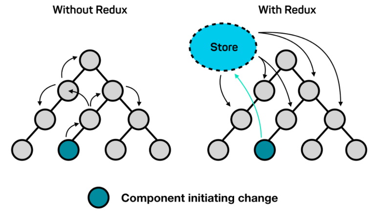

<!--
 * @Author: rh
 * @Description: 这不是一个 bug，这只是一个未列出来的特性
 * @LastEditors: rh
--> 

## React 最新的生命周期是怎样的？

React 16 之后有三个生命周期被废弃（但并未被删除）

- componentWillMount
- componentWillReceiveProps
- componentWillUpdate

官方计划在 17 版本 完全删除这三个函数，只保留 UNSAVE_ 前缀的三个函数，目的是为了向下兼容，但是对于开发者而言应该尽量避免使用它们，而是使用新增的生命周期函数替代它们

目前React 16.8 的生命周期分为 三个阶段，分别是挂载阶段、更新阶段、卸载阶段

挂载阶段：

| 生命周期函数                    | 描述或用途                                                   |
| ------------------------------- | ------------------------------------------------------------ |
| constructor                     | 在 React 组件挂载之前，会调用它的构造函数;通常在react中，构造函数仅用于两种场景：1 -  通过 `this.state` 赋值对象来初始化内部 state;  2 - 为事件处理函数绑定实例 |
| static getDerivedStateFromProps | 静态方法，`static getDerivedStateFromProps(nextProps, prevState)` 会在调用 render  方法之前调用，并且在初始挂载及后续更新时都会被调用, 当我们接收到新的属性象去修改 state时，可以使用此方法 |
| render                          | 是class 组件中唯一必须实现的方法，返回需要渲染的东西，不应该包含其它的业务逻辑，可以返回原生的DOM、React组件、Fragment、Portals、字符串和数字、Boolean 和 null 等内容 |
| componentDidMount               | 会在组件挂载后（插入Dom树中）立即调用，如果有依赖于Dom节点的初始化操作应该仿佛在这里。比如对canvas，svg的操作，服务器请求，订阅都可以写在这个里面，但是记得在componentWillUnmount中取消订阅。 |
| UNSAFE_componentWillMount()     | 在挂载之前被调用。它在 `render()` 之前调用，因此在此方法中同步调用 `setState()` 不会触发额外渲染。 |

更新阶段

| static getDerivedStateFromProps  | 此方法在更新个挂载阶段都可能会调用                           |
| -------------------------------- | ------------------------------------------------------------ |
| shouldComponentUpdated           | `shouldComponentUpdate(nextProps, nextState)` 有两个参数nextProps和nextState,表示新的属性和变化之后的state,返回一个布尔值，true表示会触发重新渲染，false表示不会触发重新渲染，默认返回true,我们通常利用此声明周期来优化 React 程序性能 |
| render                           | 更新阶段也会触发此渲染函数                                   |
| getSnapshotBeforeUpdate          | `getSnapshotBeforeUpdate(prevProps, prevState)` 这个方法在 render 之后，componentDidUpdate 之前调用，有两个参数 prevProps和prevState，表示之前的属性和之前的state,这个函数有一个返回值，会作为第三个参数传给componentDidUpdate,如果你不想要返回值，可以返回null,此声明周期必须与 componentDidUpdate 搭配使用 |
| componentDidUpdate               | `componentDidUpdate(prevProps, prevState, snapshot)`该方法在 getSnapshotBeforeUpdate 方法之后被调用，有三个参数prevProps，prevState,snapshot，表示之前的props ，之前的state,和snapshot。 第三个参数是 getSnapshotBeforeUpdate 返回的，如果触发某些回调函数时需要用到Dom 元素的状态，则将对比或计算的过程迁移至 getSnapshotBeforeUpdate ，然后在 componentDidUpdate 中统一触发回调或更新状态 |
| UNSAFE_componentWillUpdate       | 当组件收到新的 props 或 state 时，会在 render 之前调用，使用此方法作为在更新发生之前执行准备更新的机会 |
| UNSAFE_componentWillReceiveProps | 会在已挂载的组件接收新的props 之前被调用。如果你需要更新状态以响应prop更改（如重置它）,你可以比较`this.props`和`nextProps`并在此方法中使用 `this.setState`执行 state转换 |

卸载阶段

| componentWillUnmount | 当我们的组件被卸载或者销毁了就会调用，我们可以在这个函数里去清楚一些定时器，取消网络请求，清理无效的DOM元素等垃圾清理工作 |
| -------------------- | ------------------------------------------------------------ |
|                      |                                                              |

> 一个查看react生命周期的[网站](http://projects.wojtekmaj.pl/react-lifecycle-methods-diagram/)

## React 的请求应该放在哪个生命周期中？

React 的异步请求到底应该放在哪个生命周期里，有人认为在 `componentWillMount` 中可以提前进行异步请求，避免白屏，其实这个观点是由有问题的

由于Javascript 中异步事件的性质，当您启动API调用时，浏览器会在此期间返回执行其他工作。当React渲染一个组件时，它不会等待componentWillMount 它完成任何事情 - React 继续前进并继续 render, 没有办法“暂停”渲染以等待数据到达。

而且在 `componentWillMount` 请求会有一系列潜在的问题，首先，在服务器渲染时，如果在componentWillMount 里获取数据， fetch data 会执行两次，一次在服务端一次在客户端吗，这造成了多余的请求，其次，在React 16 进行 React Fiber 重写后，`componentWillMount` 可能在一次渲染中多次调用

目前官方推荐的异步请求是在 `componentDidMount` 中进行

如果有特殊需求需要提前请求，也可以在特殊情况下在 constructor 中请求

## setState 到底是异步还是同步？

先给出答案：有时表现出异步，有时表现出同步

- `setState` 只在合成事件和钩子函数中是 异步的，在原生事件 和 setTimeout 中都是同步的
- `setState` 的 "异步" 并不是说内部有异步代码实现，其实本身执行的过程和代码都是同步的，只是合成事件和钩子函数的调用顺序在更新之前，导致在合成事件和钩子函数中没法立马拿到更新后的值，形成了所谓的"异步",当然可以通过第二个参数 `setState(partialState,callback)`的 `callback`拿到更新后的结果
- `setState` 的批量更新优化也是建立在"异步"（合成事件，钩子函数）之上的，在原生事件和 setTimeout 中不会批量更新，在"异步"中如果对同一个值进行多次 `setState` , `setState` 的批量更新策略会对其进行覆盖，去最后一次的执行，如果是同事 `setState`多个不同的值，在更新时会对其进行合并批量更新。

## React 组件通信如何实现？

React组件间通信方式

- 父组件向子组件通讯: 父组件可以向子组件 通过 传 props 的方式，向子组件进行通讯
- 子组件向父组件通讯： props + 回调的方式，父组件向子组件传递 props 进行通信，此 props 为作用域为父组件自身的函数，子组件调用该函数，将子组件想要传递的信息，作为参数，传递到父组件的作用域中
- 兄弟组件通讯：找到这两个兄弟组件共同的父节点，结合上面两种方式由父节点转发信息进行通讯
- 跨层级通讯： `context` 设计目的是为了共享哪些对于一个组件树而言时“全局”的数据，例如当前认证的用户、主题或首选语言，对于跨越多层的全局数据通过 `context` 通讯再适合不过
- 发布订阅模式： 发布者发布事件，订阅者监听事件并作出反应，我们可以通过引入 event模块进行通讯
- 全局状态管理工具： 借助Redux 或者 Mobx 等全局状态管理工具进行通信，这种工具会维护一个全局状态中心 Store，并根据不同的事件产生新的状态

  

 ## 

