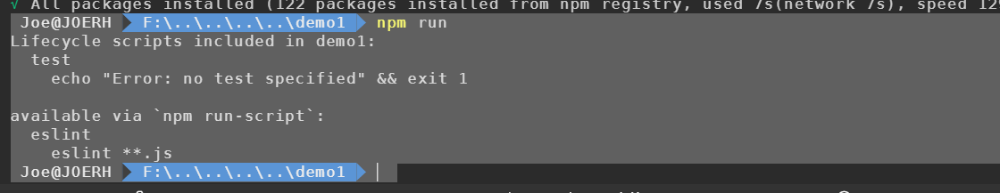
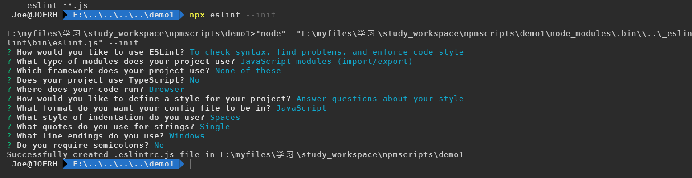
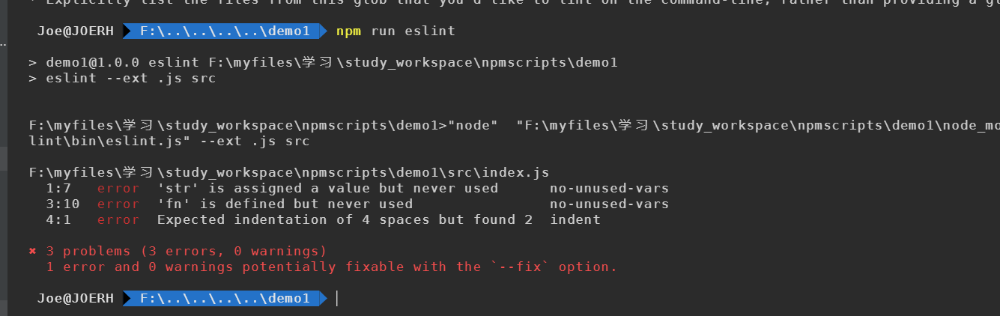

# why npm script?

 npm script 相比 grunt、gulp 之类的构建工具简单很多，因为它消除了这些构建工具所带来的抽象层，并带给我们更大的自由度。随着社区的发展，各种基础工具你都可以信手拈来，只要你会使用 [npmjs.com](https://www.npmjs.com/) 去搜索，或者去 [libraries.io](https://libraries.io/) 上搜索。 


## 初识 npm script

### 用 npm init 快速创建项目

开始探索 npm script 之前，我们先聊聊这些 scripts 所依赖的文件 package.json，以它为基础的 npm 则是 node.js 社区蓬勃发展的顶梁柱。

npm 为我们提供了快速创建 package.json 文件的命令 npm init，执行该命令会问几个基本问题，如包名称、版本号、作者信息、入口文件、仓库地址、许可协议等，多数问题已经提供了默认值，你可以在问题后敲回车接受默认值：

```shell
npm init
```


```js
// package.json

package name: (hello-npm-script)
version: (0.1.0)
description: hello npm script
entry point: (index.js)
test command:
git repository:
keywords: npm, script
license: (MIT)
```

 按回车确认就能把package.json 的内容写到文件系统，如果要修改 package.json，可以直接用编辑器编辑，或者再次运行 npm init，npm 默认不会覆盖修改里面已经存在的信息。 

>  **TIP#1**: 嫌上面的初始化方式太啰嗦？你可以使用 npm init -f（意指 --force，或者使用 --yes）告诉 npm 直接跳过参数问答环节，快速生成 package.json。 

`npm init` 初始化出来的package.json 文件内容是可以 通过命令去修改默认配置的

```
npm config set init.author.email "qiaoxinhen@sina.com"
npm config set init.author.name "rh"
npm config set init.author.url "http://github.com/rh"
npm config set init.license "MIT"
npm config set init.version "0.1.0"
```

### 用 npm run 执行任意命令

 使用 npm init 创建的 package.json 文件中包含了 scripts 字段： 

```json
"scripts": {
  "test": "echo \"Error: no test specified\" && exit 1"
},
```

 在终端中运行 npm run test，能看到 Error: no test specified 的输出。npm run test 可以简写为 npm test，或更简单的 npm t，得到的结果是几乎相同的。 

 和 test 类似，start 也是 npm 内置支持的命令，但是需要先在 scripts 字段中声明该脚本的实际内容，如果没声明就执行 npm start，会直接报错。如下图所示： 

```shell
 Joe@JOERH  F:\..\..\..\..\demo1  npm t

> demo1@1.0.0 test F:\myfiles\学习\study_workspace\npmscripts\demo1
> echo "Error: no test specified" && exit 1

"Error: no test specified"
npm ERR! Test failed.  See above for more details.
 Joe@JOERH  F:\..\..\..\..\demo1  npm start
npm ERR! missing script: start

npm ERR! A complete log of this run can be found in:
npm ERR!     C:\Users\Joe\AppData\Roaming\npm-cache\_logs\2019-12-04T05_44_20_043Z-debug.log
 Joe@JOERH  F:\..\..\..\..\demo1  
```

 那么，npm 是如何管理和执行各种 scripts 的呢？作为 npm 内置的核心功能之一，npm run 实际上是 npm run-script 命令的简写。当我们运行 npm run xxx 时，基本步骤如下： 

1. 从 package.json 文件中读取 scripts 对象里面的全部配置；
2. 以传给 npm run 的第一个参数作为键，本例中为 xxx，在 scripts 对象里面获取对应的值作为接下来要执行的命令，如果没找到直接报错；
3. 在系统默认的 shell 中执行上述命令，系统默认 shell 通常是 bash，windows 环境下可能略有不同，稍后再讲。

 如果不带任何参数执行 npm run，它会列出可执行的所有命令，比如下面这样： 

```shell
Available scripts in the myproject package:
  eslint
    eslint **.js
```

 如果运行 npm run eslint，npm 会在 shell 中运行 eslint **.js。 

 有没有好奇过上面的 eslint 命令是从哪里来的？其实，npm 在执行指定 script 之前会把 node_modules/.bin 加到环境变量 $PATH 的前面，这意味着任何内含可执行文件的 npm 依赖都可以在 npm script 中直接调用，换句话说，你不需要在 npm script 中加上可执行文件的完整路径，比如 `./node_modules/.bin/eslint **.js`。 



### 创建自定义 npm script

以 eslint 为例

再新项目或者任何现有的项目中添加 eslint 自定义脚本的步骤如下

* 准备被检查的代码

```javascript
const str = 'some value'

function fn(){
    console.log('some log')
}
```

- 添加 eslint 依赖

执行安装将 eslint 添加位 devDependencies:

```shell
npm i -D eslint
```

- 初始化 eslint 配置

 用 eslint 做检查需要配置规则集，存放规则集的文件就是配置文件，使用如下文件生成配置文件： 

```shell
npx eslint --init
```

>  **TIP#3**: 把 eslint 安装为项目依赖而非全局命令，项目可移植性更高。 

 在命令行提示中选择 Answer questions about your style，如下图回答几个问题，答案可以根据自己的偏好： 



 回车后根目录下就有了 .eslintrc.js 配置文件： 

```javascript
module.exports = {
    'env': {
        'browser': true,
        'es6': true
    },
    'extends': 'eslint:recommended',
    'globals': {
        'Atomics': 'readonly',
        'SharedArrayBuffer': 'readonly'
    },
    'parserOptions': {
        'ecmaVersion': 2018,
        'sourceType': 'module'
    },
    'rules': {
        'indent': [
            'error',
            4
        ],
        'linebreak-style': [
            'error',
            'windows'
        ],
        'quotes': [
            'error',
            'single'
        ],
        'semi': [
            'error',
            'never'
        ]
    }
}
```

- ###  添加 eslint 命令

 在 package.json 的 scripts 字段中新增命令 eslint： 

```json
{
  "scripts": {
    "eslint": "eslint --ext .js src"
    "test": "echo \"Error: no test specified\" && exit 1"
  },
}
```

 **手动修改 package.json 时一定要注意语法正确。** 

- ### 运行 eslint 命令

 执行 npm run eslint，可以看到，按照官方推荐规则代码里有 3 处不符合规范的地方： 



## 运行 多个 npm script 

现在有一个 前端项目 包含有 js、css、less、scss、json、markdown 等格式的文件， 为保障代码质量，给不同的代码添加检查是很有必要的，代码检查不仅保障代码没有低级的语法错误，还可确保代码都遵守社区的最佳实践和一致的编码风格，在团队协作中尤其有用，即使是个人项目，加上代码检查，也会提高你的效率和质量。 

通常会给前端项目加上下面4种代码检查

- eslint ：可定制的 js 代码检查

- stylelint ：可定制的样式文件检查，支持 css、less、scss

- jsonlint ： json文件语法检查

- markdownlint-cli ： markdown文件检查

  

 需要注意的是，html 代码也应该检查，但是工具支持薄弱，就略过不表。此外，为代码添加必要的单元测试也是质量保障的重要手段，常用的单测技术栈是： 

- [mocha](https://mochajs.org/)，测试用例组织，测试用例运行和结果收集的框架；
- [chai](http://chaijs.com/)，测试断言库，必要的时候可以结合 [sinon](http://sinonjs.org/) 使用；

### 让多个命令 串行？

```json
// package.json

{
  "name": "demo2",
  "version": "1.0.0",
  "description": "",
  "main": "index.js",
  "scripts": {
    "lint:js": "eslint --ext .js src",
    "lint:css": "stylelint .css src",
    "lint:json": "jsonlint --quite false src/test.json",
    "lint:markdown": "markdownlint --config .markdownlint.json .md src",
    "mocha": "mocha --require @babel/register",
    "test": "npm run lint:js && npm run lint:css && npm run lint:json && npm run lint:markdown && npm run mocha"
  },
  "keywords": [],
  "author": "",
  "license": "ISC",
  "devDependencies": {
    "@babel/core": "^7.7.4",
    "@babel/node": "^7.7.4",
    "@babel/preset-env": "^7.7.4",
    "@babel/register": "^7.7.4",
    "chai": "^4.2.0",
    "eslint": "^6.7.2",
    "jsonlint": "latest",
    "markdownlint-cli": "latest",
    "mocha": "^6.2.2",
    "stylelint": "^12.0.0",
    "stylelint-config-standard": "^19.0.0",
    "stylelint-scss": "^3.13.0"
  }
}

```


运行 npm t 命令、

```
 Joe@JOERH  F:\..\..\..\..\demo2  npm t

> demo2@1.0.0 test F:\myfiles\学习\study_workspace\npmscripts\demo2
> npm run lint:js && npm run lint:css && npm run lint:json && npm run lint:markdown && npm run mocha


> demo2@1.0.0 lint:js F:\myfiles\学习\study_workspace\npmscripts\demo2
> eslint --ext .js src


F:\myfiles\学习\study_workspace\npmscripts\demo2>"node"  "F:\myfiles\学习\study_workspace\npmscripts\demo2\node_modules\.bin\\..\_eslint@6.7.2@eslint\bin\eslint.js" --ext .js src

F:\myfiles\学习\study_workspace\npmscripts\demo2\src\index.js
  2:7   error  'str' is assigned a value but never used  no-unused-vars
  4:10  error  'fn' is defined but never used            no-unused-vars
  9:1   error  'module' is not defined                   no-undef

✖ 3 problems (3 errors, 0 warnings)


> demo2@1.0.0 lint:css F:\myfiles\学习\study_workspace\npmscripts\demo2
> stylelint .css src


F:\myfiles\学习\study_workspace\npmscripts\demo2>"node"  "F:\myfiles\学习\study_workspace\npmscripts\demo2\node_modules\.bin\\..\_stylelint@12.0.0@stylelint\bin\stylelint.js" .css src

src/index.scss
 8:5  ×  Unknown word   CssSyntaxError


> demo2@1.0.0 lint:json F:\myfiles\学习\study_workspace\npmscripts\demo2
> jsonlint --quite false src/test.json


F:\myfiles\学习\study_workspace\npmscripts\demo2>"node"  "F:\myfiles\学习\study_workspace\npmscripts\demo2\node_modules\.bin\\..\_jsonlint@1.6.3@jsonlint\lib\cli.js" --quite false src/test.json
{
  "name": "122",
  "age": "21"
}

> demo2@1.0.0 lint:markdown F:\myfiles\学习\study_workspace\npmscripts\demo2
> markdownlint --config .markdownlint.json .md src


F:\myfiles\学习\study_workspace\npmscripts\demo2>"node"  "F:\myfiles\学习\study_workspace\npmscripts\demo2\node_modules\.bin\\..\_markdownlint-cli@0.19.0@markdownlint-cli\markdownlint.js" --config .markdownlint.json .md src
Cannot read or parse config file .markdownlint.json: ENOENT: no such file or directory, open '.markdownlint.json'
src/test.md:1 MD041/first-line-heading/first-line-h1 First line in file should be a top level heading [Context: "## Introduction"]
src/test.md:3 MD013/line-length Line length [Expected: 80; Actual: 265]
src/test.md:6 MD001/heading-increment/header-increment Heading levels should only increment by one level at a time [Expected: h3; Actual: h4]    
src/test.md:8 MD013/line-length Line length [Expected: 80; Actual: 118]
src/test.md:9 MD013/line-length Line length [Expected: 80; Actual: 114]
src/test.md:10 MD013/line-length Line length [Expected: 80; Actual: 108]
src/test.md:12 MD013/line-length Line length [Expected: 80; Actual: 322]
src/test.md:23 MD013/line-length Line length [Expected: 80; Actual: 193]

> demo2@1.0.0 mocha F:\myfiles\学习\study_workspace\npmscripts\demo2
> mocha --require @babel/register


F:\myfiles\学习\study_workspace\npmscripts\demo2>"node"  "F:\myfiles\学习\study_workspace\npmscripts\demo2\node_modules\.bin\\..\_mocha@6.2.2@mocha\bin\mocha" --require @babel/register


  测试index.js
before所有的测试用例
    测试add函数
在本区块的每个测试用例之前
      √ 两个参数相加的和
在本区快的每个测试用例之后
    测试add函数1
在本区块的每个测试用例之前
      √ 两个参数相加的不为和以外的数
在本区快的每个测试用例之后
after所有的测试用例

  demo1测试index.js
before所有的测试用例
    测试add函数
在本区块的每个测试用例之前
      √ 两个参数相加的和
在本区快的每个测试用例之后
    测试add函数1
在本区块的每个测试用例之前
      √ 两个参数相加的不为和以外的数
在本区快的每个测试用例之后
after所有的测试用例

  测试hello.js
    sayhello
      √ should say hello


  5 passing (236ms)

 Joe@JOERH  F:\..\..\..\..\demo2 
```

> **demo 见 demo2**

 需要注意的是，串行执行的时候如果前序命令失败（通常进程退出码非0），后续全部命令都会终止，我们可以尝试在 index.js 中引入错误（删掉行末的分号）： 

** && 或 &  都表示串行**，并且从输出

```
可以看到子命令的执行顺序是严格按照我们在 scripts 中声明的先后顺序来的：

eslint ==> stylelint ==> jsonlint ==> markdownlint ==> mocha
```

但如果前序命令失败，后续命令会继续运行。

### npm-run-all

上面原生方式来运行多条命令很臃肿，可以使用 <font color='red'>`npm-run-all`</font>实现更轻量和简洁的多名了运行

先执行 安装命令将  <font color='red'>`npm-run-all`</font>添加到项目依赖中

```shell
npm i npm-run-all -D
```

然后修改 package.json 实现多命令的串行执行：

```json
  "scripts": {
    "lint:js": "eslint --ext .js src",
    "lint:css": "stylelint .css src",
    "lint:json": "jsonlint --quite false src/test.json",
    "lint:markdown": "markdownlint --config .markdownlint.json .md src",
    "mocha": "mocha --require @babel/register",
    "//": "npm run lint:js && npm run lint:css && npm run lint:json && npm run lint:markdown && npm run mocha",
    "test1": "npm-run-all lint:js lint:css lint:json lint:markdown mocha",
    "test2": "npm-run-all lint:* mocha"
  },
```

## 参数和注释

<Vssue title="Vssue Demo" />