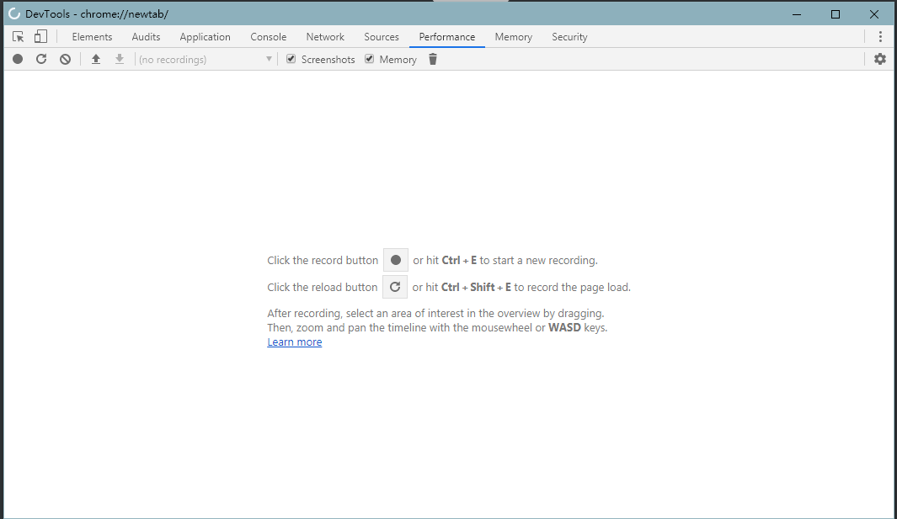
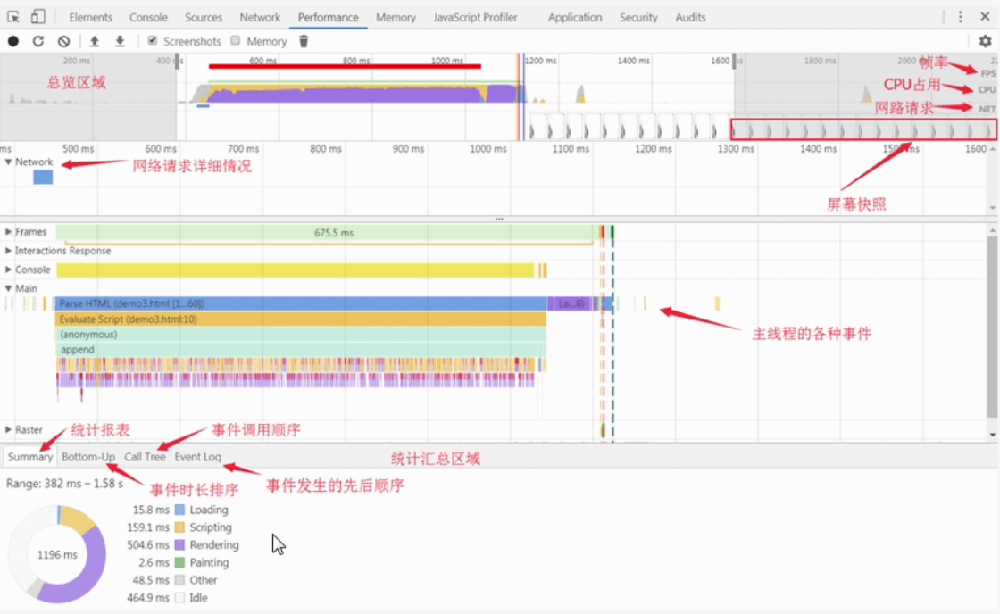

<!--
 * @Author: rh
 * @Description: 这不是一个 bug，这只是一个未列出来的特性
 * @LastEditors: rh
--> 
# chorme 开发者工具 performance

 Chrome DevTools的performance面板可以记录和分析页面在运行时的所有活动 ,可以利用它来对页面进行 性能分析

## 简单使用

使用快捷键 ctrl+shift+n 可以快速调出该面板

使用 ctrl + shift+e 可重新载入当前页面进行性能分析

使用 ctrl + e 开始 新的 记录和分析

进行页面性能分析时最好使用浏览器的匿名模式（无痕模式）

## 面板介绍

从上到下分别位4个区域

1. 工具栏，包含录制，刷新页面分析，清除结果等一系列操作
2. overview总览图，高度概括随时间线的变动，包含FPS,CPU,NET
3. 火焰图，从不同的角度分析框选区域。例如：Network,Frames,Interactions,Main等
4. 总结区域，精确到毫秒级的分析，以及按调用层级，事件分类的整理

  

###  Overview 

 Overview  窗口 包含以下三个图标

1. FPS 每秒帧数，绿色竖线越高,FPS越高，FPS图表上的红色块表示长时间帧，很可能会出现卡顿，需要优化的地方
2. CPU CPU资源，此面积图表示消耗 CPU 资源的事件类型
3. NET 每条彩色横杠表示一种资源。横杠越长，检索资源所需的时间越长，每个横杠的浅色部分表示等待时间（从请求资源到第一个子节下载完成的时间）

可以放大显示一部分记录，以便简化分析。使用 Overview 窗格可以放大显示一部分记录。 放大后，火焰图会自动缩放以匹配同一部分

　　选择部分后，可以使用 W、A、S 和 D 键调整您的选择。 W 和 S 分别代表放大和缩小。 A 和 D 分别代表左移和右移

### 火焰图

　在火焰图上看到一到三条垂直的虚线。蓝线代表 DOMContentLoaded 事件。 绿线代表首次绘制的时间。 红线代表 load 事件

　　在火焰图中选择事件时，Details 窗格会显示与事件相关的其他信息

###  总结区域 

- 蓝色(Loading)：网络通信和HTML解析(浏览器执行其 HTML 解析算法,解析HTML树,遇到script,link,src，等资源就进行下载)
- 黄色(Scripting)：JavaScript执行(浏览器执行 脚本和 js事件)
- 紫色(Rendering)：样式计算和布局，即重排(layout,页面布局,reaalculate style:重新计算元素样式)
- 绿色(Painting)：重绘 (合成的图层被绘制到显示画面的一个区域，渲染引擎合成了图像层)
- 灰色(other)：其它事件花费的时间
- 白色(Idle)：空闲时间 

**loading事件**

- Parse Html: 浏览器执行HTML 解析
- Finish Loading: 网络请求完毕事件
- Receive Data: 请求的响应数据到达事件，如果响应数据很大（拆包）,可能会多次触发该事件
- Receive Response: 响应头报文到达时触发
- send Request: 发送网络请求时触发

**Script事件**

- Animation Frame Fired : 一个定义好的动画帧发生并开始回调处理时触发
- Cancel Animation Frame : 取消一个动画帧时触发
- GC Event: 垃圾回收时触发
- DomContentLoaded : 当页面中的Dom内容加载并解析完毕时触发
- Evaluate Script : A script was evaluated
- Event: js 事件
- Function Call: 只有当浏览器进入到js引擎中时触发
- Install Timer: 创建计时器(调用setTimeout()和setInterval())时触发
- Request Animation Frame: A requestAnimationFrame() call sscheduled a new frame
- Remove Timer: 当清除一个 计时器时触发
- Time: 调用console.time() 触发
- TimeEnd: 调用console.timeEnd() 触发
- Timer Fired : 定时器激活回调后触发
- XHR Ready State Change : 当一个异步请求为就绪状态后触发
- XHR Load : 当一个异步请求完成加载后触发

**Rendering事件**

- Invalidate layout : 当Dom更改导致页面布局失效时触发
- Layout: 页面布局计算执行时触发
- Recalculate style : Chrome重新计算元素样式时触发
- Scroll： 内嵌的视窗滚动时触发

**Painting 事件**

- Composite Layers : Chrome 的渲染引擎完成图片层合并时触发
- Image Decode: 一个图片资源完成解码后触发
- Image Resize: 一个图片被修改尺寸后触发
- Paint : 合并后的层被绘制到对应显示图切后触发

<Vssue title="Vssue Demo" />