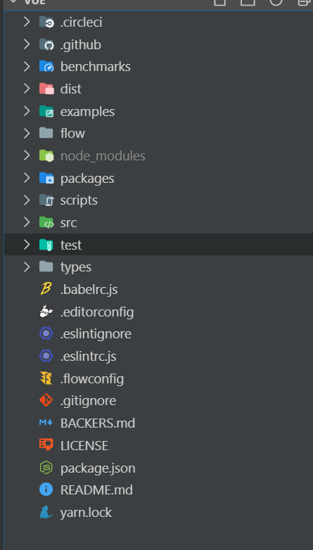

源码的版本 为 2.6.10.

源码的结构为 ：



## 从入口开始

在看源码的时候，首先需要看的 是 项目的 package.json 文件，该文件配置了 vue 的 依赖以及开发环境和生产环境的编译的启动脚本登其它信息。

```js
{ 
  // 项目名称
  "name": "vue", 
  // 选个木版本   
  "version": "2.6.10",
  // 项目描述    有利于 别人 发现你的  包 ,方便 npm search 搜索你的包 ，有同样作用的还有关键字 keywords
  "description": "Reactive, component-oriented view layer for modern web interfaces.",
  // 指定加载的入口文件，require('moduleName') 就会加载这个文件。 默认值为 根目录下面的index.js
  // 定义了 npm 包的入口文件，browser 环境和 node 环境均可使用    
  "main": "dist/vue.runtime.common.js",
  // 定义 npm 包的ESM规范的入口文件，browswr 环境 和 node 环境均可使用
  "module": "dist/vue.runtime.esm.js",
  // npm 上所有的文件都开启 cdn 服务地址    
  "unpkg": "dist/vue.js",
  // jsdeliver cdn 公共库    
  "jsdelivr": "dist/vue.js",
  // typescript 的入口文件    
  "typings": "types/index.d.ts",
  // 当你发布package时，具体那些文件会发布上去    
  "files": [
    "src",
    "dist/*.js",
    "types/*.d.ts"
  ],
  // 声明该模块是否包含 sideEffects（副作用）,从而可以为 tree-shaking 提供更大的优化空间    
  "sideEffects": false,
  "scripts": {
    "dev": "rollup -w -c scripts/config.js --environment TARGET:web-full-dev",
    "dev:cjs": "rollup -w -c scripts/config.js --environment TARGET:web-runtime-cjs-dev",
    "dev:esm": "rollup -w -c scripts/config.js --environment TARGET:web-runtime-esm",
    "dev:test": "karma start test/unit/karma.dev.config.js",
    "dev:ssr": "rollup -w -c scripts/config.js --environment TARGET:web-server-renderer",
    "dev:compiler": "rollup -w -c scripts/config.js --environment TARGET:web-compiler ",
    "dev:weex": "rollup -w -c scripts/config.js --environment TARGET:weex-framework",
    "dev:weex:factory": "rollup -w -c scripts/config.js --environment TARGET:weex-factory",
    "dev:weex:compiler": "rollup -w -c scripts/config.js --environment TARGET:weex-compiler ",
    "build": "node scripts/build.js",
    "build:ssr": "npm run build -- web-runtime-cjs,web-server-renderer",
    "build:weex": "npm run build -- weex",
    "test": "npm run lint && flow check && npm run test:types && npm run test:cover && npm run test:e2e -- --env phantomjs && npm run test:ssr && npm run test:weex",
    "test:unit": "karma start test/unit/karma.unit.config.js",
    "test:cover": "karma start test/unit/karma.cover.config.js",
    "test:e2e": "npm run build -- web-full-prod,web-server-basic-renderer && node test/e2e/runner.js",
    "test:weex": "npm run build:weex && jasmine JASMINE_CONFIG_PATH=test/weex/jasmine.js",
    "test:ssr": "npm run build:ssr && jasmine JASMINE_CONFIG_PATH=test/ssr/jasmine.js",
    "test:sauce": "npm run sauce -- 0 && npm run sauce -- 1 && npm run sauce -- 2",
    "test:types": "tsc -p ./types/test/tsconfig.json",
    "lint": "eslint src scripts test",
    "flow": "flow check",
    "sauce": "karma start test/unit/karma.sauce.config.js",
    "bench:ssr": "npm run build:ssr && node benchmarks/ssr/renderToString.js && node benchmarks/ssr/renderToStream.js",
    "release": "bash scripts/release.sh",
    "release:weex": "bash scripts/release-weex.sh",
    "release:note": "node scripts/gen-release-note.js",
    "commit": "git-cz"
  },
  // 代码质量检查    
  "gitHooks": {
    "pre-commit": "lint-staged",
    "commit-msg": "node scripts/verify-commit-msg.js"
  },
  // 代码规范检查    
  "lint-staged": {
    "*.js": [
      "eslint --fix",
      "git add"
    ]
  },
  // git 仓库所在位置    
  "repository": {
    "type": "git",
    "url": "git+https://github.com/vuejs/vue.git"
  },
  // 关键词    
  "keywords": [
    "vue"
  ],
  // 作者    
  "author": "Evan You",
  // 开源协议    
  "license": "MIT",
  // bug 地址    
  "bugs": {
    "url": "https://github.com/vuejs/vue/issues"
  },
  // 主页    
  "homepage": "https://github.com/vuejs/vue#readme",
  // 依赖    
  //   dependencies字段指定了项目运行所依赖的模块，devDependencies指定项目开发所需要的模块    
  "devDependencies": {
    "@babel/core": "^7.0.0",
    "@babel/plugin-proposal-class-properties": "^7.1.0",
    "@babel/plugin-syntax-dynamic-import": "^7.0.0",
    "@babel/plugin-syntax-jsx": "^7.0.0",
    "@babel/plugin-transform-flow-strip-types": "^7.0.0",
    "@babel/preset-env": "^7.0.0",
    "@babel/register": "^7.0.0",
    "@types/node": "^12.12.0",
    "@types/webpack": "^4.4.22",
    "acorn": "^5.2.1",
    "babel-eslint": "^10.0.1",
    "babel-helper-vue-jsx-merge-props": "^2.0.3",
    "babel-loader": "^8.0.4",
    "babel-plugin-istanbul": "^5.1.0",
    "babel-plugin-transform-vue-jsx": "^4.0.1",
    "babel-preset-flow-vue": "^1.0.0",
    "buble": "^0.19.3",
    "chalk": "^2.3.0",
    "chromedriver": "^2.45.0",
    "codecov": "^3.0.0",
    "commitizen": "^2.9.6",
    "conventional-changelog": "^1.1.3",
    "cross-spawn": "^6.0.5",
    "cz-conventional-changelog": "^2.0.0",
    "de-indent": "^1.0.2",
    "es6-promise": "^4.1.0",
    "escodegen": "^1.8.1",
    "eslint": "^5.7.0",
    "eslint-plugin-flowtype": "^2.34.0",
    "eslint-plugin-jasmine": "^2.8.4",
    "file-loader": "^3.0.1",
    "flow-bin": "^0.61.0",
    "hash-sum": "^1.0.2",
    "he": "^1.1.1",
    "http-server": "^0.11.1",
    "jasmine": "^2.99.0",
    "jasmine-core": "^2.99.0",
    "karma": "^3.1.1",
    "karma-chrome-launcher": "^2.1.1",
    "karma-coverage": "^1.1.1",
    "karma-firefox-launcher": "^1.0.1",
    "karma-jasmine": "^1.1.0",
    "karma-mocha-reporter": "^2.2.3",
    "karma-phantomjs-launcher": "^1.0.4",
    "karma-safari-launcher": "^1.0.0",
    "karma-sauce-launcher": "^2.0.2",
    "karma-sourcemap-loader": "^0.3.7",
    "karma-webpack": "^4.0.0-rc.2",
    "lint-staged": "^8.0.0",
    "lodash": "^4.17.4",
    "lodash.template": "^4.4.0",
    "lodash.uniq": "^4.5.0",
    "lru-cache": "^5.1.1",
    "nightwatch": "^0.9.16",
    "nightwatch-helpers": "^1.2.0",
    "phantomjs-prebuilt": "^2.1.14",
    "puppeteer": "^1.11.0",
    "resolve": "^1.3.3",
    "rollup": "^1.0.0",
    "rollup-plugin-alias": "^1.3.1",
    "rollup-plugin-buble": "^0.19.6",
    "rollup-plugin-commonjs": "^9.2.0",
    "rollup-plugin-flow-no-whitespace": "^1.0.0",
    "rollup-plugin-node-resolve": "^4.0.0",
    "rollup-plugin-replace": "^2.0.0",
    "selenium-server": "^2.53.1",
    "serialize-javascript": "^1.3.0",
    "shelljs": "^0.8.1",
    "terser": "^3.10.2",
    "typescript": "^3.6.4",
    "webpack": "~4.28.4",
    "weex-js-runtime": "^0.23.6",
    "weex-styler": "^0.3.0",
    "yorkie": "^2.0.0"
  },
  // 设置一些用于npm包的脚本命令会用到的配置参数    
  "config": {
    "commitizen": {
      "path": "./node_modules/cz-conventional-changelog"
    }
  }
}

```

<Vssue title="Vssue Demo" />