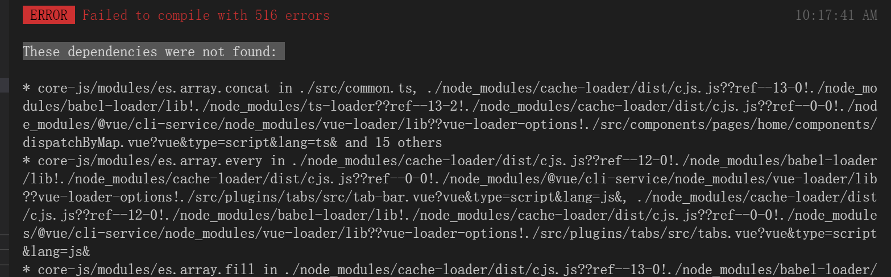

<!--
 * @Author: rh
 * @Description: 这不是一个 bug，这只是一个未列出来的特性
 * @LastEditors: rh
--> 

## vue-cli3 项目升级到 vue-cli4

## 前提: 全局安装最新的Vue Cli

```shell

npm install -g @vue/cli

# Or

yarn global add @vue/cli

```

安装完成后 使用 `vue -V` 命令查看 vue-cli 版本

```shell

vue -V    # 输出 @vue/cli 4.x.x 说明 安装成功

```

## 在vue-cli 3 项目的根目录下执行 

```shell

vue upgrade 

```

按提示升级即可。


## 可能出现的问题以及解决方法

core-js  报错,原因时 vue-cli4 中已推荐使用 core-js3,因此将 core-js 依赖更新至版本3即可


