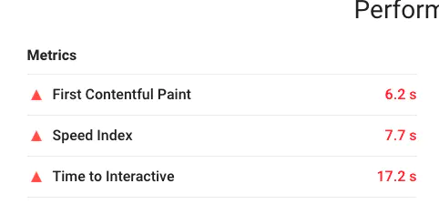
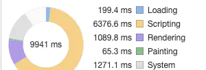
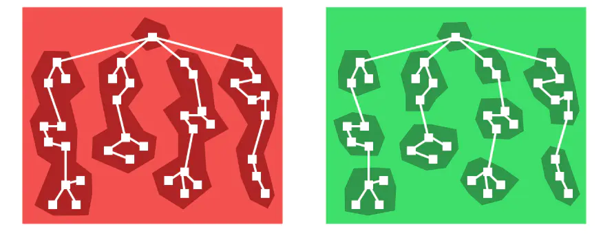
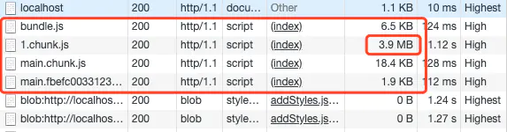
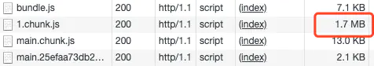
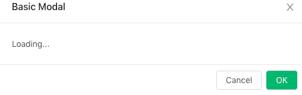

<!--
 * @Author: rh
 * @Description: 这不是一个 bug，这只是一个未列出来的特性
 * @LastEditors: rh
--> 


[此文章是转载自掘金](https://juejin.im/post/5d00820b5188255ee806a1c7#heading-9)

## 性能检测工具

可以使用 [LightHouse](https://chrome.google.com/webstore/detail/lighthouse/blipmdconlkpinefehnmjammfjpmpbjk?hl=zh-CN) chrome 插件来检测一个web应用的性能


通过五个方面得分来分析一个web应用的性能是否优异

- Performance : 性能 
- Accessibility: 辅助功能，友好性
- Best Practices : 最佳实践
- SEO:
- Progressive Web App: 渐进式web应用

### 术语

- FP: 首次绘制（First Paint）
- FCP: 首次内容绘制（First Content Paint）
- FMP: 首次有效绘制
- LCP: 可是去内容最大的可见内容绘制（Largest Contentfunl Paint）
- TTI: 可交互时间（Time to Interactive）
- TTFB: 浏览器接收第一个子节的时间（Time to First Byte）
- FCI: 第一次CPU空闲（First CPU Idle）

    

## Performance 性能

LightHouse 通过六个指标来 计算 performace 性能得分

这六个指标为

- First Contentful Paint: 开始有内容展示时耗时(首次内容绘制)

- First Meaningful Paint: 开始有效内容展示时耗时(首次有效绘制)

- Speed Index: 表示显示页面可见部分的平均时间（注意，是真正的可见，用户可以立马看见的，屏幕外的部分不算），数值越小说明速度越快，它主要用于测量页面内容在视觉上填充的速度。通常会使用这个指标来进行性能的比较。比如优化前和优化后，我们的产品与竞品的性能比较等。但是只能用于 粗略 的比较，不同的产品侧重点完全不同，所以还是需要根据自己产品所侧重的方向，并结合其他指标来进行更详细的对比。

- First Cpu Idle: Cpu 第一次CPU空闲 (是对TTI的一种补充,第一次CPU 空闲,主线程空闲表示可以接收用户的响应了，表示浏览器真正的第一次可以响应用户的输入)

- Time to Interactive: 等到页面可交互耗时(告诉我们页面什么时候完全达到可交互，表示浏览器以及可以持续性的响应用户的输入)

- Max Potential First Input Delay: 最大首次输入最大潜在延迟（用户首次与产品进行交互式，产品可以在多长时间给出反馈）


可以看到 一个web应用的性能跟 首屏加载和  白屏 及js执行有关。
一个网页 的 FCP 和 FMP 分别对应着网页白屏时间和首屏加载内容。而  Speed Index 和 FCI 又与页面渲染速度及执行速度有关。

## 网页白屏和首屏加载

从路由加载到FCP 的耗时，这段时间主要是 资源加载与 浏览器解析HTML,在现代前端应用开发中，我们往往会使用 gulp,webpack,rollup 等打包构建工具来进行打包我们的应用,很多场景下如果不进行优化的话，就会出现很多体积巨大的chunk,有的甚至打包到一个chunk的更可怕,这些体积巨大的chunk就会占用浏览器的下载资源和线程。

由于端口数量和线程切换开销的考虑，浏览器不能无限量的并发请求，再者将所有请求一起发给服务器，也很可能会引发服务器的并发阈值控制而被 BAN，而另外一个控制的原因是 keep alive 技术的存在使得浏览器复用现有连接和服务器通信比创建新连接的性能要更好一些，出于客户端和服务端因素的综合考虑，因此浏览器大多都有并发现之.

以下为各大浏览器并发请求限制的数量（只在同一与域名下有效）

| 浏览器       | HTTP 1.1 | HTTP 1.0 |
| ------------ | -------- | -------- |
| IE 6, 7      | 2        | 4        |
| IE 8, 9      | 6        | 6        |
| Firefox 13   | 6        | 6        |
| Chrome 20    | 6        | ?        |
| Safari 5.1.7 | 6        | ?        |
| Opera 11.64  | 8        | ?        |

因此 体积巨大的chunk 资源 会影响白屏的时间

### 白屏的性能优化

我们先梳理下白屏时间内发生了什么:

1. 回车按下,浏览器解析网址,进行 DNS 查询,查询返回 IP,通过 IP 发出 HTTP(S) 请求
2. 服务器返回HTML,浏览器开始解析 HTML,此时触发请求 js 和 css 资源
3. js 被加载,开始执行 js,调用各种函数创建 DOM 并渲染到根节点,直到第一个可见元素产生

从前端的角度出发，能动手脚的只有后面两步,浏览器在解析HTML的时候 和 js

#### loading 提示

如果是用 webpack 为基础的前端框架工程体系，那么你的index.html 文件一定是这样的:

```html
<!-- index.html -->

<div id="root"></div>

```
我们将打包好的整个代码都渲染到这个root根节点上，而我们如何渲染呢？当然是用javascript 操作各种Dom 渲染，比如 react 肯定是调用各种
`_React_._createElement_()`，这是很耗时的，在此期间虽然html被加载了，但是依然是白屏，这就村的在操作空间，我们可以在js 执行之前加入提示，增加用户体验呢？

是的,我们一般有一款 webpack 插件叫[html-webpack-plugin](https://github.com/jantimon/html-webpack-plugin) ,在其中配置 html 就可以在文件中插入 loading 图。

```javascript
const HtmlWebpackPlugin = require('html-webpack-plugin')
const loading = require('./render-loading') 

module.exports = {
  entry: './src/index.js',
  output: {
    path: __dirname + '/dist',
    filename: 'index_bundle.js'
  },
  plugins: [
    new HtmlWebpackPlugin({
      template: './src/index.html',
      loading: loading
    })
  ]
}
```

```html

 <div id="root">
    <div class="app-loading" style="width:100%;height:100%;text-align:center;display:flex;justify-content:center;align-items:center;">
      
    </div>
  </div>

```
这样加一个提示,当需要渲染dom时，就会自动清空 容器中的内容

#### (伪)服务端渲染 Prerendering
 那么既然在 HTML 加载到 js 执行期间会有时间等待,那么为什么不直接服务端渲染呢?直接返回的 HTML 就是带完整 DOM 结构的,省得还得调用 js 执行各种创建 dom 的工作,不仅如此还对 SEO 友好。
正是有这种需求 vue 和 react 都支持服务端渲染,而相关的框架Nuxt.js、Next.js也大行其道,当然对于已经采用客户端渲染的应用这个成本太高了。

于是有人想到了办法,谷歌开源了一个库Puppeteer,这个库其实是一个无头浏览器,通过这个无头浏览器我们能用代码模拟各种浏览器的操作,比如我们就可以用 node 将 html 保存为 pdf,可以在后端进行模拟点击、提交表单等操作，自然也可以模拟浏览器获取首屏的 HTML 结构。

[prerender-spa-plugin](https://github.com/chrisvfritz/prerender-spa-plugin)就是基于以上原理的插件,此插件在本地模拟浏览器环境,预先执行我们的打包文件,这样通过解析就可以获取首屏的 HTML,在正常环境中,我们就可以返回预先解析好的 HTML 了。

#### 拆包和浏览器缓存
通过浏览器缓存来最大程度的减少HTTP的请求，提升网页资源加载速度

通常情况下我们的 WebApp 是有我们的自身代码和第三方库组成的,我们自身的代码是会常常变动的,而第三方库除非有较大的版本升级,不然是不会变的,所以第三方库和我们的代码需要分开打包,我们可以给第三方库设置一个较长的强缓存时间,这样就不会频繁请求第三方库的代码了。

在webpack应用中，5.x.x版本的webpack 已经可以实现 [code spliting](https://webpack.js.org/guides/code-splitting/)代码分割,在旧版本中，可以使用 [SplitChunksPlugin](https://webpack.docschina.org/plugins/split-chunks-plugin/)插件来支持代码分割，抽取工干模块。

> SplitChunksPlugin 的默认配置如下

``` javascript
module.exports = {
  //...
  optimization: {
    splitChunks: {
      chunks: 'async',  // 分割的代码块类型，提供字符串时有效值为三个：initial-默认 async-动态加载 all-表示在同步和非异步模块之间也可以共享
      minSize: 30000,   //  形成一个新代码块最小的体积
      minRemainingSize: 0,
      maxSize: 0,
      minChunks: 1,   //  最小 chunk ，默认1
      maxAsyncRequests: 6,  // 按需加载时候最大的并行请求数
      maxInitialRequests: 4,  //  最大初始化请求数
      automaticNameDelimiter: '~', // 打包分割符
      cacheGroups: {  // 缓存组会继承splitChunks的配置，但是test、priorty和reuseExistingChunk只能用于配置缓存组。
        defaultVendors: {
          test: /[\\/]node_modules[\\/]/,
          priority: -10
        },
        default: {
          minChunks: 2,
          priority: -20,
          reuseExistingChunk: true
        }
      }
    }
  }
};


```

如果乡愁去第三方库可以这样简单配置

```javascript

   splitChunks: {
      chunks: 'all',   // initial、async和all
      minSize: 30000,   // 形成一个新代码块最小的体积
      maxAsyncRequests: 5,   // 按需加载时候最大的并行请求数
      maxInitialRequests: 3,   // 最大初始化请求数
      automaticNameDelimiter: '~',   // 打包分割符
      name: true,
      cacheGroups: {
        vendor: {
          name: "vendor",
          test: /[\\/]node_modules[\\/]/, //打包第三方库
          chunks: "all",
          priority: 10 // 优先级
        },
        common: { // 打包其余的的公共代码
          minChunks: 2, // 引入两次及以上被打包
          name: 'common', // 分离包的名字
          chunks: 'all',
          priority: 5
        },
      }
    }
```

这样似乎大功告成了?并没有,我们的配置有很大的问题:

我们粗暴得将第三方库一起打包可行吗? 当然是有问题的,因为将第三方库一块打包,只要有一个库我们升级或者引入一个新库,这个 chunk 就会变动,那么这个chunk 的变动性会很高,并不适合长期缓存,还有一点,我们要提高首页加载速度,第一要务是减少首页加载依赖的代码量,请问像 react vue reudx 这种整个应用的基础库我们是首页必须要依赖的之外,像 d3.js three.js这种特定页面才会出现的特殊库是没必要在首屏加载的,所以我们需要将应用基础库和特定依赖的库进行分离。
当 chunk 在强缓存期，但是服务器代码已经变动了我们怎么通知客户端？上面我们的示意图已经看到了，当命中的资源在缓存期内，浏览器是直接读取缓存而不会向服务器确认的，如果这个时候服务器代码已经变动了，怎么办？这个时候我们不能将 index.html 缓存(反正webpack时代的 html 页面小到没有缓存的必要),需要每次引入 script 脚本的时候去服务器更新,并开启 hashchunk,它的作用是当 chunk 发生改变的时候会生成新的 hash 值,如果不变就不发生变动,这样当 index 加载后续 script资源时如果 hashchunk 没变就会命中缓存,如果改变了那么会重新去服务端加载新资源。

下图示意了如何将第三方库进行拆包,基础型的 react 等库与工具性的 lodash 和特定库 Echarts 进行拆分


```javascript

      cacheGroups: {
        reactBase: {
          name: 'reactBase',
          test: (module) => {
              return /react|redux/.test(module.context);
          },
          chunks: 'initial',
          priority: 10,
        },
        utilBase: {
          name: 'utilBase',
          test: (module) => {
              return /rxjs|lodash/.test(module.context);
          },
          chunks: 'initial',
          priority: 9,
        },
        uiBase: {
          name: 'chartBase',
          test: (module) => {
              return /echarts/.test(module.context);
          },
          chunks: 'initial',
          priority: 8,
        },
        commons: {
          name: 'common',
          chunks: 'initial',
          priority: 2,
          minChunks: 2,
        },
      }


```

> 我们对 chunk 进行 hash 化,正如下图所示,我们变动 chunk2 相关的代码后,其它 chunk 都没有变化,只有 chunk2 的 hash 改变了

```javascript

  output: {
    filename: mode === 'production' ? '[name].[chunkhash:8].js' : '[name].js',
    chunkFilename: mode === 'production' ? '[id].[chunkhash:8].chunk.js' : '[id].js',
    path: getPath(config.outputPath)
  }

```

::: tip
webpack hash缓存相关内容建议阅读此[文章](https://github.com/pigcan/blog/issues/9) 作为拓展
:::

### FMP(首次有效加载)

在白屏结束之后,页面开始渲染,但是此时的页面还只是出现个别无意义的元素,比如下拉菜单按钮、或者乱序的元素、导航等等，这些元素虽然是页面的组成部分但是没有意义.什么是有意义?对于搜索引擎用户是完整搜索结果对于微博用户是时间线上的微博内容对于淘宝用户是商品页面的展示

那么在FCP 和 FMP 之间虽然开始绘制页面,但是整个页面是没有意义的,用户依然在焦虑等待,而且这个时候可能出现乱序的元素或者闪烁的元素,很影响体验,此时我们可能需要进行用户体验上的一些优化。Skeleton是一个好方法,Skeleton现在已经很开始被广泛应用了,它的意义在于事先撑开即将渲染的元素,避免闪屏,同时提示用户这要渲染东西了,较少用户焦虑。


在不同框架上都有相应的Skeleton实现
React: antd 内置的骨架图[Skeleton](https://ant.design/components/skeleton-cn/)方案
Vue: [vue-skeleton-webpack-plugin](https://github.com/lavas-project/vue-skeleton-webpack-plugin)

> 以 vue-cli 3 为例,我们可以直接在vue.config.js 中配置

```
//引入插件
const SkeletonWebpackPlugin = require('vue-skeleton-webpack-plugin');

module.exports = {
	// 额外配置参考官方文档
	configureWebpack: (config)=>{
		config.plugins.push(new SkeletonWebpackPlugin({
			webpackConfig: {
				entry: {
					app: path.join(__dirname, './src/Skeleton.js'),
				},
			},
			minimize: true,
			quiet: true,
		}))
	},
	//这个是让骨架屏的css分离，直接作为内联style处理到html里，提高载入速度
	css: {
		extract: true,
		sourceMap: false,
		modules: false
	}
}

```

然后就是基本的 vue 文件编写了,直接看文档即可。

### TTI(可交互时间)

当有意义的内容渲染出来之后,用户会尝试与页面交互,这个时候页面并不是加载完毕了,而是看起来页面加载完毕了,事实上这个时候 JavaScript 脚本依然在密集得执行.

> 我们看到在页面已经基本呈现的情况下,依然有大量的脚本在执行

  


这个时候页面并不是可交互的,直到TTI 的到来,TTI 到来之后用户就可以跟页面进行正常交互的,TTI 一般没有特别精确的测量方法,普遍认为满足**FMP && DOMContentLoader事件触发 && 页面视觉加载85%**这几个条件后,TTI 就算是到来了。

在页面基本呈现到可以交互这段时间,绝大部分的性能消耗都在 JavaScript 的解释和执行上,这个时候决定 JavaScript 解析速度的无非一下两点:

1. Javascript 脚本体积
2. Javascript 本身执行速度

### 使用Tree Shaking （剔除无用代码，缩小提交）

Tree Shaking虽然出现很早了,比如js基础库的事实标准打包工具 rollup 就是Tree Shaking的祖师爷,react用 rollup 打包之后体积减少了 30%,这就是Tree Shaking的厉害之处。
Tree Shaking的作用就是,通过程序流分析找出你代码中无用的代码并剔除,如果不用Tree Shaking那么很多代码虽然定义了但是永远都不会用到,也会进入用户的客户端执行,这无疑是性能的杀手,Tree Shaking依赖es6的module模块的静态特性,通过分析剔除无用代码.
目前在 webpack4.x 版本之后在生产环境下已经默认支持Tree Shaking了,所以Tree Shaking可以称得上开箱即用的技术了,但是并不代表Tree Shaking真的会起作用,因为这里面还是有很多坑.
坑 1: Babel 转译,我们已经提到用Tree Shaking的时候必须用 es6 的module,如果用 common.js那种动态module,Tree Shaking就失效了,但是 Babel 默认状态下是启用 common.js的,所以需要我们手动关闭.坑 2: 第三方库不可控,我们已经知道Tree Shaking的程序分析依赖 ESM,但是市面上很多库为了兼容性依然只暴露出了ES5 版本的代码,这导致Tree Shaking对很多第三方库是无效的,所以我们要尽量依赖有 ESM 的库,比如之前有一个 ESM 版的 lodash(lodash-es),我们就可以这样引用了`import { dobounce } from 'lodash-es'`

### 动态加载 polyfill，按需加载

polyfill是为了浏览器兼容性而生,是否需要 polyfill 应该有客户端的浏览器自己决定,而不是开发者决定,但是我们在很长一段时间里都是开发者将各种 polyfill 打包,其实很多情况下导致用户加载了根本没有必要的代码.

解决这个问题的方法很简单,直接引入 `<script src="https://cdn.polyfill.io/v2/polyfill.min.js"></script>` 即可,而对于 Vue 开发者就更友好了,vue-cli 现在生成的模板就自带这个引用.

  

这个原理就是服务商通过识别不同浏览器的浏览器User Agent，使得服务器能够识别客户使用的操作系统及版本、CPU 类型、浏览器及版本、浏览器渲染引擎、浏览器语言、浏览器插件等，然后根据这个信息判断是否需要加载 polyfill,开发者在浏览器的 network 就可以查看User Agent。

  

### 路由级别拆解代码

我们在上文中已经通过SplitChunksPlugin将第三方库进行了抽离,但是在首屏加载过程中依然有很多冗余代码,比如我们的首页是个登录界面,那么其实用到的代码很简单

1. 框架的基础库例如 vue redux 等等
2. ui 框架的部分 form 组件和按钮组件等等
3. 一个简单的布局组件
4. 其它少量逻辑和样式

登录界面的代码是很少的,为什么不只加载登录界面的代码呢?这就需要我们进行对代码在路由级别的拆分,除了基础的框架和 UI 库之外,我们只需要加载当前页面的代码即可,这就有得用到Code Splitting技术进行代码分割,我们要做的其实很简单.我们得先给 babel 设置plugin-syntax-dynamic-import这个动态import 的插件,然后就可以就函数体内使用 import 了.

对于Vue 你可以这样引入路由

```javascript
export default new Router({ 
  routes: [ 
    { 
      path: '/', 
      name: 'Home', 
      component: Home 
    }, 
    { 
      path: '/login', 
      name: 'login', 
      component: () => import('@components/login') 
    } 
  ]

```
你的登录页面会被单独打包.
对于react,其内置的 React.lazy() 就可以动态加载路由和组件,效果与 vue 大同小异,当然 lazy() 目前还没有支持服务端渲染,如果想在服务端渲染使用,可以用[React Loadable](https://github.com/jamiebuilds/react-loadable).

## 组件加载

路由其实是一个大组件,很多时候人们忽略了路由跳转之间的加载优化,更多的时候我们的精力都留在首屏加载之上,但是路由跳转间的加载同样重要,如果加载过慢同样影响用户体验。

我们不可忽视的是在很多时候,首屏的加载反而比路由跳转要快,也更容易优化。

比如石墨文档的首页是这样的:


一个非常常见的官网首页,代码量也不会太多,处理好第三方资源的加载后,是很容易就达到性能要求的页面类型.加载过程不过几秒钟,而当我跳转到真正的工作界面时,这是个类似 word 的在线编辑器


我用 Lighthouse 的测试结果是,可交互时间高达17.2s




这并不是石墨做得不够好,而是对于这种应用型网站,相比于首屏,工作页面的跳转加载优化难度更大,因为其工作页面的代码量远远大于一个官网的代码量和复杂度.

> 我们看到在加载过程中有超过 6000ms 再进行 JavaScript 的解析和执行




### 组件懒加载

ode Splitting不仅可以进行路由分割,甚至可以进行组件级别的代码分割,当然是用方式也是大同小异,组件的级别的分割带来的好处是我们可以在页面的加载中只渲染部分必须的组件,而其余的组件可以按需加载.

就比如一个Dropdown(下拉组件),我们在渲染初始页面的时候下拉的Menu(菜单组件)是没必要渲染的,因为只有点击了Dropdown之后Menu 才有必要渲染出来.

> 路由分割 vs 组件分割





我们可以以一个demo 为例来分析一下组件级别分割的方法与技巧.我们假设一个场景,比如我们在做一个打卡应用,有一个需求是我们点击下拉菜单选择相关的习惯,查看近一周的打卡情况.

> 我们的 demo 是这样子:


我们先对比一下有组件分割和无组件分割的资源加载情况(开发环境下无压缩)

> 无组件分割,我们看到有一个非常大的chunk,因为这个组件除了我们的代码外,还包含了 antd 组件和 Echarts 图表以及 React 框架部分代码





> 组件分割后,初始页面体积下降明显,路由间跳转的初始页面加载体积变小意味着更快的加载速度





其实组件分割的方法跟路由分割差不多,也是通过 lazy + Suspense 的方法进行组件懒加载

```javascript
// 动态加载图表组件
const Chart = lazy(() => import(/* webpackChunkName: 'chart' */'./charts'))

// 包含着图表的 modal 组件
const ModalEchart = (props) => (
    <Modal
    title="Basic Modal"
    visible={props.visible}
    onOk={props.handleOk}
    onCancel={props.handleCancel}
  >
      <Chart />
  </Modal>
)
```

### 组件预加载

我们通过组件懒加载将页面的初始渲染的资源体积降低了下来,提高了加载性能,但是组件的性能又出现了问题,还是上一个 demo,我们把初始页面的 3.9m 的体积减少到了1.7m,页面的加载是迅速了,但是组件的加载却变慢了.

原因是其余的 2m 资源的压力全部压在了图表组件上(Echarts 的体积缘故),因此当我们点击菜单加载图表的时候会出现 1-2s 的 loading 延迟,如下:





我们能不能提前把图表加载进来,避免图表渲染中加载时间过长的问题?这种提前加载的方法就是组件的预加载.

原理也很简单,就是在用户的鼠标还处于 hover 状态的时候就开始触发图表资源的加载,通常情况下当用户点击结束之后,加载也基本完成,这个时候图表会很顺利地渲染出来,不会出现延迟.

```
/**
 * @param {*} factory 懒加载的组件
 * @param {*} next factory组件下面需要预加载的组件
 */
function lazyWithPreload(factory, next) {
  const Component = lazy(factory);
  Component.preload = next;
  return Component;
}
...
// 然后在组件的方法中触发预加载
  const preloadChart = () => {
    Modal.preload()
  }

复制代码
```

[demo地址](https://github.com/xiaomuzhu/preload-lazy-component)

### keep-alive

对于使用 vue 的开发者 keep-alive 这个 API 应该是最熟悉不过了,keep-alive 的作用是在页面已经跳转后依然不销毁组件,保存组件对应的实例在内存中,当此页面再次需要渲染的时候就可以利用已经缓存的组件实例了。

> 如果大量实例不销毁保存在内存中,那么这个 API 存在内存泄漏的风险,所以要注意调用deactivated销毁

但是在 React 中并没有对应的实现,而[官方 issue](https://github.com/facebook/react/issues/12039#issuecomment-411621949) 中官方也明确不会添加类似的 API,但是给出了两个自行实现的方法

1. 利用全局状态管理工具例如 redux 进行状态缓存
2. 利用 `style={{display: 'none'}}` 进行控制

如果你看了这两个建议就知道不靠谱,redux 已经足够啰嗦了,我们为了缓存状态而利用 redux 这种全局方案,其额外的工作量和复杂度提升是得不偿失的,用 `dispaly` 控制显示是个很简单的方法,但是也足够粗暴,我们会损失很多可操作的空间,比如动画。

[react-keep-alive](https://github.com/StructureBuilder/react-keep-alive/blob/master/README.zh-CN.md) 在一定程度上解决这个问题,它的原理是利用React 的 Portals API 将缓存组件挂载到根节点以外的 dom 上,在需要恢复的时候再将缓存组件挂在到相应节点上,同时也可以在额外的生命周期 `componentWillUnactivate` 进行销毁处理。


<Vssue title="Vssue Demo" />