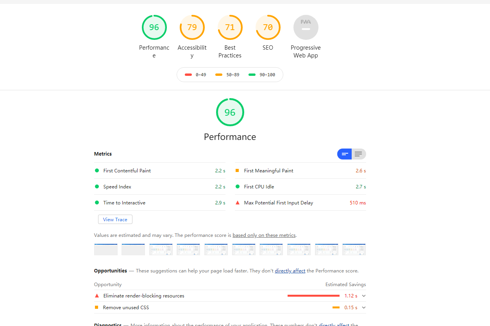

<!--
 * @Author: rh
 * @Description: 这不是一个 bug，这只是一个未列出来的特性
 * @LastEditors: rh
--> 
## 性能检测工具

可以使用 [LightHouse](https://chrome.google.com/webstore/detail/lighthouse/blipmdconlkpinefehnmjammfjpmpbjk?hl=zh-CN) chrome 插件来检测一个web应用的性能

通过五个方面得分来分析一个web应用的性能是否优异

- Performance : 性能 
- Accessibility: 辅助功能，友好性
- Best Practices : 最佳实践
- SEO:
- Progressive Web App: 渐进式web应用

### Performance 性能

LightHouse 通过六个指标来 计算 performace 性能得分

这六个指标为

- First Contentful Paint: 开始有内容展示时耗时
- First Meaningful Paint: 开始有效内容展示时耗时
- Speed Index: 速度指数
- First Cpu Idle: Cpu 第一次空闲耗时
- Time to Interactive: 等到页面可交互耗时
- Max Potential First Input Delay: 最大潜在优先输入延迟