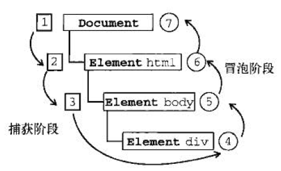

## 简介

Javascript 与 HTML 之间的交互式通过事件实现的。事件，就是文档或浏览器窗口中发生的一些特定的交互瞬间。

## 事件流

事件流描述的是从页面 中接收事件的顺序。

### 事件冒泡

IE 的事件流叫做事件冒泡，即事件开始时是由最具体的元素（文档中嵌套层次最深的那个节点）接收，然后逐级向上传播到较为不具体的节点（文档）。以下面的HTML页面为例：

```html
<!DOCTYPE html>
<html>
<head>
	<title>岱ent B心bling Example</title>
</head>
<body>
	<div id="myDiv">Click Me</div>
</body>
</html>
```

如果点击了页面中 `div`元素,那么这个 `click`事件会按照如下顺序传播：

```
div   ->     body     ->      html       ->    document
```

也就是 `click`事件首先在 `div`元素上发生，而这个元素就是我们单击的元素，然后 `click`事件沿着 `dom`树向上传播，在每一级节点都会发生，直至传播到 `document`对象。

所有现代浏览器都支持事件冒泡，但在具体实现上还是有一些差别。IE5.5 及更早版本中的事件冒
泡会跳过<html>元素（从<body>直接跳到document)。IE9 、Firefox 、Chrome 和Safari 则将事件一直
冒泡到window 对象。

### 事件捕获

Netscape Communicator 团队提出的另一种事件流叫做事件捕获(event capturing)。事件捕获的思想
是不太具体的节点应该更早接收到事件，而最具体的节点应该最后接收到事件。事件捕获的用意在于在
事件到达预定目标之前捕获它。如果仍以前面的HTML 页面作为演示事件捕获的例子，那么单击<div>
元素就会以下列顺序触发c li ck 事件。

```
document   ->    html     ->     body     ->    div
```

在事件捕获过程中， document 对象首先接收到c lick 事件，然后事件沿DOM 树依次向下， 一直
传播到事件的实际目标，即<div>元素。

### DOM 事件流

DOM事件流规定的事件流包括三个阶段：事件捕获阶段，处于目标阶段和事件冒泡阶段。首先发生的事 事件捕获，为截获事件提供了机会。然后是 实际的目标接收到事件。最后一个阶段是冒泡阶段，可以在这个阶段对事件做出响应。以前面简单的HTML 为例，单击 <div> 元素会按照下图所示的顺序触发事件。



在DOM 事件流中，实际的目标（<div>元素）在捕获阶段不会接收到事件。这意味着在捕获事件阶段，事件从document 到 <html>再到<body>后就停止了。下一个阶段是“处于目标”阶段，于是事件在<div>上发生，并在事件处理中被看成冒泡阶段的一部分。然后冒泡阶段发生，事件又传播会文档。

:::warn

IE9、Opera、Firefox、Chrome 和 Safari 都支持Dom 事件流；IE8 及更早版本不支持 DOM 事件流

:::

## 事件处理程序

事件就是用户或浏览器自身执行的某种动作，诸如 click、load、 和mouseover ，都是事件的名称；而响应某个事件的函数就叫事件处理程序（或事件侦听器）。事件处理程序的名字以 “on”开头，因此 click事件的事件处理程序就是 `onclick`，load 事件的事件处理程序就是 `onload`。为事件指定处理程序的方式有好几种。

主要划分为：

- HTML 事件处理程序
- DOM 事件处理程序（包含 DOM0级 和 DOM2级）
- IE事件处理程序
- 跨浏览器的事件处理程序

### HTML事件处理程序

在 HTML 中通过 某个元素的 与相应事件处理程序同名的 HTML 属性/特性 来指定 响应事件的函数，这种指定事件处理程序的方式就是 HTML 事件处理程序。

```html
<!-- 在 JavaScript 中 声明 函数-->
<script type="text/javascript">
	function showMessage(message){
        alert(message)
    }
</script>

<!-- 在 HTML 中 通过 元素的 onclick 属性 来指定 事件执行函数-->
<input type="button" value="Click Me" onclick="showMessage(event.value)">
<input type="button" value="Click Me" onclick="showMessage(this.value)">
<input type="button" value="Click Me" onclick="showMessage(value)">


<form method="post">
    <input type="text" name="username" value="">
    <input type="button" value="Echo Username" onclick="alert(username.value)">
</form>


```

**特点**

- 会创建一个封装着元素属性值的函数。该函数中有一个局部变量event，也就是事件对象，通过event 变量可以直接访问事件对象
- 这个动态创建的函数，会扩展函数的作用域，在这个函数内部，可以像访问局部变量一样访问document 及 该元素本身的成员，并且可以直接访问自身的某个属性（例如上面 的 `showMessage(value)`），甚至可以获取同一表单的其它字段

### DOM 事件处理程序

#### DOM0 级事件处理程序

通过 Javascript 指定事件处理程序的方式，就是将一个函数赋值给一个事件处理程序属性。

每个元素（包括 window 和 document）都有自己的事件处理程序属性，这些属性通常全部小写，例如 onclick.将这种属性的值设置为一个函数，就可以指定事件处理程序。如下所示：

```html
<input type="button" value="click me" id="myBtn">


<script type="text/javascript">
	var btn = document.getElementById('myBtn')
    
    // 绑定事件处理程序
    btn.onclick = function(){
        alert("clicked")
    }
    
    // 移除事件处理程序
    btn.onclick = null
</script>

```

#### DOM2级事件处理程序

`DOM2级事件` 定义了两个方法，用于处理指定和删除事件处理程序的操作： `addEventListener()` 和`removeEventListener()`。所有的DOM 节点中都包含这两个方法，并且接收3个参数： 

- 要处理的事件名
- 作为事件处理程序的函数
- 一个布尔值（true 表示在捕获阶段调用事件处理程序，false 表示在冒泡阶段调用事件处理程序）

```js
var btn = document.getElementById('myBtn')

var handler  = function(){
    alert(this.id + '非匿名函数')
}

btn.addEventListener('click',handler,false)

btn.addEventListener('click',function(){
    alert(this.id + '匿名函数')
},false)

btn.addEventListener('click',function(){
    alert('hello world')
},false)

// 无效
btn.removeEventListener('click',function(){
    alert(this.id + '匿名函数')
},false)

// 有效
btn.removeEventListener('click',handler,false)
```

**特点**

- 可以添加多个 事件处理程序
- 可以指定事件处理程序的执行时机（是在捕获阶段执行还是在冒泡阶段执行）
- 可以删除指定的事件处理程序（非匿名）
- 匿名的事件处理程序使用 removeEventListener 无效

:::info

IE9、Opera、Firefox、Chrome 和 Safari  都支持 DOM2级事件处理程序

:::

### IE事件处理程序

IE 实现了与 DOM2级 事件中类似的两个方法：`attachEvent()` 和 `detachEvent()`,这两个方法接收相同的两个参数

- 事件处理程序名称
- 事件处理程序函数

由于 IE8 及更早版本只支持 事件冒泡。所以通过 attachEvent 添加的事件处理程序都会被添加到冒泡阶段。

```js
var btn = document.getElementById('myBtn')

var handler  = function(){
    alert(this.id + '非匿名函数')
}

btn.arttachEvent('onclick',handler)

btn.arttachEvent('onclick',function(){
    alert(this === window )
    alert(this.id + '匿名函数')
})

btn.arttachEvent('onclick',function(){
    alert('hello world')
})

// 无效
btn.detachEvent('onclick',function(){
    alert(this.id + '匿名函数')
})

// 有效
btn.detachEvent('onclick',handler)
```

