## 查看 ssh 运行服务

```
service sshd status
```

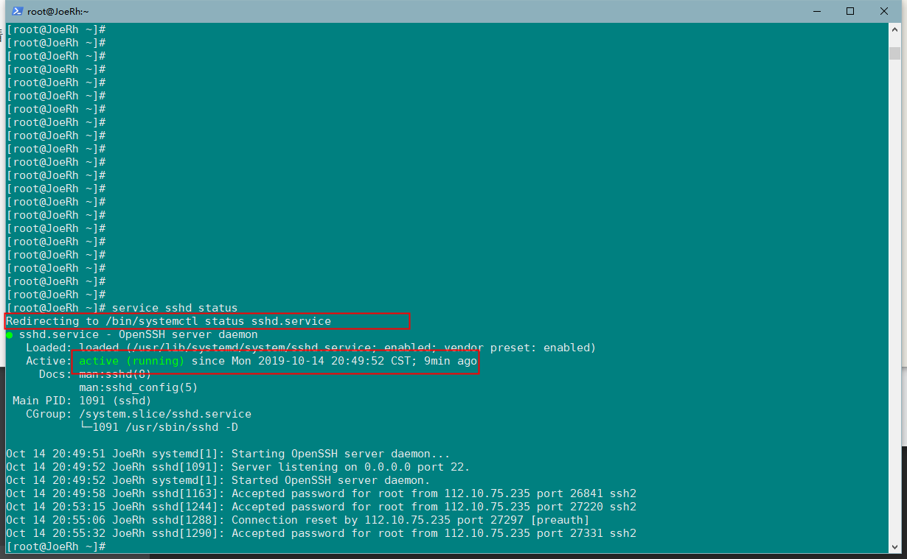

## 查看 ssh 服务监听的端口

```
netstat -anlp |grep sshd
```

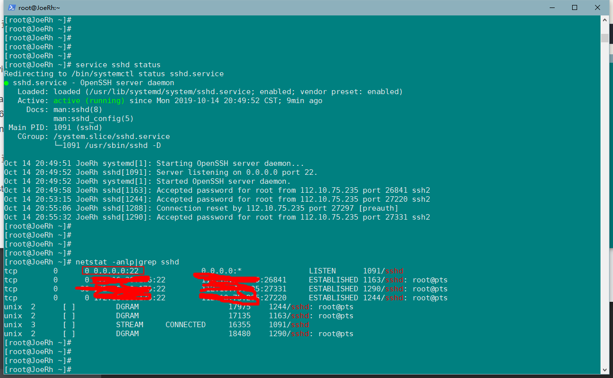
默认监听的 端口 是 22 端口

## 修改 ssh 服务端口（centos 和 unbantu 都是这个路径：/etc/ssh/sshd_config）

```
vi /etc/ssh/sshd_config
```

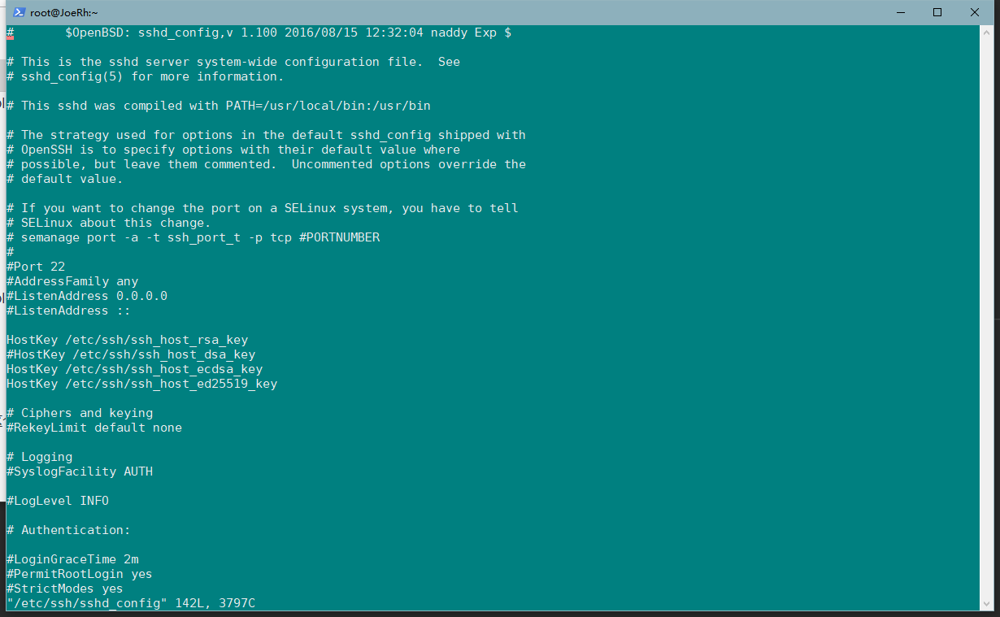

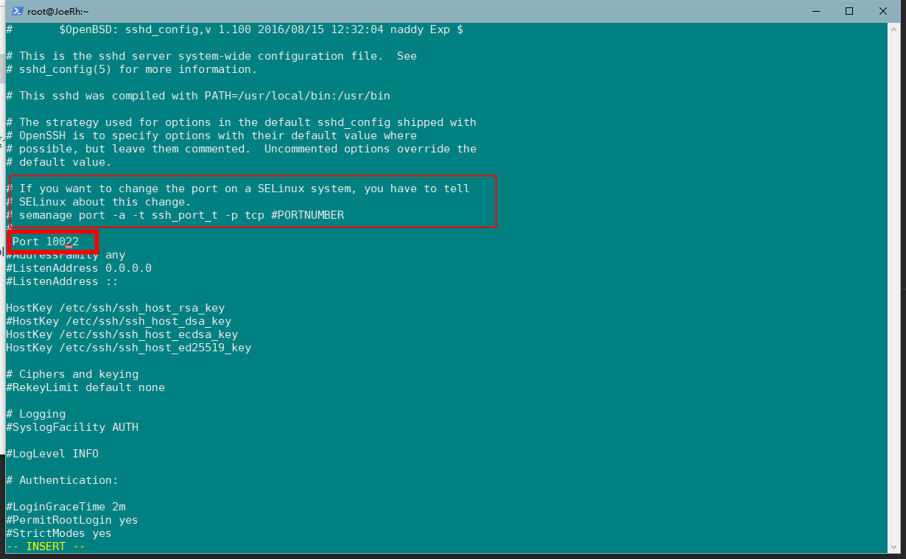

- 修改完端口之后 需要运行下 上述提示框的中的命令

* 发现没有 没有 semanage 命令

- 使用 命令反查 哪个包里面 含有 semanage 命令 `semanage port -a -t ssh_port_t -p tcp 10022`

```
yum whatprovides semanage
```

- 找到 policycoreutils-python-2.5-33.el7.x86_64 这个包中 由 semanage 命令

- 安装 policycoreutils-python 这个包 ，加载 semanage 命令

- 运行 上面 的命令 `semanage port -a -t ssh_port_t -p tcp 10022`

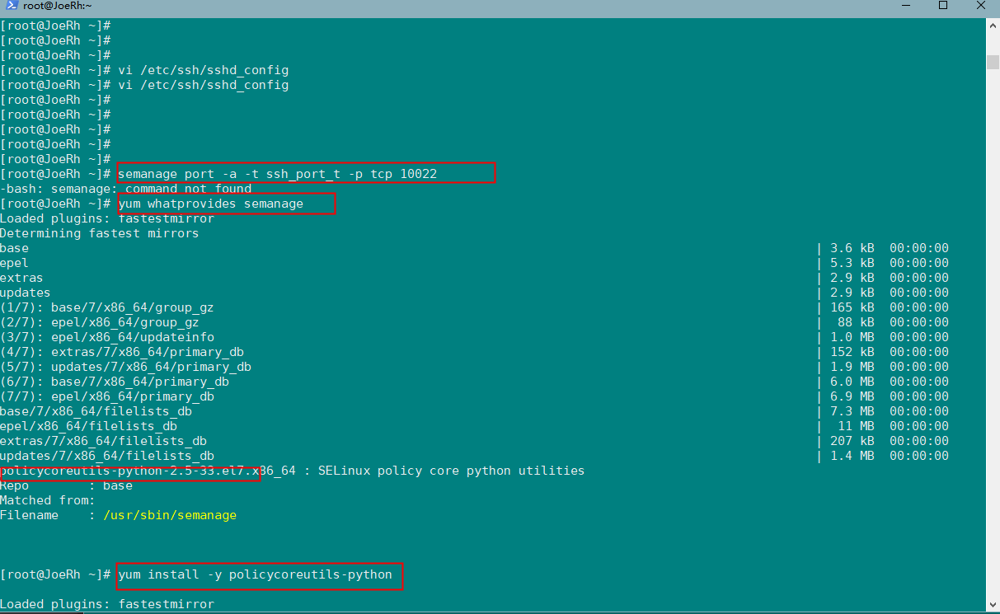

- 运行成功之后 使用命令 `semanage port -l |grep ssh` 查询 是否 将 10022 端口 添加进去

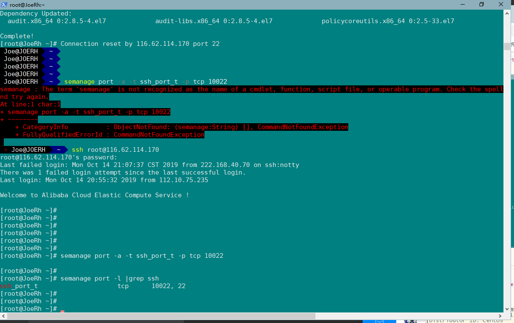

现在 应该 ssh 服务 监听了 两个端口 10022 和 22
如果有多余的端口，想要删除可以使用 `semanage port -d -t ssh_port_t -p tcp 27000` _这里 27000 是多余的端口，具体 端口指代想删除的端口_

## 修改好后 重启 ssh 服务 `service sshd restart`

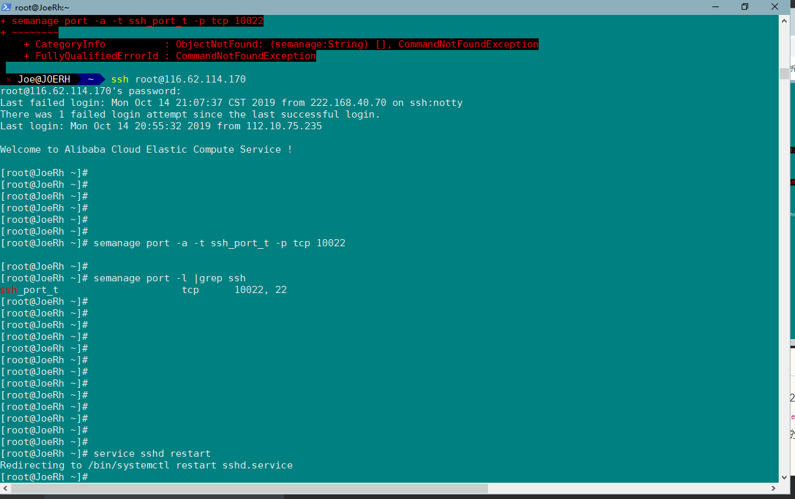

## 测试验证 是否 ssh 端口是否修改成功

退出 重新 登录

```
logout

ssh root@xxx.xxx.xxx
```

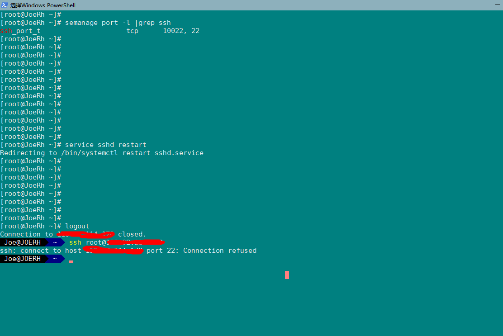

_可以看到 22 端口 已经 连接不上了_，现在尝试从 10022 端口 登录

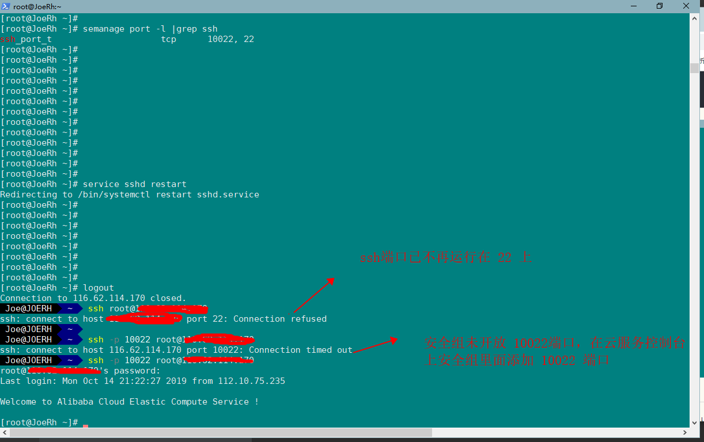

## ssh 密钥登录

#### 1、 在 本地 生产 ssh key 密钥

```
cd ~/.ssh

```

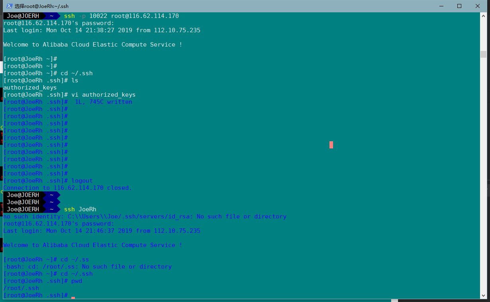

#### 2、本地 ssh 目录在 config 文件中 添加一组 配置

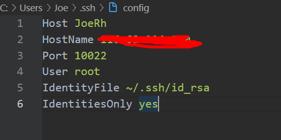

#### 3、然后将本地`ssh keygen` 命令生产的公钥 id_rsa.pub 里面的公钥串复制粘贴到 服务器 上的上述 `IdentyFile` 所指向的 `~/.ssh/`目录中的 authorized_keys 文件中去

实现了上述步骤 ，最后就可以使用 `ssh 主机名` 就可以登录了例如上述图片中的 `ssh JoeRh`
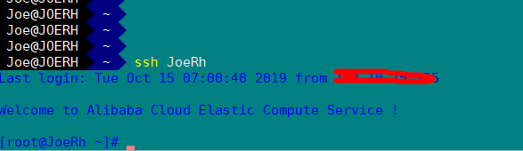


<Vssue title="Vssue Demo" />