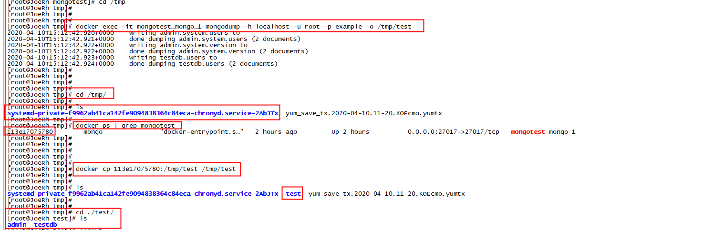

## 安装

[mongodb安装]( https://docs.mongodb.com/manual/installation/  )

docker-compose 安装 mongodb

```yaml
# docker-compose.yml
# Use root/example as user/password credentials
version: '3.1'

services:

  mongo:
    image: mongo
    restart: always
    environment:
      MONGO_INITDB_ROOT_USERNAME: root
      MONGO_INITDB_ROOT_PASSWORD: example
    ports:
      - 27017:27017
    volumes:
      - /home/mongotest:/data/db

  # mongo-express:
  #  image: mongo-express
  #  restart: always
  #  ports:
  #    - 8081:8081
  #  environment:
  #    ME_CONFIG_MONGODB_ADMINUSERNAME: root
  #    ME_CONFIG_MONGODB_ADMINPASSWORD: example
```

创建一个目录，进入目录,创建 docker-compose.yml 文件，写入上面的内容，然后保存 推出后 执行 命令 `docker-compose up -d` 即可安装完成

```shell
cd /home/

mkdir mongotest

cd ./mongotest

vi docker-compose.yml			// 粘贴上面的 docker-compose.yml 里的内容


docker-compose up -d

```

## 查看 已创建运行的容器

```shell
docker ps 	// 查看 在运行的 docker 容器


docker exec -it 容器名称  镜像名称
例如：
docker exec -it mongotest_mongo_1 mongo

```

mongo 登录 账号

```shell
use admin	// 切换到管理员所在的数据库上

db.auth(用户名,用户密码)	// 登录 账户

show dbs		// 查看所有的 数据库db

use db名称	// 创建或切换 到 某 db

db.createUser({user:"test",pwd:"123456",roles:[{role:"dbOwner",db:"testdb"}]})	
// 创建 一个 角色为 testdb数据库 的 dbOwner 的账户

```

## mongodb 的备份与 恢复

```shell
docker exec -it 容器名称 mongodump -h localhost -u root -p example -o /temp/test
进入 mongodb容器 备份 容器用超级管理员的权限将所有的数据库备份到 temp/test 目录
```



- 备份工具： mongodunp

```shell
mongodump -h host -d dbname -o directory
mongodump -h IP --port 端口 -u 用户名 -p 密码 -d 数据库 -o 文件存储路径
Eg: # mongodump -d test -o /data/
如果像导出所有数据库，可以去掉 -d
-h： mongodb 所在服务器地址，如 127.0.0.1，也可以指定端口号 127.0.0.1:27017
-d:  需要备份的数据库名称，如： db_test
-o:  备份的数据存放位置,如： ~\dump,当然该目录需要提前建立，在备份完成后，系统自动在 dump 目录下建一个 db_test 目录，这个目录里面存放该数据库实例的备份数据
```

- 恢复工具 mongorestore

概念：

mongorestore 是 Mongodb 从备份中恢复数据的工具，它主要用来获取 mongodump 的输出结果，并将备份的数据插入到运行的 Mongodb 中。

```shell
mongorestore -h host -d dbname --directoryperdb dbdirectory
Eg: # mongorestore --host=10.0.2.105 --port=21017 --db zhpt --dir=zhpt/
参数说明：
-h： mongodb 所在服务器地址
-d： 需要恢复的数据库名称，如： db_test ,当然这个名称可以不同于备份的时候，比如 new_db
--directoryperdb：备份数据文件所在位置，如：~\dump\db_test（这里之所以要加db_test子目录，从mongoretore的help中的--directoryperdb，可以读出“每一个db在一个单独的目录”。）
```


<Vssue title="Vssue Demo" />