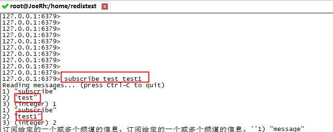
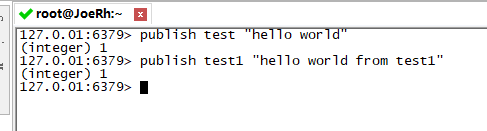
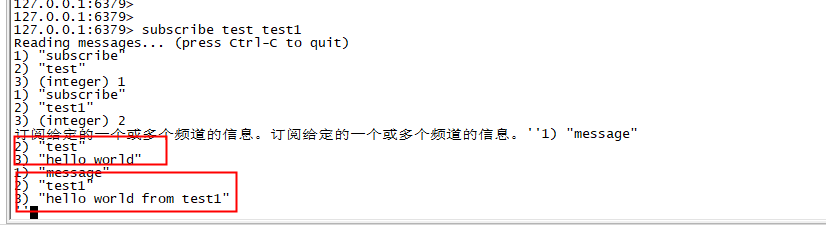

## redis Pub/Sub  发布和订阅

**SUBSCRIBE channel [channel ...]**:订阅给定的一个或多个频道的信息。

在第二个终端窗口  发布一些信息

发布完后看 第一个窗口 会发现 接收到 第二个窗口发布的消息

:::warning

如果没有频道被指定，也即是，一个无参数的 UNSUBSCRIBE 调用被执行，那么客户端使用 [SUBSCRIBE](http://doc.redisfans.com/pub_sub/subscribe.html#subscribe) 命令订阅的所有频道都会被退订。在这种情况下，命令会返回一个信息，告知客户端所有被退订的频道。

UNWATCH命令是Transaction事务相关的命令，取消 WATCH 命令对所有 key 的监视。事务：http://doc.redisfans.com/transaction/index.html

:::

