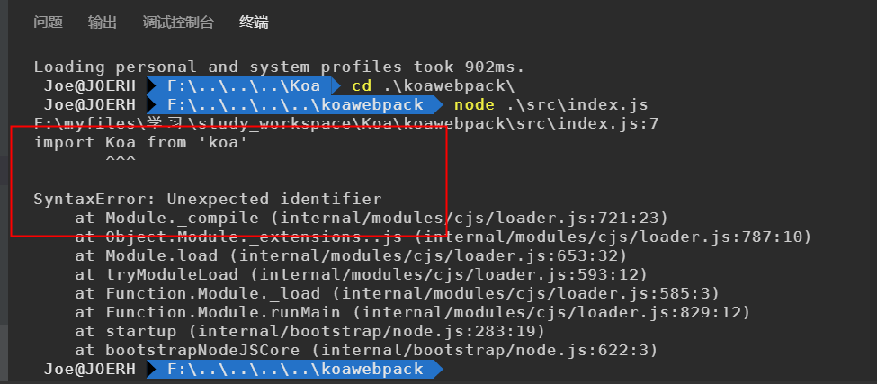
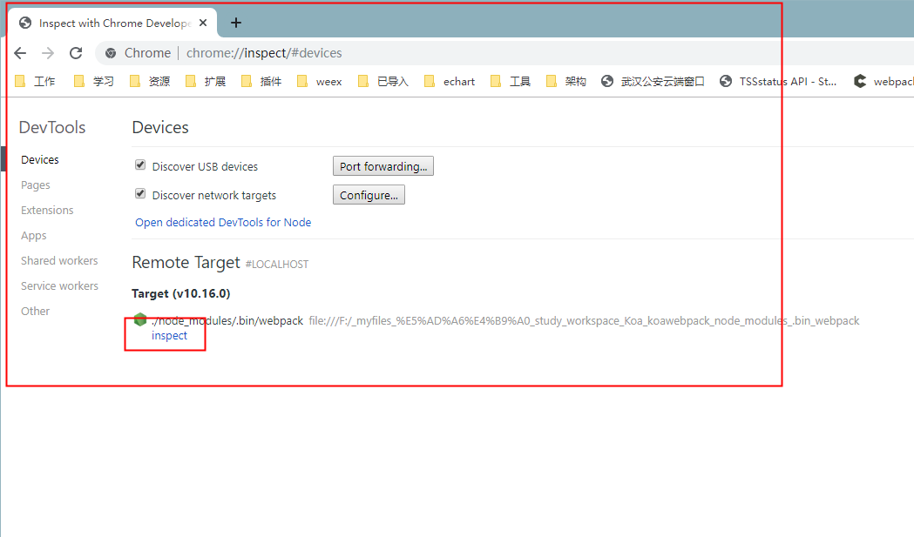
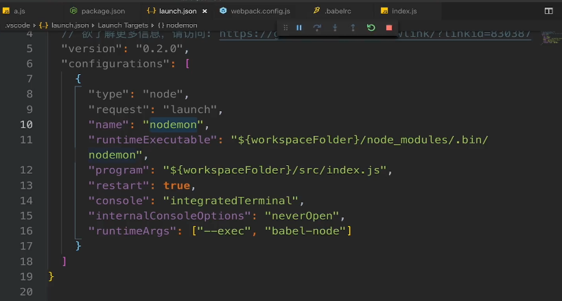

# Koa

 Koa 是一个新的 web 框架，由 Express 幕后的原班人马打造， 致力于成为 web 应用和 API 开发领域中的一个更小、更富有表现力、更健壮的基石。 通过利用 async 函数，Koa 帮你丢弃回调函数，并有力地增强错误处理。 Koa 并没有捆绑任何中间件， 而是提供了一套优雅的方法，帮助您快速而愉快地编写服务端应用程序。 


## 简单使用 

- 安装

```shell
npm i koa -S
```

- 必须的 hello world

```js
const Koa = require('koa');
const app = new Koa();

app.use(async ctx => {
  ctx.body = 'Hello World';
});

app.listen(3000);
```

- ctx 上下文


## Koa的链式调用和原理

 Koa 是一个 通过 使用各种中间件去  处理 各种业务的 nodejs框架

可以通过链式调用的形式去 调用 中间件，像一个洋葱模型一样


```js
const Koa = require('koa')
const app = new Koa()


const middleware = function async(ctx, next) {
  console.log('this is a middleware')
  console.log(ctx.request.path)
  // next()
}

const middleware1 = function async(ctx, next) {
  console.log('this is a middleware1')
  console.log(ctx.request.path)
  next()
  console.log('this is a middleware1 ending')
}

const middleware2 = function async(ctx, next) {
  console.log('this is a middleware2')
  console.log(ctx.request.path)
  next()
  console.log('this is a middleware2 ending')
}

app.use(middleware1).use(middleware2).use(middleware)

app.listen(3001)

// 运行输出 结果为
this is a middleware1
/
this is a middleware2
/
this is a middleware
/
this is a middleware2 ending
this is a middleware1 ending

```

上述的代码 如果 调用运行不同

```js
# app.use(middleware).use(middleware1).use(middleware2)

// 运行输出结果为 
this is a middleware
/

# app.use(middleware1).use(middleware).use(middleware2)
// 运行输出结果为 
this is a middleware1
/
this is a middleware
/
this is a middleware1 ending
```


这说明 koa  调用中间件 时 遇到 没有 调用 next () 时 会默认 请求 结束，直接返回；如果遇到 调用 next() 方法时，会暂停当前中间件的执行，转而交给下一个中间件去执行，如果下一个中间件 没有调用 next()方法时，就会默认请求结束，返回继续去执行 上一级中间件的的next() 方法的后面语句。


## 使用 Koa开发 restful 接口

会使用到 的中间件 有

- 路由： koa-router
- 协议解析： koa-body
- 跨域处理： @koa/cors

### koa-router


### koa-body


### @koa/cors


### koa-combine-routers

## koa 开发热加载，ES6语法支持

### 热加载

安装 nodemon 插件 热加载

```shell
npm i -D nodemon
```

然后使用 nodemon 监听 入口文件

```shell
npx nodemon src/index.js
```

或者 在 package.json 添加 script 命令

```json
// package.json

{
  "name": "koastaic",
  "version": "1.0.0",
  "description": "",
  "main": "index.js",
  "scripts": {
    "start": "nodemon src/index.js",
    "test": "echo \"Error: no test specified\" && exit 1"
  },
  "keywords": [],
  "author": "",
  "license": "ISC",
  "dependencies": {
    "@koa/cors": "^3.0.0",
    "koa": "^2.11.0",
    "koa-body": "^4.1.1",
    "koa-combine-routers": "^4.0.2",
    "koa-helmet": "^5.2.0",
    "koa-json": "^2.0.2",
    "koa-router": "^7.4.0",
    "koa-static": "^5.0.0"
  },
  "devDependencies": {
    "nodemon": "^2.0.1",
    "webpack": "^4.41.2",
    "webpack-cli": "^3.3.10"
  }
}

```


### ES6 支持和 webpack

安装 webpack

```shell
npm i -D webpack webpack-cli
```

安装 babel

```shell
npm install -D clean-webpack-plugin webpack-node-externals @babel/core @babel/node @babel/preset-env babel-loader  cross-env
```

- clean-webpack-plugin : 主要用于清理 dist 目录下的一些文件
- webpack-node-externals ： 主要是针对 nodemodules 目录下的文件进行排除处理，这样就不会去处理node_modules 目录下的文件
- @babel/core : babel 的核心
- @babel/node : babel 调试用到
- @babel/preset-env : 对ES6的一些新特性增加支持
- babel-loader ： webpack 中用到的
- cross-env : 设置环境变量

项目根目录下新建 webpack.config.js

```
// webpack.config.js

const path = require('path')
const nodeExcternals = require('webpack-node-externals')
const { CleanWebpackPlugin } = require('clean-webpack-plugin')

const webpackconfig = {
  target: 'node',
  mode: 'development',
  entry: {
    server: path.join(__dirname, 'src/index.js')
  },
  output: {
    filename: '[name].bundle.js',
    path: path.join(__dirname, './dist')
  },
  devtool: 'eval-source-map',
  module: {
    rules: [
      {
        test: /\.(js|jsx)$/,
        use: {
          loader: 'babel-loader',
        },
        exclude: [path.join(__dirname, '/node_modules')]
      }
    ]
  },
  externals: [nodeExcternals()],
  plugins: [
    new CleanWebpackPlugin()
  ],
  node: {
    console: true,
    global: true,
    process: true,
    Buffer: true,
    __filename: true,
    __dirname: true,
    setImmediate: true,
    path: true
  }
}

module.exports = webpackconfig
```

根目录下新建 `.babelrc` 文件

```
{
  "presets": [
    [
      "@babel/preset-env",
      {
        "targets": {
          "node": "current"
        }
      }
    ]
  ]
}

```

使用 命令检查下,查看有无报错，没有报错就可以 在 项目中使用 ES6 语法

```
npx webpack 
```

将入口文件 src/index.js 改写 成 ES6 语法

```js
// index.js

// const koa = require('koa')
// const path = require('path')
// const helmet = require('koa-helmet')
// const statics = require('koa-static')
// const router = require('./routes/routes')

import Koa from 'koa'
import path from 'path'
import helmet from 'koa-helmet'
import statics from 'koa-static'
import router from './routes/routes'

const app = new koa()


app.use(helmet())
app.use(statics(path.join(__dirname, '../public')))
app.use(router())

app.listen(3000)
```


在 项目中使用 ES6语法 之后，想要运行，就不能再直接使用 node 运行，因为这时候项目中已经 含有 ES6语法，运行会报语法错误



这时候 要想运行 服务 

需要使用 babel-node 来运行服务

```shell
npx babel-node src/index.js
```

nodemon 热加载

```
npx nodemon --exec babel-node src/index.js
```

所以 现在 package.json 中的热加载 nodemon 也需要重新配置

```
// package.json

{
  "name": "koawebpack",
  "version": "1.0.0",
  "description": "",
  "main": "index.js",
  "scripts": {
    "start:es6": "nodemon --exec babel-node src/index.js",
    "test": "echo \"Error: no test specified\" && exit 1"
  },
  "keywords": [],
  "author": "",
  "license": "ISC",
  "dependencies": {
    "@koa/cors": "^3.0.0",
    "koa": "^2.11.0",
    "koa-body": "^4.1.1",
    "koa-combine-routers": "^4.0.2",
    "koa-helmet": "^5.2.0",
    "koa-json": "^2.0.2",
    "koa-router": "^7.4.0",
    "koa-static": "^5.0.0"
  },
  "devDependencies": {
    "@babel/core": "^7.7.4",
    "@babel/node": "^7.7.4",
    "@babel/preset-env": "^7.7.4",
    "babel-loader": "^8.0.6",
    "clean-webpack-plugin": "^3.0.0",
    "cross-env": "^6.0.3",
    "nodemon": "^2.0.1",
    "webpack": "^4.41.2",
    "webpack-cli": "^3.3.10",
    "webpack-node-externals": "^1.7.2"
  }
}

```

## 如何调试webpack

执行命令

```
npx node --inspect-brk ./node_modules/.bin/webpack --inline --progress
```

然后 通过 chorme 进行调试



### vscode 调试配置



## 优化 webpack 配置

### npm-check-updates

全局安装 npm-check-updates

```shell
npm install -g npm-check-updates
```

安装完成后 就可以使用 ncu --help 查看 指令

```
ncu --help
```

在项目下执行 命令 `ncu`可以检索项目下的 package.json里面的依赖 版本更新情况，可以考虑是否对项目中的某些依赖进行升级

```shell
ncu
```

执行 `ncu -u`可以改写 package.json 将有版本更新的 依赖更新版本写进 package.json 中

然后删除 node_modules

重新 npm install 安装新版本的依赖


<Vssue title="Vssue Demo" />