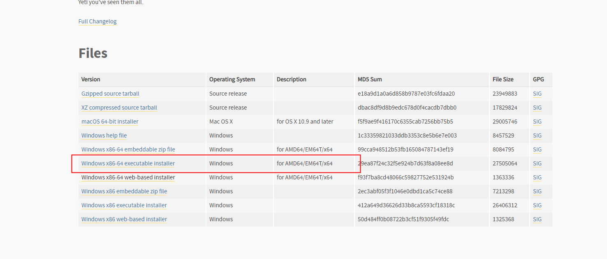
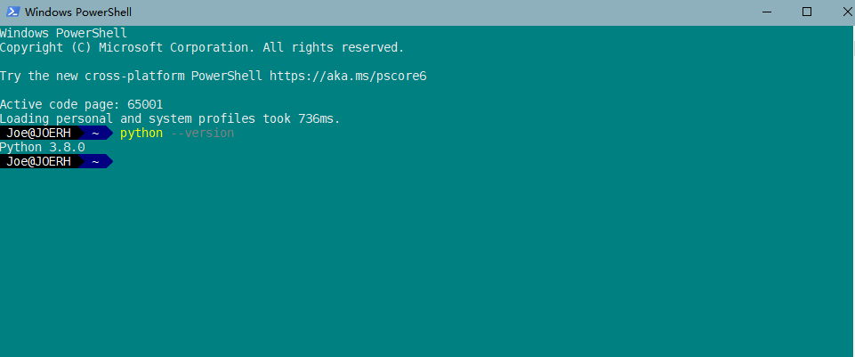
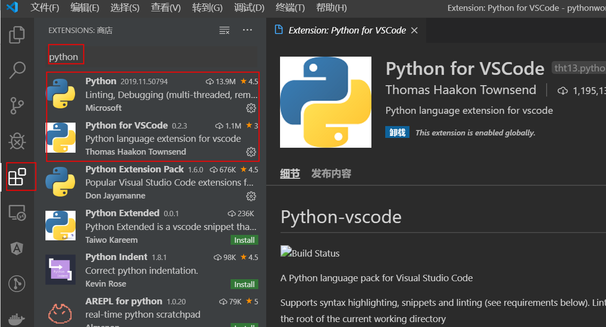
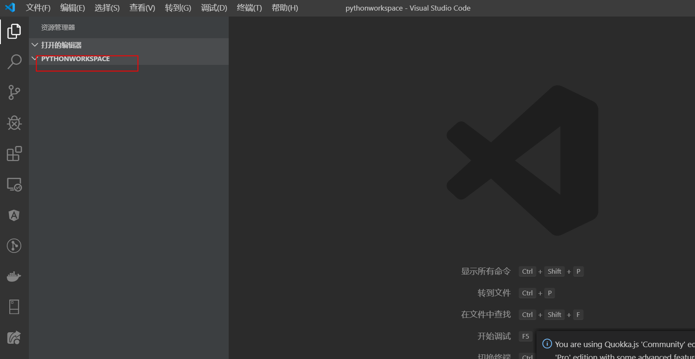
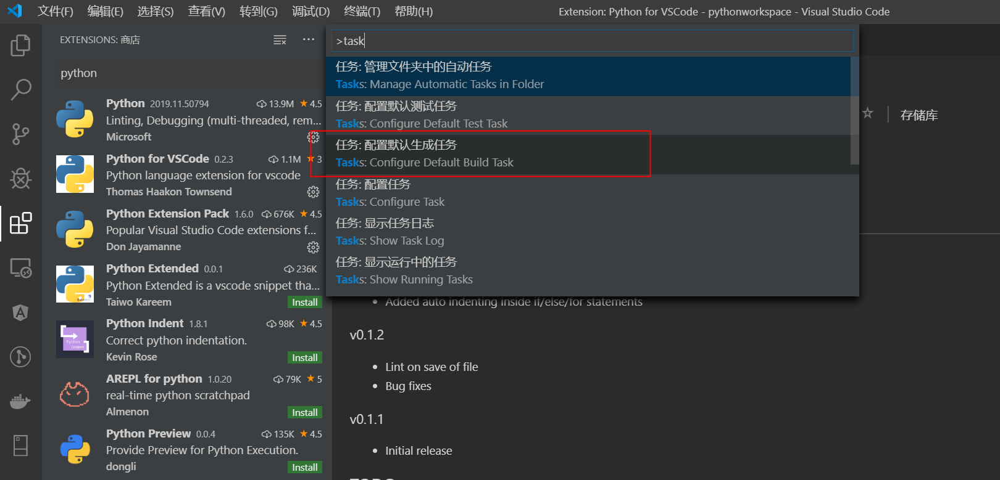
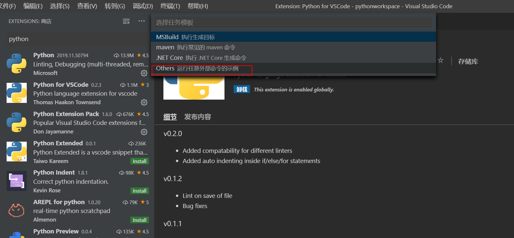
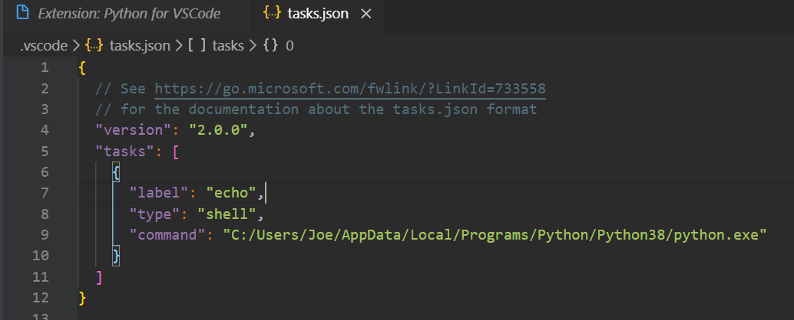

#  苟富贵，勿相忘 


# 环境搭建

 目前 Python 2 官方已经宣布在 2020 年停止支持，什么，你就要学 Python 2 ，出门左转不送。 

 在 windows 上构建 Python 的环境还是十分简单的，访问 Python 的官方网站（https://www.python.org/ ），发挥我小学的英文水平，找到 DownLoad ，点一下,选择 windows




小编是的电脑是 win10 ，所以选择了红框中的这个版本，再点一下，开始下载，如果嫌慢的话可以使用迅雷下载（你们谁跟迅雷讲一下回头记得给我广告费）

下载完成后是一个 exe 文件，直接双击安装就好了，有需要的可以修改下安装路径，虽然是英文版的，但是操作也很简单，一路 next 到底就好了，安装成功后可以打开 cmd 或者 powershell 命令行输入以下命令：

```powershell
$ python --version
  Python 3.8.0
```

 执行后应该出现目前安装的 Python 版本信息 



可以看到，安装的版本是 3.7.4 ，和我们刚才下载的版本吻合【废话

开发工具可以选用 jetbrains 提供的 PyCharm 或者是微软提供的 VSCode 

这里因为 岗位的原因，vscode 用的比较多，所以这里主要使用 vscode

## Vscode python 开发环境配置

> 1、安装插件

如下图，安装vscode 后打开软件，点击应用图标，搜索 python,安装前两个插件



>  2、打开工作目录

如下图，点击左边的 文件图标，再点击“Open Folder”按钮，选择一个文件夹作为工作目录，之后新建的文件都会存放在这个目录下。



> 3、添加配置

 输入ctrl+shift+p进入搜索task 选择生成默认任务，选择others其他。就生成了tasks.json文件。 





 修改command配置，最简单可用就改这点就行了。 



> 安装pip

 pip是用来导入各种python包的，需要安装。
要安装pip，请安全下载get-pip.py。 

```shell
curl https://bootstrap.pypa.io/get-pip.py -o get-pip.py
```

然后运行以下命令

```shell
python get-pip.py 
```

## helloworld

 环境搭建完成一定要写一个 `Hello World` ，这不仅仅是程序员的信仰，同时也是对一门开发语言的尊重 

  

```python
// helloworld.py

print('Hello World')
```

终端运行 输出 `Hello World`

